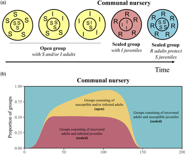
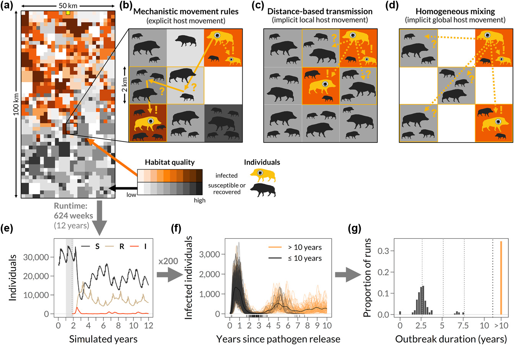
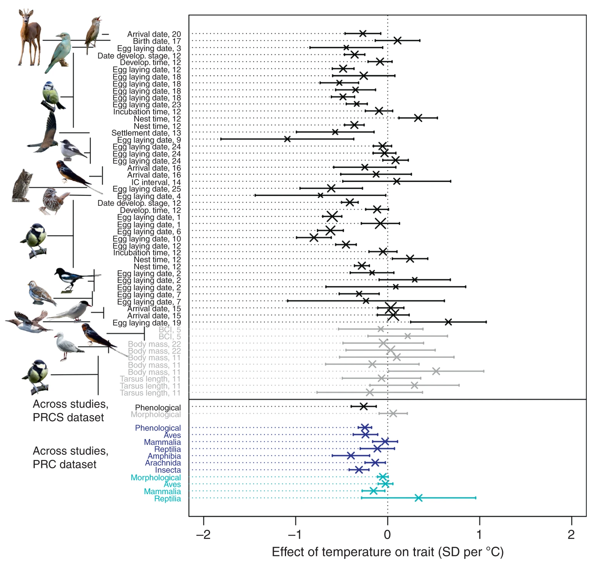

```{r setup, include=FALSE}
knitr::opts_chunk$set(echo = FALSE)
```

<style>
.card-wrapper-wide {
  list-style: none;
  padding: 0;
  margin: 0;
  display: inline-grid;
  grid-template-columns: repeat(auto-fit, minmax(.5ch, 60ch));
  grid-gap: 1.5rem;
  max-width: 80vw;
  width: 110ch;
  padding: 3rem 1rem 5rem 1rem;
  overflow: hidden;
  place-self: center;
  justify-content: center; 
}

.card-wide {
  background-color: #f6f6f6;
  box-shadow: 0.05rem 0.1rem 0.3rem -0.03rem rgba(17, 10, 49, 0.2);
  transition: 0.3s;
  padding: 3px 28px 12px 28px;
  border-radius: 0.5rem;
  margin: auto;
  place-items: center;
  -webkit-columns: 40px 2;
  /* Chrome, Safari, Opera */
  -moz-columns: 60px 2;
  /* Firefox */
  columns: 60px 2;
  }

</style>


<ul class="card-wrapper-wide">
   <li class="card-wide">
<div class="card-content">Marescot, Franz, Benhaiem et al. 2021 [*J Anim Ecol*](https://doi.org/10.1111/1365-2656.13555)   [Code](https://github.com/EcoDynIZW/Marescot_Franz_Benhaiem_2021_JAnimEcol) 


{width=100%}</div>

<div class="card-content">The purpose of our conceptual model was to assess whether and how an age-dependent pattern of between-group interactions, which increases social network modularity, consistently increased the probability of epidemic fade-out across a large range of host and pathogen life history traits.</div>
  </div>
  
</ul>

<ul class="card-wrapper-wide">
   <li class="card-wide">
<div class="card-content">Kürschner et al. 2021 [*Ecol Evol*](http://doi.org/10.1002/ece3.7478) — [Code](https://github.com/EcoDynIZW/Kuerschner_2021_EcolEvol)


{width=100%}</div>

<div class="card-content">We used a spatially explicit individual-based eco-epidemiological model originally developed by Scherer et al. (2020). It is based on earlier models considering neighbourhood infections only which was developed by Kramer-Schadt et al. (2009) and Lange et al. (2012).</div>
  </li>
  
</ul>

<ul class="card-wrapper-wide">
   <li class="card-wide">
<div class="card-content">Scherer et al. 2020 [*OIKOS*](http://doi.org/10.1111/oik.07002) — [Code](https://github.com/EcoDynIZW/Scherer_2020_OIKOS)

{width=100%}</div>

<div class="card-content">The spatially explicit agent‐based eco‐epidemiological model is based on the study by Kramer-Schadt et al. (2009) and subsequent modifications by Lange et al. (2012).</div>
  </li>
  
</ul>

<ul class="card-wrapper-wide">
   <li class="card-wide">
<div class="card-content">Radchuk et al. 2019 [*Nat Com*](http://doi.org/10.1038/s41467-019-10924-4) — [Code](https://github.com/EcoDynIZW/Radchuk_2019_NatCom)

{width=100%}</div>

<div class="card-content">The goal of adRes package is to provide the data and the exact workflow required to reproduce the analyses for the manuscript 'Adaptive responses of animals to climate change are most likely insufficient' by Radchuk et al. Nature Communications (2019)'.</div>
  </li>
  
</ul>

<ul class="card-wrapper-wide">
   <li class="card-wide">
<div class="card-content">Benhaiem et al. 2018 [*Comms Biol*](http://doi.org/10.1038/s42003-018-0197-1) — [Code](https://github.com/EcoDynIZW/Benhaiem_2018_CommsBio)

{width=100%}</div>

<div class="card-content">We developed a stage-structured matrix population model to provide a long-term projection of demographic responses by a keystone social predator, the spotted hyena, to a virulent epidemic of canine distemper virus (CDV) in the Serengeti ecosystem in 1993/1994 and predict the recovery time for the population following the epidemic.</div>
  </li>
  
</ul>


