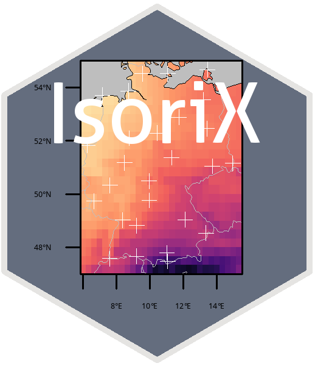
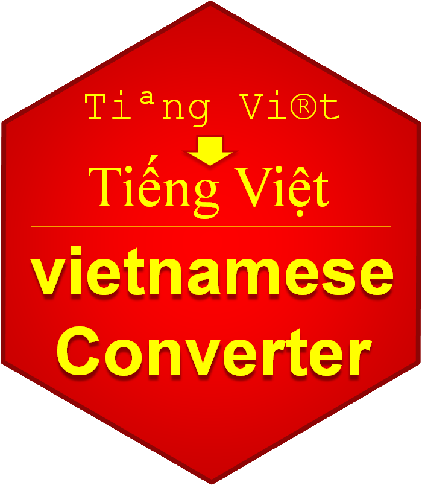
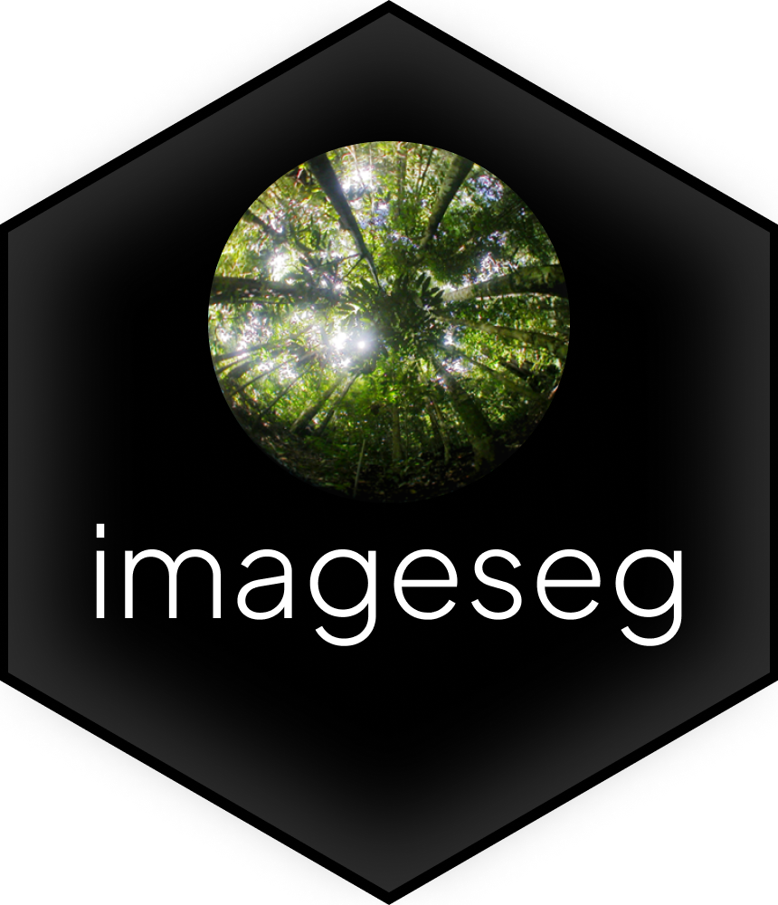

```{r, echo = FALSE}
knitr::opts_chunk$set(echo = FALSE)
```


### R Packages and Tools

[{width=25%}](https://cran.r-project.org/web/packages/IsoriX/index.html)
[{width=25%}](https://cran.r-project.org/web/packages/vietnameseConverter/index.html) 
[{width=25%}](https://cran.r-project.org/web/packages/camtrapR/index.html)
  
[{width=39%}](https://cran.r-project.org/web/packages/imageseg/index.html)
[{width=39%}](https://ropensci.github.io/NLMR/)

- [IsoriX](https://cran.r-project.org/web/packages/IsoriX/index.html): Isoscape Computation and Inference of Spatial Origins using Mixed Models; learn about IsoriX [here](https://bookdown.org/content/782/)
- [camtrapR](https://cran.r-project.org/web/packages/camtrapR/index.html): Camera Trap Data Management and Preparation of Occupancy and Spatial Capture-Recapture Analyses
- contribution to [NLMR](https://cran.r-project.org/web/packages/NLMR/index.html): Simulating neutral landscape models
- Cedric’s great ggplot2 graphics guide [here](https://cedricscherer.netlify.com/2019/08/05/a-ggplot2-tutorial-for-beautiful-plotting-in-r/) 


### Research Repositories

<b class='orange'>
Find codes to our published papers and helpful material on our repositories
on [GitHub](https://github.com/EcoDynIZW). Simulation models can also be retrieved from Zenodo or the Computational Model Library CoMSES, e.g.:
</b>

- Kürschner et al. 2021 *Ecol Evol* on [Zenodo](https://doi.org/10.5281/zenodo.4593791)
- Scherer et al. 2020 *OIKOS* on [Zenodo](https://doi.org/10.5281/zenodo.3387444) and [CoMSES](https://www.comses.net/codebases/82f2b53e-ae0e-4ac0-9e06-d541ecb4d1b6/releases/1.0.0/)
- Dalleau et al. 2019 *Ecol Evol* on [CoMSES](https://www.comses.net/codebases/69863caa-2f8e-4412-a564-a2826d9d38d3/releases/1.0.0/)
- Radchuk et al. 2016 *Ecology* on [CoMSES](https://www.comses.net/codebases/4b484186-d8fb-4307-a710-fc05daa36afa/releases/1.0.0/)


### Field Techniques

- Behavioural observations, experiments and analysis
- Non-invasive physiological and genetic techniques
- High-resolution telemetry and movement analysis
- Camera trapping

### Lab methods

- Paternity analyses
- Molecular population genetics and DNA metabarcoding
- NGS

### Computational Ecology

- Biostatistical modelling
- Geographic Information Systems (GIS) and remote sensing (using high resolution satellite images)
- Spatial statistics and species distribution modelling (occupancy and spatially-explicit capture-mark-recapture)
- Social network dynamics and network modeling
- Analysis of long-term longitudinal data
- Hidden Markov (Multi-event-Capture-Mark-Recapture) modelling
- Matrix population modeling
- Individual-based, spatially-explicit modelling 
