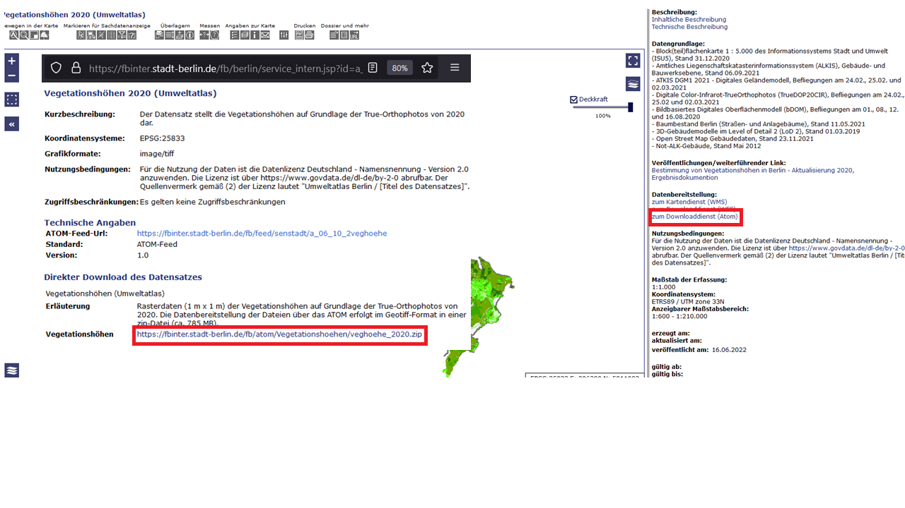

```{r setup, include=FALSE}
knitr::opts_chunk$set(echo = TRUE)
```

The [`{d6berlin}` package](https://github.com/EcoDynIZW/d6berlin) provides several functions for the members of the Ecological Department of the IZW. Now two functions are added to the package: `download_fisbroker_wfs()` and `download_fisbroker_atom()`.

```{r install, eval=3}
devtools::install_github("EcoDynIZW/d6berlin")
library(d6berlin)
```

## The FIS-Broker database

The [FIS-Broker database](https://fbinter.stadt-berlin.de/fb/index.jsp) is hosted by the Berlin Senate and provides several geographical data sets. The file formats differ and some data sets have just one of the file formats to offer. The file formats are WMS (Web Media Service: Just like a png or jpg), WFS (Web Feature Service: Shapefiles) and ATOM (xml format: Raster layers data). This function is only looking for WFS files (Shapefiles), because these are the polygons, lines or points that we are looking for. 

For using these two functions you have to select the layer you aim to download from the online data base. 

## WFS Data

As an example we will download the layer containing the districts of Berlin (*ALKIS Bezirke*):


```{r example wfs}
library(dplyr)
library(ggplot2)

url <- "https://fbinter.stadt-berlin.de/fb/wfs/data/senstadt/s_wfs_alkis_bezirk"

data_wfs <- d6berlin::download_fisbroker_wfs(link = url)

data_wfs

ggplot() +
  geom_sf(data = data_wfs, aes(fill = namgem)) +
  rcartocolor::scale_fill_carto_d(palette = "Bold")
```

You got a spatial layer which you can save to disk or to use it directly.

## ATOM Data 

As an example we will download a raster of vegetation heights (*Vegetationshöhen 2020 (Umweltatlas)*)



```{r example atom}
library(dplyr)
library(ggplot2)

url <- "https://fbinter.stadt-berlin.de/fb/atom/Vegetationshoehen/veghoehe_2020.zip"

data_atom <-
  d6berlin::download_fisbroker_atom(
    zip_link = url,
    path = "_posts/d6geodatapackage/man",
    name = "vegetation_heights"
  )

data_atom

data_atom_10 <- terra::aggregate(data_atom, 10)

p_base_map <-
  ggplot2::ggplot() +
  stars::geom_stars(data = stars::st_as_stars(data_atom_10)) +
  ggplot2::coord_sf(expand = FALSE)

d6geodata::plot_quantitative_map(tif = data_atom_10, p_base_map = p_base_map)
```

```{r, echo=FALSE, include=FALSE}
suppressMessages(file.remove(here::here("_posts", "d6geodatapackage", "man", "vegetation_heights")))
```


