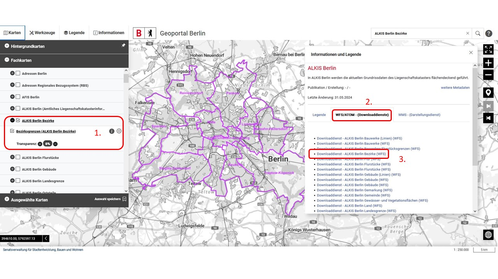
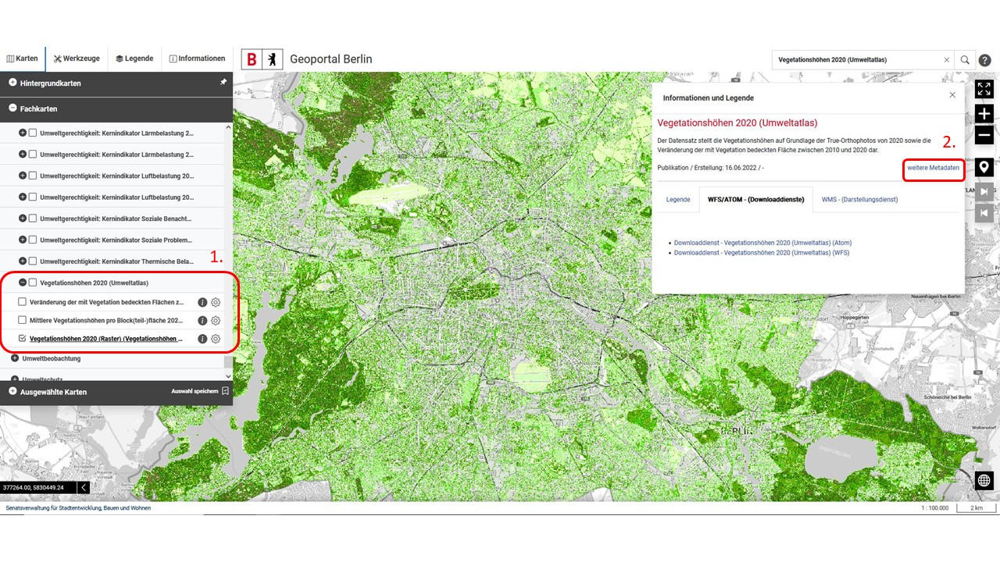
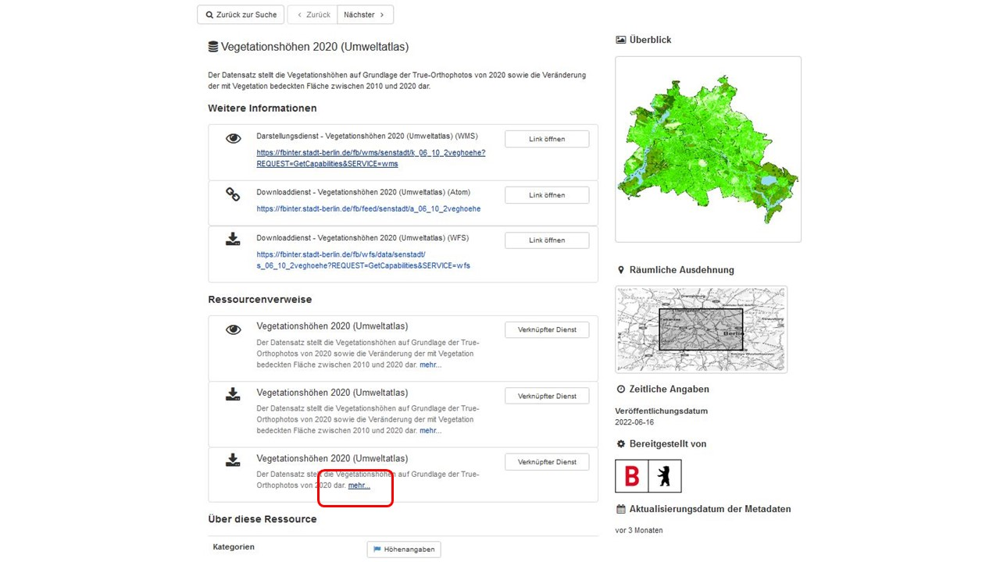

```{r setup, include=FALSE}
knitr::opts_chunk$set(echo = TRUE)
terra::terraOptions(progress = 0)
```

The [`{d6berlin}` package](https://github.com/EcoDynIZW/d6berlin) provides several functions for the members of the Ecological Department of the IZW. Now two functions are added to the package: `download_fisbroker_wfs()` and `download_fisbroker_atom()`.

```{r install, eval=FALSE}
install.packages("remotes")
remotes::install_github("EcoDynIZW/d6berlin")
install.packages("rcartocolor")
install.packages("stars")
```

```{r library}
library(d6berlin)
library(dplyr)
library(ggplot2)
```


## The Geoportal database

The [Geoportal database](https://gdi.berlin.de/viewer/main/#LayerInfoDataDownload) is hosted by the Berlin Senate and provides several geographical data sets. The file formats differ and some data sets have just one of the file formats to offer. The file formats are WMS (Web Media Service: just like a png or jpg), WFS (Web Feature Service: Shapefiles) and ATOM (xml format: raster layers data). This function is only looking for WFS files (shapefiles), because these are the polygons, lines or points that we are looking for. 

For using these two functions you have to select the layer you aim to download from the online data base. 

## WFS Data

As an example we will download the layer containing the districts of Berlin ("ALKIS Bezirke"):

Copy the name or browse for your desired data.

1. Click on the layer
2. Click on "WFS/Atom Downloaddienste"
3. Right click on the layer you want to download and copy the link



```{r example wfs}
url <- "https://gdi.berlin.de/services/wfs/alkis_bezirke?REQUEST=GetCapabilities&SERVICE=wfs"

data_wfs <- d6berlin::download_fisbroker_wfs(link = url)

glimpse(data_wfs)

ggplot() +
  geom_sf(data = data_wfs, aes(fill = namgem)) +
  rcartocolor::scale_fill_carto_d(palette = "Bold")
```

You got a spatial layer which you can save to disk or to use it directly.

## WFS Data - special case

In some cases you'll get an unusual geometry type like "COMPOUNDCURVE".
With the following you can transform the data to the desired geometry type:

For example "Straßenabschnitte - Verkehrsobjekte des Regionalen Bezugssytems (RBS)" contains this unusual geometry type.

```{r}
roads <- d6berlin::download_fisbroker_wfs("https://gdi.berlin.de/services/wfs/rbs_strab?REQUEST=GetCapabilities&SERVICE=wfs")

roads_coll <- sf::st_cast(roads, "GEOMETRYCOLLECTION") # transform to GEOMETRYCOLLECTION
roads_lines <- sf::st_collection_extract(roads_coll, "LINESTRING") # and now to LINESTRING
```

Hint: You may find the geometry type in the description of the data. 

```{r}
roads_lines
```

## ATOM Data 

As an example we will download a raster of vegetation heights ("Vegetationshöhen 2020 (Umweltatlas)"):

1. Click on the layer
2. Click on "weitere Metadaten"



Look for the data set which contains the raster data and click on "mehr..."


Find the downloadable data and eaither download the data directly or copy the download link for the next step.


```{r example atom}
url <- "https://fbinter.stadt-berlin.de/fb/atom/Vegetationshoehen/veghoehe_2020.zip"

data_atom <-
  d6berlin::download_fisbroker_atom(
    zip_link = url,
    path = here::here("_posts", "d6berlin-fisbroker", "man"),
    name = "vegetation_heights"
  )

glimpse(data_atom)

data_atom_10 <- terra::aggregate(data_atom, 10)
```


```{r, preview=TRUE}
ggplot() +
  stars::geom_stars(data = stars::st_as_stars(data_atom_10)) +
  coord_sf(expand = FALSE) + 
  rcartocolor::scale_fill_carto_c(
    palette = "Emrld", name = NULL, 
    guide =  guide_legend(label.position = "bottom")
  ) + 
  theme_void()
```

```{r, echo=FALSE, include=FALSE}
suppressMessages(file.remove(here::here("_posts", "d6berlin-fisbroker", "man", "vegetation_heights")))
```

A shortcut to plot this kind of data is the `plot_qualitative_map()` function from our dedicated `{d6geodata}` package. You can install this package with devtools::install_github("EcoDynIZW/d6geodata").

```{r, eval=FALSE}
d6geodata::plot_quantitative_map(tif = data_atom_10)
```

