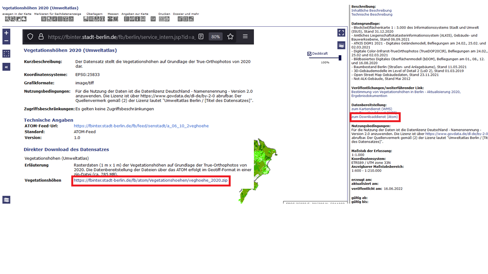

```{r setup, include=FALSE}
knitr::opts_chunk$set(echo = TRUE)
```

The [`{d6geodata}` package](https://github.com/EcoDynIZW/d6geodata) provides several functions for the members of the Ecological Department of the IZW. Some functions can be used without access to our resources such as *download_fisbroker_wfs* and *download_fisbroker_atom*.

```{r install, eval=3}
devtools::install_github("EcoDynIZW/d6geodata")
library(d6geodata)
```

Functions for all: 

- download_fisbroker_wfs
- download_fisbroker_atom

## The [fis-broker](https://fbinter.stadt-berlin.de/fb/index.jsp) database

The fisbroker database is a hosted by the Berlin Senate and provides several geodatasets. The file formats differ and some datasets have just one of the file formats to offer. The file formats are WMS (Web Media Service: Just like a png or jpg), WFS (Web Feature Service: Shapefiles) and ATOM (xml format: Raster layers data). This function is only looking for WFS files (Shapefiles), because these are the polygons, lines or points that we are looking for. 

For using these two functions you have to go to the  data base and select a layer you want to download. 

# image fis broker site

# image pop up window

## WFS

As an example we will download the berlin districts (*ALKIS Bezirke*) layer:


```{r example wfs}
library(dplyr)
library(ggplot2)

data_wfs <-
  d6geodata::download_fisbroker_wfs(link = "https://fbinter.stadt-berlin.de/fb/wfs/data/senstadt/s_wfs_alkis_bezirk")

data_wfs

ggplot() +
  geom_sf(data = data_wfs, aes(fill = namgem)) +
  rcartocolor::scale_fill_carto_d(palette = "Bold")
```

You got a spatial layer which you can save to disk or to use it directly.

## ATOM 

As an example we will download the vegetation heights (*Vegetationshöhen 2020 (Umweltatlas)*)



```{r example atom}
library(dplyr)
library(ggplot2)

data_atom <-
  d6geodata::download_fisbroker_atom(zip_link = "https://fbinter.stadt-berlin.de/fb/atom/Vegetationshoehen/veghoehe_2020.zip",
                                     path = "_posts/d6geodatapackage/man",
                                     name = "vegetation_heights")

data_atom

data_atom_10 <- terra::aggregate(data_atom, 10)

p_base_map <-
  ggplot2::ggplot() +
  stars::geom_stars(data = stars::st_as_stars(data_atom_10)) +
  ggplot2::coord_sf(expand = FALSE)

d6geodata::plot_quantitative_map(tif = data_atom_10, p_base_map = p_base_map)
```


Functions for internal use only:

- geo_overview
- get_geodata

If you want to get geodata we already have in our database you have two options: go on the EcoDyn Website, click on wikis and select geodata. There you'll find several raster layers and vector data with plots and metadata. In the metadata section, you'll find the folder_name. You can copy this and use this together with wth get_geodata function to get the data from our PopDynCloud. Another option is the function called get_overview. There you can select which data and from which location you want to have a list of data we have. 

```{r example geo_overview, eval=FALSE}
#d6geodata::geo_overview("C:/PopDynCloud")
```


Now you can nopy the name of one of the layers and paste it into the get_geodata function

```{r example get_geodata}
corine <-
  d6geodata::get_geodata(
    data_name = "corine_berlin_2015_20m_03035_tif",
    path_to_cloud = "C:/PopDynCloud",
    download_data = FALSE
  )
```

If you set download_data = TRUE the data will be download and copied to your data-raw folder. If the data-raw folder doesn't exist, it will create one.
