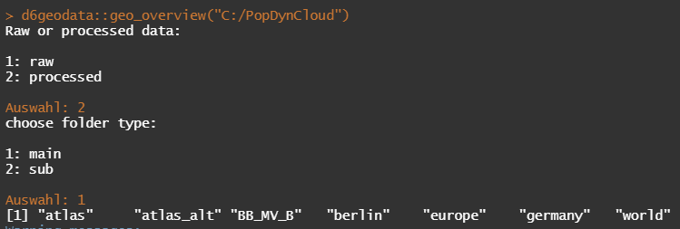
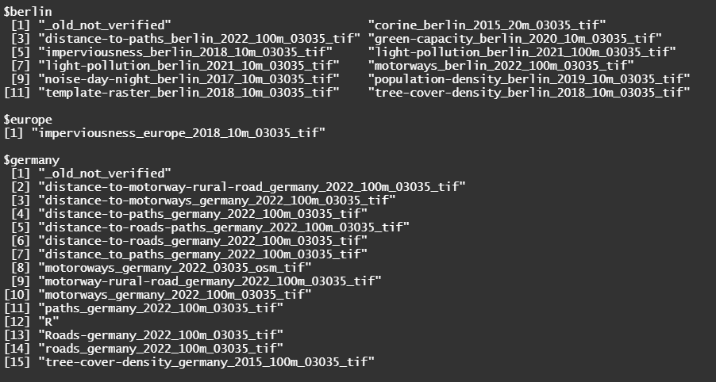

```{r setup, include=FALSE}
knitr::opts_chunk$set(echo = TRUE)
```

The [`{d6geodata}` package](https://github.com/EcoDynIZW/d6geodata) provides several functions for the members of the Ecological Department of the IZW.

```{r install, eval=3}
devtools::install_github("EcoDynIZW/d6geodata")
library(d6geodata)
```

Functions for internal use only:

- geo_overview
- get_geodata

If you want to get geodata we already have in our database you have two options: go on the EcoDyn Website, click on wikis and select geodata. There you'll find several raster layers and vector data with plots and metadata. In the metadata section, you'll find the folder_name. You can copy this and use this together with wth get_geodata function to get the data from our PopDynCloud. Another option is the function called get_overview. There you can select which data and from which location you want to have a list of data we have. 

```{r example geo_overview, eval=FALSE}
#d6geodata::geo_overview("C:/PopDynCloud")
```




Now you can nopy the name of one of the layers and paste it into the get_geodata function

```{r example get_geodata}
corine <-
  d6geodata::get_geodata(
    data_name = "corine_berlin_2015_20m_03035_tif",
    path_to_cloud = "E:/PopDynCloud",
    download_data = FALSE
  )
```

If you set download_data = TRUE the data will be download and copied to your data-raw folder. If the data-raw folder doesn't exist, it will create one.
