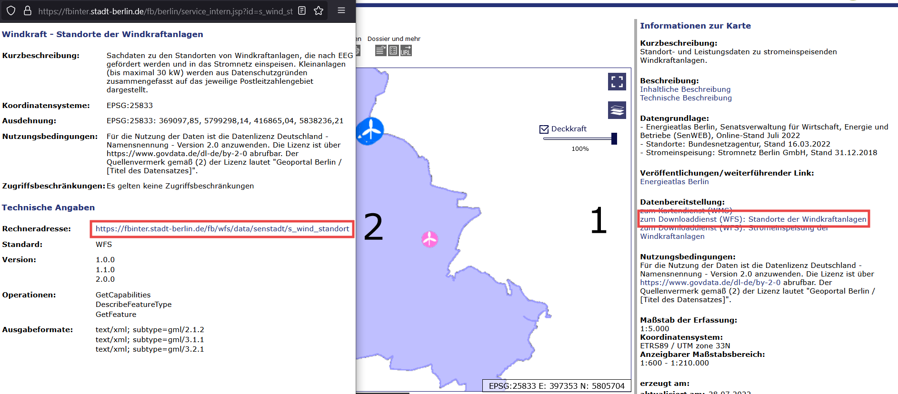

```{r setup, include=FALSE}
knitr::opts_chunk$set(echo = TRUE)
```

The [`{d6raster}` package](https://github.com/EcoDynIZW/d6raster) provides a function called download_fisbroker. The aim is to easily get the data from the fisbroker database by just copying the link for the download. If you have several links you can use an lapply and store them in a list.

## The fisbroker database

The fisbroker database is a hosted by the Berlin Senate and provides several geodatasets. The file formats differ and some datasets have just one of the file formats to offer. The file formats are WMS (Web Media Service: Just like a png or jpg), WFS (Web Feature Service: Shapefiles) and ATOM (xml format: Raster layers data). This function is only looking for WFS files (Shapefiles), because these are the polygons, lines or points that we are looking for. 

## Installation

You can install the `{d6raster}` package from GitHub:

```{r install, eval=3}
install.packages("devtools")
devtools::install_github("EcoDynIZW/d6raster")
library(d6raster)
```

(Note: If you are asked if you want to update other packages either press "No" (option 3) and continue or update the packages before running the install command again.)


## get a download link

Go the [Geoportal Berlin (FIS-Broker)](https://fbinter.stadt-berlin.de/fb/index.jsp) website and select one of the wfs layers you want to download. Click on the WFS hyperlink (1) and a popup-window will open. The "Rechneradresse" (2) is the download link we are looking for.



```{r example, layout="l-page"}
data_sf <- d6raster::download_fisbroker("https://fbinter.stadt-berlin.de/fb/wfs/data/senstadt/s_wind_standort")
```

```{r, echo=FALSE, layout="l-page"}
data_raster <- raster::rasterize(x = data_sf,
                                 y = raster::raster(
                                   crs = sf::st_crs(data_sf)$proj4string,
                                   ext = raster::extent(data_sf),
                                   resolution = 1000,
                                   vals = NA
                                 ),
                                 field = "inst_leistung")
```

## useage with lapply

After that you can just run "data_sf".

```{r example-data, layout="l-page"}
data_sf
```

If you want to download several datasets at one time you can just use lapply and a list of download links.

```{r example-lapply, layout="l-page"}
data_list <- list("https://fbinter.stadt-berlin.de/fb/wfs/data/senstadt/s_wind_standort",
                  "https://fbinter.stadt-berlin.de/fb/wfs/data/senstadt/sach_kleing") 
  
data_sf_list <- lapply(data_list, d6raster::download_fisbroker)
```

After that you can save them to disk or use them just within our script!

## a list of download links from the fisbroker that we probably used in the d6 Department

Note that some of the links may not work in the future because links can be changed or data gets outdated.

```{r, echo=FALSE, layout="l-page"}
df <- read.csv2("man/fis_broker_wfs_links.csv")[,c(1,2,4)]
```

```{r, echo=FALSE, layout="l-page"}
DT::datatable(df)
```

