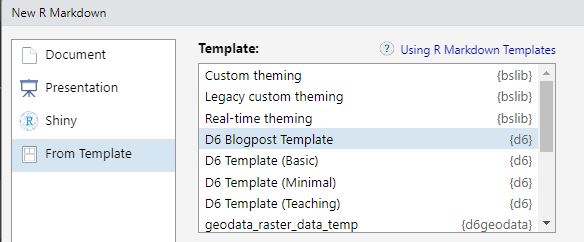

```{r setup, include=FALSE}
knitr::opts_chunk$set(echo = TRUE)
```

You have a nice piece of code? You have developed a cool package? You have something to share within (or even outside) our department?
  
You can share it with a blogpost on our [EcoDynIZW Website](https://ecodynizw.github.io) by following these simple steps!

## Create a Blogpost

### Step 0 --- Install the {d6} Package

  - If not yet installed, install the [`{d6}` package](https://github.com/ecodynizw/d6). It provides several functions for our department along with Rmarkdown templates, including the D6 blogpost template.
  
```{r, eval=FALSE}
# install.packages(remotes)
remotes::install_github("EcoDynIZW/d6")
```

### Step 1 --- Use the D6 Blogpost Template

  - In RStudio, navigate to `File > New File... > R Markdown...` .
  - In the `From Template` section, choose the **D6 Blogpost Template** from the list.
  
   
  
<aside>
If the template is not listed, please make sure that the latest version of `{d6}` is installed.
</aside>

### Step 2 --- Fill the YAML Header of the Script 

  - Fill in a proper name, please use uppercase for the name.   
  - Write a short description. Please have in mind that this description will appear on the blogpost listing page as well as in the post. Usually, we start these descriptions with *"Learn how to learn x to do y."*.
  - Add some categories that relate to your article. For examples, browse through other posts featured in the [wiki section of our web page](https://ecodynizw.github.io/coding.html).
  - Enter your name and the date of the post in the given format.
  
### Step 3 --- Add the Content

  - Describe briefly what you will show us and describe each chunk separately. 
  - Leave a line of space between text and chunk for separating text and chunk output.
  - Please use the chunk options to name chunks, hide them or ignore them in the knitting process. This will help later to find possible errors.
  
### Step 4 --- Render the Blogpost

  - Knit the post and check if the knitted document looks as desired.

### Step 5 --- Review Process

  - [Send the Rmd file to the data manager](mailto:wenzler@izw-berlin.de) for review.
  - Wait for feedback by the data manager. If changes are requested, update the article accordingly and send the corrected script.

### Step 6 --- Published!
  
  - The data manager will publish your post as soon as possible on the website.

## General Tips for Posting

- Please use the spell check before knitting and pushing the post.

- Please check if the code is running (in a reasonable time) as we have to rebuild the page from time to time.

- Use styling like \`plot()\` for function names in the text and \`{pckg}\` package names.

- Pick examples that are simple enough in terms of file size and performance so that they can be easily reproduced within the script.

- Make sure that your code can be run by anybody reading the post. If you need data inputs, generate made-up data examples, use data sets from packages, or link to the data source (make sure it is publicly available as readers are not necessarily part of the department!)
