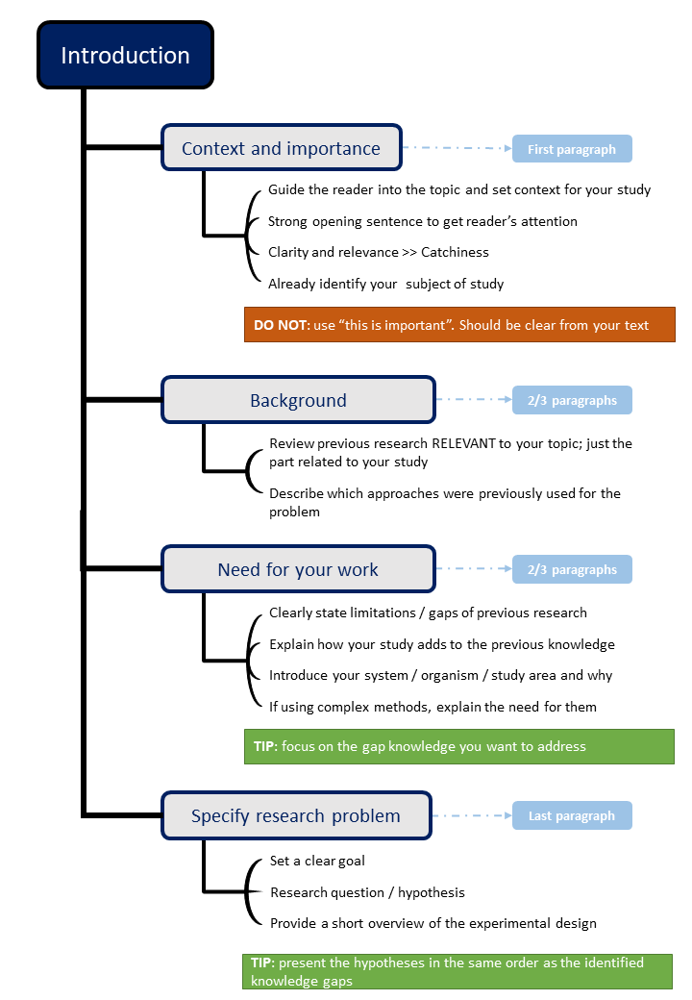
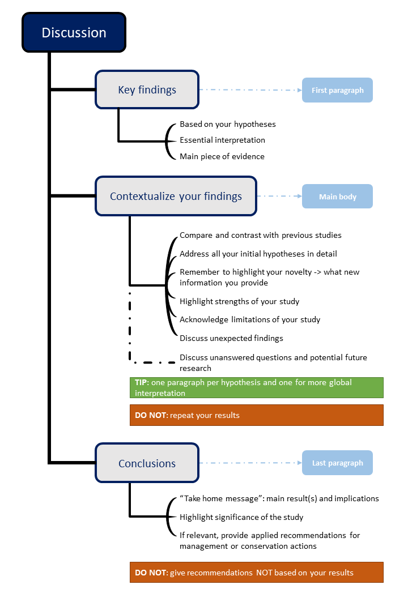

```{r setup, include=FALSE}
knitr::opts_chunk$set(echo = TRUE) ## keep this, add other settings if needed
```

{width=40%}
{width=40%}

[Introduction](https://github.com/EcoDynIZW/EcoDynIZW.github.io/raw/main/_posts/scientificwritingtips/man/Introduction_str.pdf) [Discussion](https://github.com/EcoDynIZW/EcoDynIZW.github.io/raw/main/_posts/scientificwritingtips/man/Discussion_str.pdf)


<ul class="card-wrapper">
  <li class="card-repo">
    
    <h3>Introduction Structure</h3>
    <p> </p><p>
    [link to pdf](https://github.com/EcoDynIZW/EcoDynIZW.github.io/raw/main/_posts/scientificwritingtips/man/Introduction_str.pdf)</a> 
    </p>
  </li>


](man/ResponseLetter.pdf)


