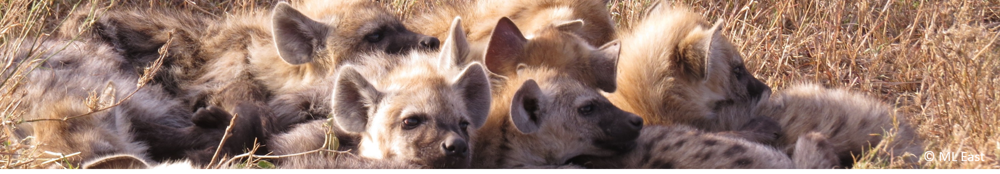
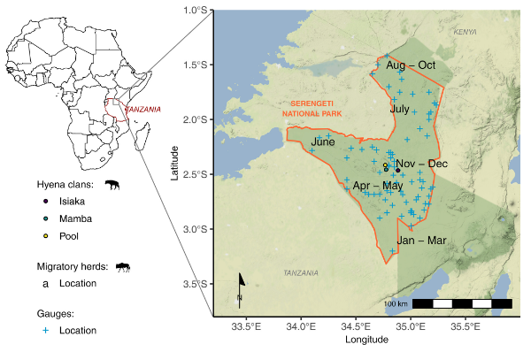
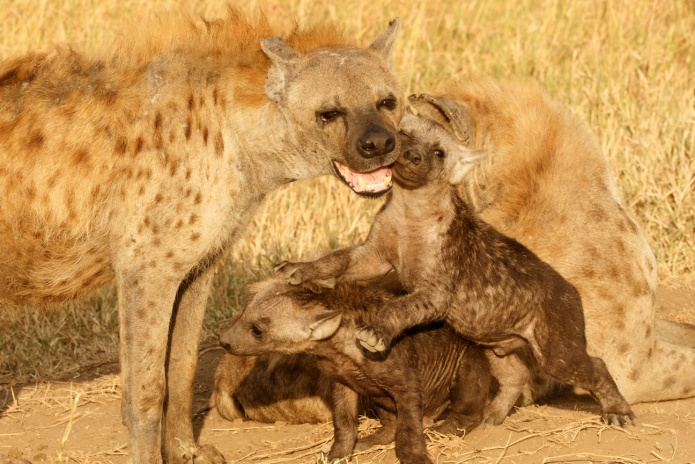
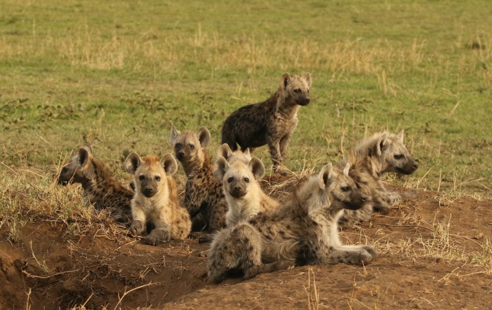
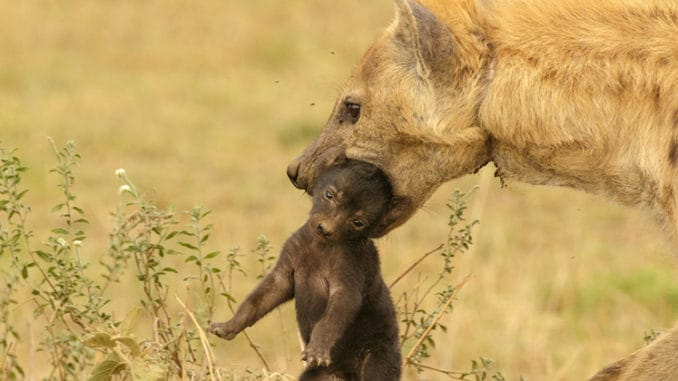
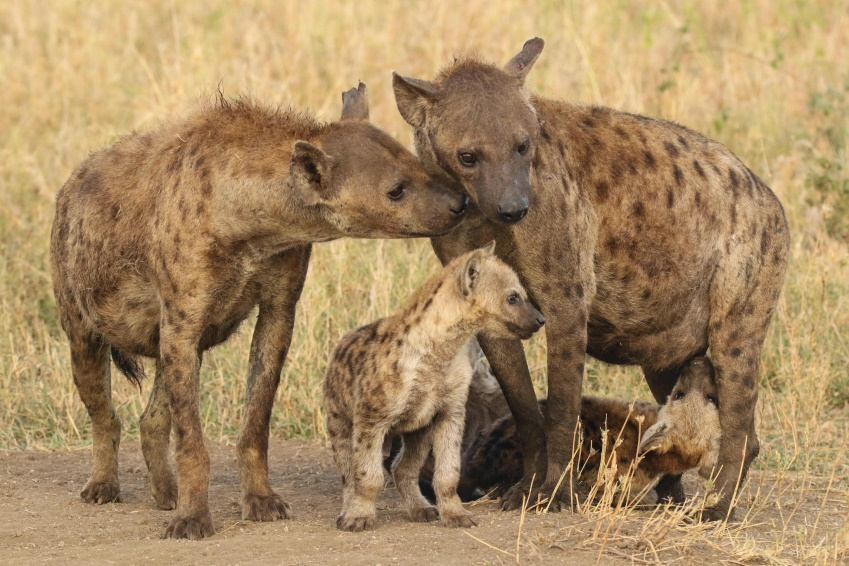

```{r setup, include=FALSE}
knitr::opts_chunk$set(echo = FALSE)
```

```{r, layout="l-screen-inset"}

```

<div class='highlightbox'>
  <span class='highlight'>
  Welcome! We study the behaviour, ecology and health of three clans of spotted hyenas (Crocuta crocuta) in the Serengeti National Park in Tanzania since 1987. We are currently interested in the impact of early life conditions, infections and human activities on individual performance and fitness at all life stages. With our collaborators we also study the role of epigenetic mechanisms in mediating the effects of the social environment on life history trade-offs, hormones and immunity, and the demographic consequences of disturbances. Our interdisciplinary research applies non-invasive or minimally invasive methods and to further this aim we have developed and verified several faecal assays for spotted hyenas. 
  </span>
</div>


<small>
<ul>*Figure: M. Gicquel (from Gicquel et al. 2022 Ecosphere, https://doi.org/10.1002/ecs2.4012)*</ul>
</small>

**Why are spotted hyenas so interesting to study?**</br>
This highly social mammal has several unusual traits: female social dominance, an erectile ‘pseudopenis’ in females (similar to that of the male penis), an exceptionally long lactation period and intense sibling competing. It is a keystone carnivore in the ecosystem, which both hunts and scavenges. All these aspects make hyenas an interesting model species to study social behaviour, sexual conflict, maternal effects, host-pathogen interactions, immunology or endocrinology. 
Our study population experiences extreme and unpredictable fluctuations in prey abundance throughout the year, because of the migratory movements of its main prey (wildebeest, zebras and Thompson’s gazelles) and the low abundance of resident herbivores. We discovered that Serengeti hyenas solve this problem by commuting long distances to forage throughout the year. Individuals leave their clan territory and travel to areas up to 70 km to locate areas with large aggregations of migratory herbivores where they feed before returning to their clan territory. In the context of global change, the commuting system of Serengeti hyenas is particularly valuable to study how animals cope with a variable and uncertain resource. 
Unfortunately, commuting hyenas in the Serengeti can get killed by wire snares set illegally by  bushmeat hunters along some borders of the Park or victims of road accidents.These anthropogenic threats are likely to intensify with the expected increases in local human populations and traffic volume associated with tourism. Changes in rainfall patterns driven by global warming may also have cascading effects on this large slow-reproducing mammal.


# Running Projects

<div class='headerbox'><hbox>Behavioural Ecology, Ecology, and Demography</hbox></div>


<div class='headerbox-secondary'><hbox-secondary>Ecological, social and maternal effects on individual performance, population dynamics and resilience></div>

**Current team & collaborators: Morgane Gicquel (PhD candidate), Dagmar Thierer, Stephan Karl, Sonja Metzger, Sarah Benhaiem, Marion L. East, Heribert Hofer, Viktoriia Radchuk (Dept. 6, IZW), Oliver Höner (Dept. 1, IZW), Adam Clark (University of Graz), Stephanie Kramer-Schadt (Dept. 6, IZW)**

{width=50%}
<small>
<ul>*Picture: Sonja Metzger*</ul>
</small>

We investigate how ecological and social conditions (e.g. rainfall, maternal rank, litter size), behaviours (e.g. infanticides), and disturbances (e.g. epidemics, droughts) influence the reproductive performance and survival prospects of spotted hyenas at different life stages, and their demographic resilience.

<small>
  <b>Key Publications:</b>
  <ul>
    <li>[Benhaiem et al. Commun Biol 1, 201 (2018)](https://www.nature.com/articles/s42003-018-0197-1)</li>
    <li>[Benhaiem et al. (2018) Front. Vet. Sci. 5:197.](https://www.frontiersin.org/articles/10.3389/fvets.2018.00197/full)</li>
    <li>[East et al. (2022). Front. Ecol. Evol. 10:860854.](https://www.frontiersin.org/articles/10.3389/fevo.2022.860854/full)</li>
    <li>[Gicquel et al. (2022). Journal of Animal Ecology, 00, 1– 13.](https://besjournals.onlinelibrary.wiley.com/doi/10.1111/1365-2656.13785)</li>
     <li>[Marescot et al. (2018). FUNC ECOL 32, 1237-1250.](https://besjournals.onlinelibrary.wiley.com/doi/10.1111/1365-2435.13059)</li>
   </ul>
</small>


<div class='headerbox'><hbox>Disease ecology</hbox></div>


<div class='headerbox-secondary'><hbox-secondary>Disease ecology: consequences of infections on allostatic load and fitness></div>

**Current team & collaborators: Miguel Veiga (PhD candidate), Susana Soares (PhD candidate), Dagmar Thierer, Stephan Karl, Sonja Metzger, Joshua Dalijono (student helper), Marion L. East, Heribert Hofer, Gábor Á. Czirják (Dept. 3, IZW), Sarah Benhaiem, Jella Wauters (Dept. 4, IZW)**

{width=50%}
<small>
<ul>*Picture: Sonja Metzger*</ul>
</small>

We investigate the interactions between spotted hyenas and their pathogens, including their gastrointestinal parasitic community and viruses. We are particularly interested in the causes and consequences of infections in individuals, immunosenescence and the interactions between allostatic load (“stress”), immunity and infections.

<small>
  <b>Key Publications:</b>
  <ul>
    <li>[Davidian et al. (2015). METHODS ECOL EVOL 6, 576-583.](https://besjournals.onlinelibrary.wiley.com/doi/10.1111/2041-210X.12338)</li>
    <li>[Ferreira et al. (2019). ECOL EVOL 9, 8783-8799.](https://onlinelibrary.wiley.com/doi/pdf/10.1002/ece3.5431)</li>
    <li>[Ferreira et al. (2021). ECOL EVOL 11, 7685-7699.](https://onlinelibrary.wiley.com/doi/10.1002/ece3.7602)</li>
    <li>[Marescot et al. (2021). J ANIM ECOL 9,2523-2535.](https://besjournals.onlinelibrary.wiley.com/doi/10.1111/1365-2656.13555)</li>
     <li>[Olarte‐Castillo et al. (2021). MOL ECOL.](https://onlinelibrary.wiley.com/doi/10.1111/mec.15910)</li>
   </ul>
</small>


<div class='headerbox'><hbox>Conservation</hbox></div>


<div class='headerbox-secondary'><hbox-secondary>Human-wildlife conflicts & climate change in the Serengeti></div>

**Current team & collaborators: Marwan Naciri (former MSc student), Montan Kalyahe (PhD candidate), Morgane Gicquel (PhD candidate), Dagmar Thierer, Stephan Karl, Sonja Metzger, Sarah Benhaiem, Marion L. East, Heribert Hofer, Aimara Planillo (Dept. 6, IZW), Sarah Cubaynes (CEFE, Montpellier)**

{width=50%}
<small>
<ul>*Picture: Sonja Metzger*</ul>
</small>

We are interested in assessing the effects of illegal bushmeat hunting (snaring), roadkills, changes in rainfall patterns driven by global warming on spotted hyenas. We also investigate the factors that influence the likelihood of predation on livestock and consumption of discarded livestock ‘waste’. 

<small>
  <b>Key Publications:</b>
  <ul>
    <li>[Benhaiem et al. (2022). ANIM CONSERV.](https://zslpublications.onlinelibrary.wiley.com/doi/10.1111/acv.12798)</li>
    <li>[Gicquel et al. (2022). ECOSPHERE 13, e4012.](https://esajournals.onlinelibrary.wiley.com/doi/10.1002/ecs2.4012)</li>
    <li>[Kalyahe et al. (2022). ENVIRON CONSERV 49, 105-113.](https://www.cambridge.org/core/journals/environmental-conservation/article/do-anthropogenic-sources-of-food-increase-livestock-predation-in-the-area-surrounding-ruaha-national-park/A8A65281F07BF90B84300A7C74AE58DE)</li>
    <li>[Naciri et al. Under review.]()</li>
   </ul>
</small>


<div class='headerbox'><hbox>Social Epigenetics</hbox></div>


<div class='headerbox-secondary'><hbox-secondary>Epigenetic stability and plasticity of social environmental effects></div>

**Current team & collaborators: Alexandra Weyrich (Dept. 2, IZW, PI), Colin Vullioud (Dept. 2, IZW), Jörns Fickel (Dept. 2, IZW), Lena Ruf (Dept. 2, IZW), Nick Mewes (Dept. 2, IZW), Sarah Benhaiem, Marion L. East, Heribert Hofer, Gábor Á. Czirják (Dept. 2, IZW), Emmanuel Heitlinger (Humboldt University), Jerzy Adamski (Helmholtz-Center Munich), Alexander Cecil (Helmholtz-Center Munich), Moshe Szyf (McGill University), Yoav Soen (Weizmann Institute of Science)**

{width=50%}
<small>
<ul>*Picture: Sonja Metzger*</ul>
</small>

We investigate if DNA methylation is a main mechanism through which an individual’s social environment regulates gene expression and physiological responses. We hypothesize that changes in social status will led to changes in epigenetic patterns. To test our hypotheses, we study the DNA methylation patterns in the spotted hyena.

<small>
  <b>Key Publications:</b>
  <ul>
    <li>[Guerrero et al. (2020). CURR  ZOOL, zoaa005.](https://pubmed.ncbi.nlm.nih.gov/32440291/)</li>
    <li>[Heitlinger et al. (2017). FRONT. CELL. INFECT. MICROBIOL. 7, 262.](https://www.frontiersin.org/articles/10.3389/fcimb.2017.00262/full)</li>
   </ul>
</small>


```{r, layout="l-screen"}
knitr::include_graphics("img/meckpom-csf-inferno-cut-bottom.png")
```
