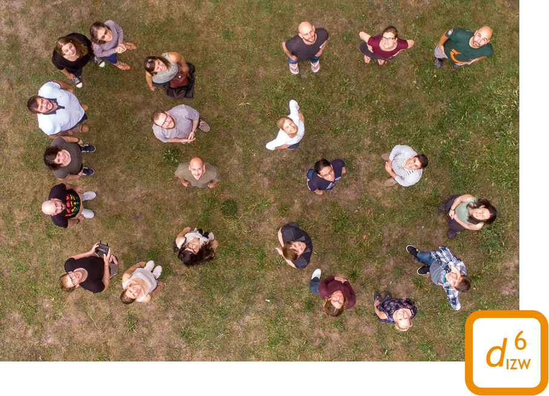

```{r setup, include=FALSE}
knitr::opts_chunk$set(echo = FALSE)
```



<div class='highlightbox'>
  <span class='highlight'>
  We are scientists of the Department of Ecological Dynamics at the Leibniz Institute for Zoo and Wildlife Research, Berlin, Germany. Our research is focused on understanding ecological dynamics in space and time, at different levels of organisation, from individuals to communities, and across gradients of human altered environments. We investigate how fitness consequences of processes acting at the individual level, such as social behaviour or movements, competition, predator-prey or host-pathogen interactions, shape population and community dynamics, also at evolutionary scales.</span>
</div>

### How to contact us?

Email: <a href="mailto:assist6@izw-berlin.de">assist6[at]izw-berlin.de</a>  

**Address:**  
Leibniz Institute for Zoo and Wildlife Research  
Department of Ecological Dynamics  
Alfred-Kowalke-Str. 17  
D-10315 Berlin, Germany  

<br>

```{r, layout="l-screen-inset shaded"}
library(leaflet)
leaflet() %>%
  setView(lng = 13.5211, lat = 52.5062, zoom = 14) %>% 
  #addTiles() %>%  # Add default OpenStreetMap map tiles
  addProviderTiles(providers$CartoDB.Voyager, group = "Default Map") %>%
  addProviderTiles(providers$Stadia.StamenTerrain, group = "Terrain Map") %>% 
  addProviderTiles(providers$CartoDB.DarkMatter, group = "Dark Map") %>%
  addTiles(group = "OpenStreetMap") %>% 
  addPopups(lng = 13.521167153974313, lat = 52.506286189883994, 
            popup = "<b>Leibniz Institute for<br>Zoo and Wildlife Research</b>",
            options = popupOptions(closeButton = FALSE)) %>%
  # Layers control
  addLayersControl(
    baseGroups = c("Default Map", "Terrain Map", "Dark Map", "OpenStreetMap"),
    options = layersControlOptions(collapsed = FALSE)
  )
```

<br><br>