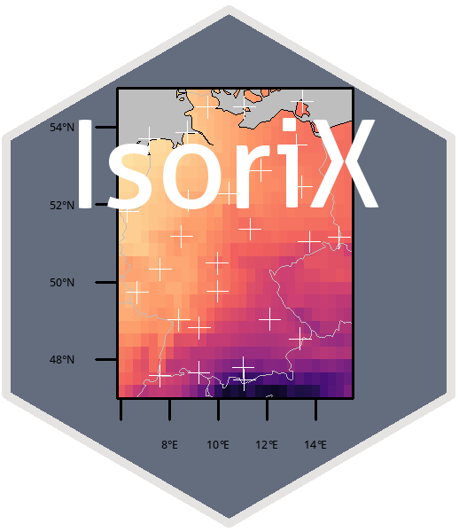
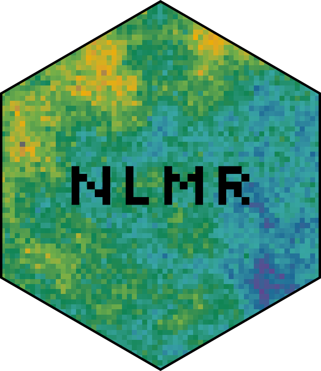
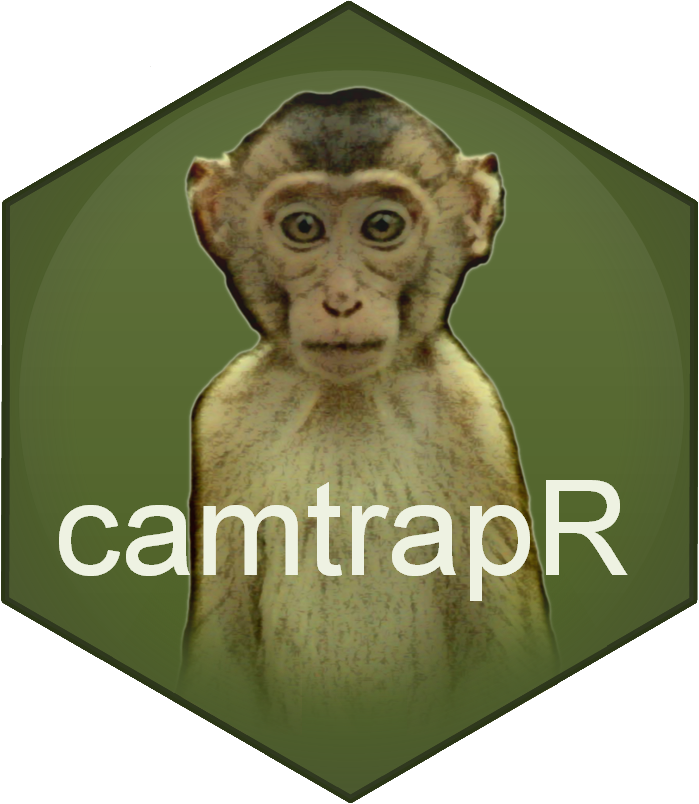
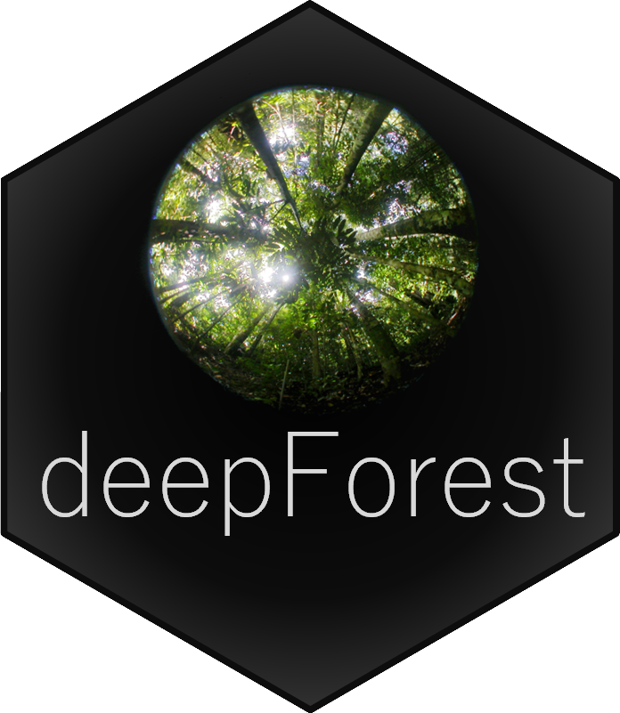

```{r, echo = FALSE}
knitr::opts_chunk$set(echo = FALSE)
```

**R-packages and tools**

[{width=27%}](https://cran.r-project.org/web/packages/IsoriX/index.html) [{width=25%}](https://cran.r-project.org/web/packages/NLMR/index.html) [{width=25%}](https://cran.r-project.org/web/packages/camtrapR/index.html)
{width=39%} {width=39%} 

[IsoriX](https://cran.r-project.org/web/packages/IsoriX/index.html): Isoscape Computation and Inference of Spatial Origins using Mixed Models; learn about IsoriX [here](https://bookdown.org/content/782/).

[camtrapR](https://cran.r-project.org/web/packages/camtrapR/index.html): Camera Trap Data Management and Preparation of Occupancy and Spatial Capture-Recapture Analyses 

contributing to [NLMR](https://cran.r-project.org/web/packages/NLMR/index.html): Simulating neutral landscape models 

Cedric’s great ggplot2 graphics guide [here](https://cedricscherer.netlify.com/2019/08/05/a-ggplot2-tutorial-for-beautiful-plotting-in-r/) 

<b style='color:orange;'>
**Find codes to our published papers and helpful material in our repositories
at [github](https://github.com/EcoDynIZW)**:  or at Zenodo/ Computational Model Library CoMSES, e.g.:
</b>

Kürschner et al. 2021 ECOL EVOL: [https://doi.org/10.5281/zenodo.4593791](https://doi.org/10.5281/zenodo.4593791)

Scherer et al 2020 OIKOS: [https://doi.org/10.5281/zenodo.3387444](https://doi.org/10.5281/zenodo.3387444); CoMSES Computational Model Library. Retrieved from: [https://www.comses.net/codebases/82f2b53e-ae0e-4ac0-9e06-d541ecb4d1b6/releases/1.0.0/](https://www.comses.net/codebases/82f2b53e-ae0e-4ac0-9e06-d541ecb4d1b6/releases/1.0.0/)

Dalleau et al. 2019 ECOL EVOL, CoMSES Computational Model Library. Retrieved from: [https://www.comses.net/codebases/69863caa-2f8e-4412-a564-a2826d9d38d3/releases/1.0.0/](https://www.comses.net/codebases/69863caa-2f8e-4412-a564-a2826d9d38d3/releases/1.0.0/)

Radchuk et al. 2016 Ecology: [https://www.comses.net/codebases/4b484186-d8fb-4307-a710-fc05daa36afa/releases/1.0.0/](https://www.comses.net/codebases/4b484186-d8fb-4307-a710-fc05daa36afa/releases/1.0.0/)

**Field techniques**

- Behavioural observations, experiments and analysis
- Non-invasive physiological and genetic techniques
- High-resolution telemetry and movement analysis
- Camera trapping

**Lab methods**

- Paternity analyses
- Molecular population genetics and DNA metabarcoding
- NGS

**Computational Ecology**

- Biostatistical modelling
- Geographic Information Systems (GIS) and remote sensing (using high resolution satellite images)
- Spatial statistics and species distribution modelling (occupancy and spatially-explicit capture-mark-recapture)
- Social network dynamics and network modeling
- Analysis of long-term longitudinal data
- Hidden Markov (Multi-event-Capture-Mark-Recapture) modelling
- Matrix population modeling
- Individual-based, spatially-explicit modelling 
