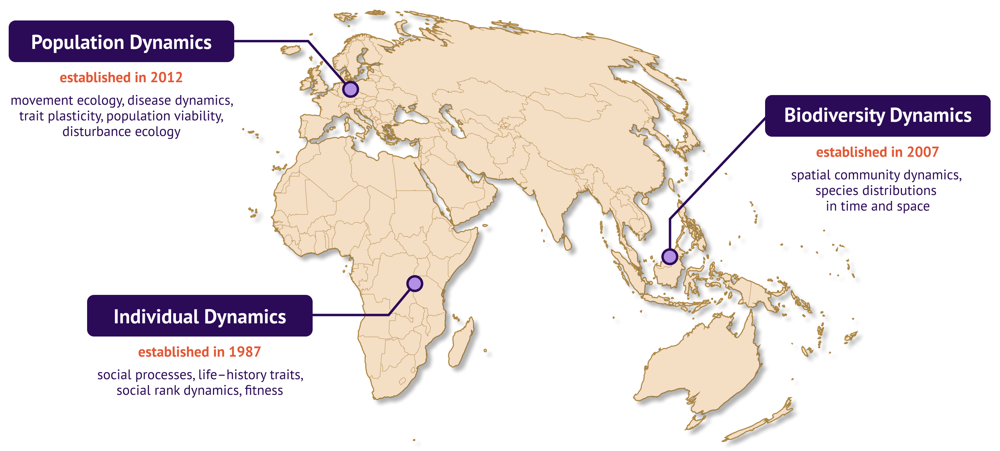

```{r setup, include=FALSE}
knitr::opts_chunk$set(echo = FALSE)
```

# Welcome to D6!

We are scientists of the Department of Ecological Dynamics at the [Leibniz Institute for Zoo and Wildlife Research in Berlin](https://www.izw-berlin.de/en/home.html), Germany. Our research is focused on understanding ecological dynamics in space and time, at different levels of organisation, from individuals to communities, and across gradients of human altered environments. We investigate how fitness consequences of processes acting at the individual level, such as social behaviour or movements, competition, predator-prey or host-pathogen interactions, shape population and community dynamics, also at evolutionary scales.

<ul class="card-wrapper">
  <li class="card">
## Our Vision

<div class="card-content">Our ultimate goal is to predict the **future viability of wildlife populations, species, and communities** faced with accelerating environmental change in the anthropocene and to improve landscape scale planning for conservation.</div>
  </li>
  
  <li class="card">

## Our Mission
<div class="card-content">We advance theory and concepts in ecology and evolution as well as the use of computational toolkits by developing and using a wide range of modern field and lab techniques and dynamic and simulation modeling.</div>
  </li>
  
  <li class="card">
## Our Teams

<div class="card-content">We are organized in three teams spanning all levels from [individuals](https://ecodynizw.github.io/team-individual.html) to [populations](https://ecodynizw.github.io/team-population.html) to [communities](https://ecodynizw.github.io/team-biodiversity.html). Check out the three team pages for an overview of our current projects, group activities, and our latest publications!</div>
  </li>
</ul>

```{r, layout="l-screen"}

```

Get an overview of our teams, field sites and research themes.

```{r, out.extra='style="background-color: #efefef; padding:5px; display: inline-block;"'}

```

### Contributions to R Packages

- [d6](https://github.com/EcoDynIZW/d6): Simplify workflows at our department
- [d6berlin](https://github.com/EcoDynIZW/d6berlin): Template maps for Berlin
- [camtrapR](https://github.com/jniedballa/camtrapR): Manage camera trap data in R
- [NLMR](https://github.com/ropensci/NLMR): Simulate neutral landscape models
- [Isorix](https://github.com/courtiol/IsoriX): Building isoscapes and inferring geographic origins on isotopic ratios
- [imageseg](https://github.com/EcoDynIZW/imageseg): Deep learning image segmentation

<br> 

```{r, layout="l-screen"}

```

## Address {.appendix}

Leibniz Institute for Zoo and Wildlife Research  
Department of Ecological Dynamics  
Alfred-Kowalke-Str. 17  
D-10315 Berlin, Germany

```{r, layout="l-screen-inset shaded"}
library(leaflet)
leaflet() %>%
  setView(lng = 13.5211, lat = 52.5062, zoom = 04) %>% 
  addProviderTiles(providers$CartoDB.Voyager, group = "Default Map") %>%
  addProviderTiles(providers$Stamen.Terrain, group = "Terrain Map") %>% 
  addProviderTiles(providers$CartoDB.DarkMatter, group = "Dark Map") %>%
  addTiles(group = "OpenStreetMap") %>% 
  addPopups(lng = 13.521167153974313, lat = 52.506286189883994, 
            popup = "<b>Leibniz Institute for<br>Zoo and Wildlife Research</b>",
            options = popupOptions(closeButton = FALSE)) %>%
  # Layers control
  addLayersControl(
    baseGroups = c("Default Map", "Terrain Map", "Dark Map", "OpenStreetMap"),
    options = layersControlOptions(collapsed = TRUE)
  )
```

<br> 

## Contact {.appendix}

Department Lead: Prof. Dr. S. Kramer-Schadt  
Deputy Lead: Dr. Andreas Wilting  
Coordination: Dr. Conny Landgraf  
<a href="mailto:assist6@izw-berlin.de">assist6[at]izw-berlin.de</a>