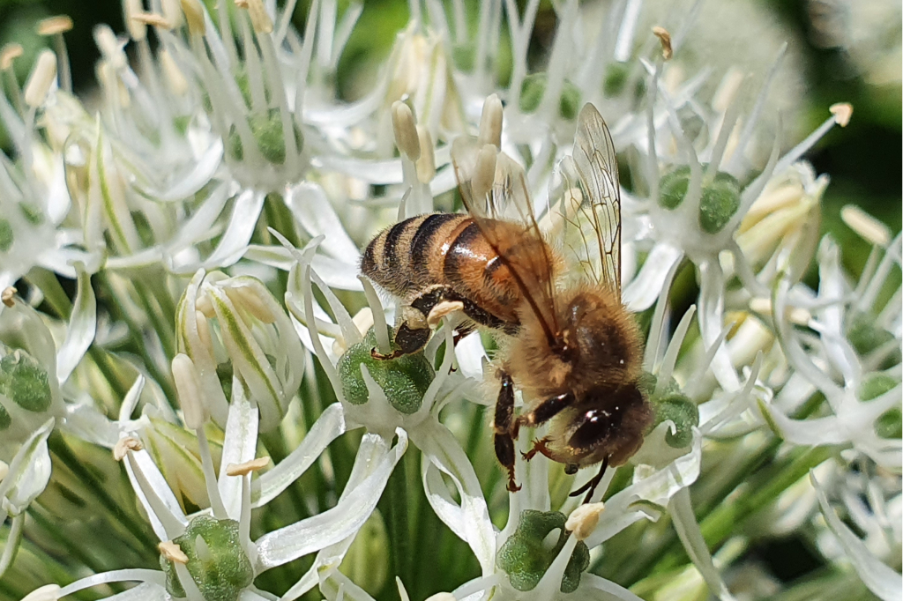
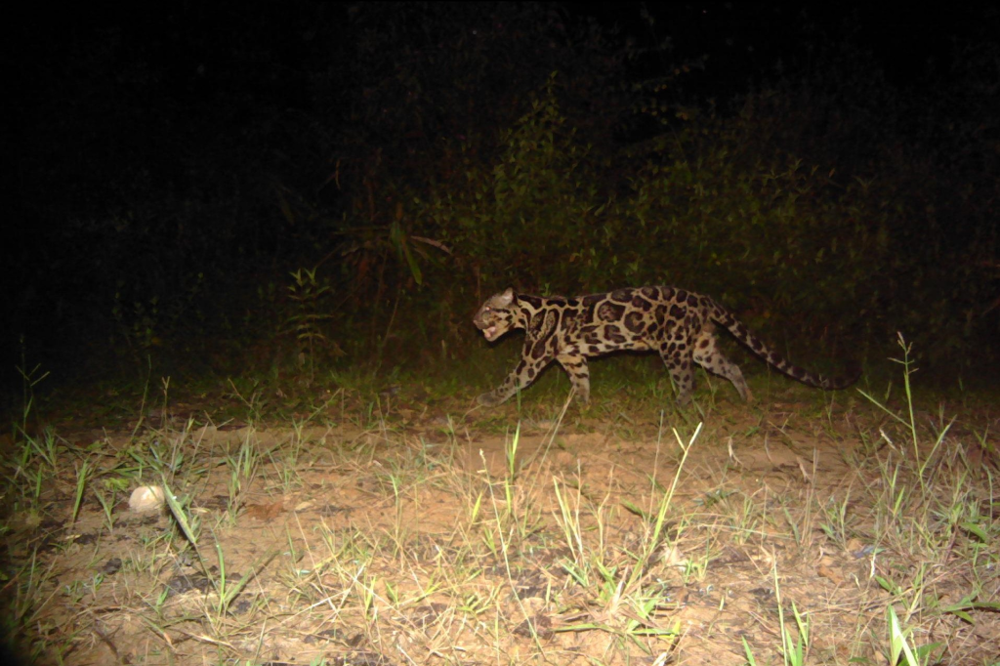

**2022**

{width=32.5%}
{width=32.5%}
{width=32.5%}
{width=32.5%}
{width=32.5%}
{width=32.5%}

* Pilot study for the use of tick surveys and blood meal analysis to monitor wildlife populations and disease risk in the Southern Black Forest. **Sarah Evelyn Hollis.** 18.11.2022. MSc. Albert-Ludwigs-Universität Freiburg , Faculty of Environmental and Natural Sciences. Supervision: Prof. Dr. Gernot Segelbacher (ALUF), S Kramer-Schadt.

* Retracing the wolf colonization of Germany using an individual-based model. **Paul Ritter.** 19.10.2022. BSc. Rheinische Friedrich-Wilhelms-Universität Bonn, Geographisches Institut. Supervision: Prof. Dr. Jürgen Löffler (UB), S Kramer-Schadt, Cedric Scherer, Aimara Planillo (all IZW).

* Controlled habitat degradation as a mitigation measure for interventions in habitats of Lacerta agilis. **Magdalena Sophia Engl.** 16.10.2022. MSc. TU Berlin. Urban Ecosystem Sciences. Supervision: S Kramer-Schadt, PD Dr. M.-O. Rödel (MfN).

* Einfluss von Witterungsbedingungen auf den Nachweis von Zauneidechsen (*Lacerta agilis*) in Berlin und Brandenburg. **Maximilian Schwenke** 18.07.2022. BSc. TU Berlin. Ecology and Environmental Planning. Supervision: S Kramer-Schadt, M von der Lippe (TUB).

* Evaluating the effects of blackberry (*Rubus niveus*) abundance on land bird diversity on Santiago Island, Galapagos. **Mateo Reyes.** 23.05.2022. BSc. TU Berlin. Ecology and Environmental Planning. Supervision: S Kramer-Schadt, M von der Lippe (TUB).

* Zur Verbreitung des Rotfuchses (*Vulpes vulpes*) in deutschen Nationalparken auf Grundlage von Kamerafallendaten. **Clara Heinrich.** 20.05.2022. BSc. TU Berlin. Ecology and Environmental Planning. Supervision: S Kramer-Schadt, C Fiderer (ALUF).

* Wildtiere in deutschen Großstädten: ein Vergleich zwischen Medienpräsenz und Wahrnehmung von Stadtbewohnern. **Henry Karsch.** 15.05.2022. MSc. FU Berlin. Fachbereich Biologie/Chemie/Pharmazie. Supervision: J Jeschke (FU), T Straka (TUB), S Kramer-Schadt

* Social status driven epigenetic differences in female spotted hyenas in the Serengeti National Park. **Nick Mewes.** 14.06.2022. MSc. Universität Potsdam. Ecology, Evolution and Conservation. Supervision: A Weyrich, S Benhaiem

* Birds in the city: understanding direct and indirect effects of human disturbance and vegetation structure on functional diversity in Berlin. **Estelle Solem.** 06.04.2022. BSc. Humboldt Universität zu Berlin. Geographie. Supervision: T Kümmerle (HU), A Planillo, S Kramer-Schadt

* Differential DNA methylation between dominant and subordinate spotted hyena twins. **Lena Ruf.** 05.04.2022. MSc. University of Potsdam. Ecology, Evolution and Conservation. Supervision: A Weyrich, S Benhaiem, J Fickel (UP)

* Urban planning for animals and humans: An empirical investigation of planning approaches and their perception by Berlin citizens. **Lisa Jäger.** 23.02.2022. MSc. TU Berlin. Ecology and Environmental Planning. Supervision: T Straka (TUB), S Kramer-Schadt

* Einfluss einer Unterrichtseinheit über Wildbienen auf die Einstellungen, die Emotionen und das Wissen von Schülern. **Sarah Festl.** 25.02.2022. BSc. TU Berlin. Ecology and Environmental Planning. Supervision: T Straka (TUB), S Kramer-Schadt

* Spatial use and population development of the Eurasian otter *Lutra lutra* in Sielmanns Naturlandschaft Groß Schauen and the state of Brandenburg. **Yvonne Rychlak.** 02.02.2022. MSc. Ecology, Evolution and Nature Conservation. University of Potsdam. Supervision: N Blaum (UP), S Kramer-Schadt.

