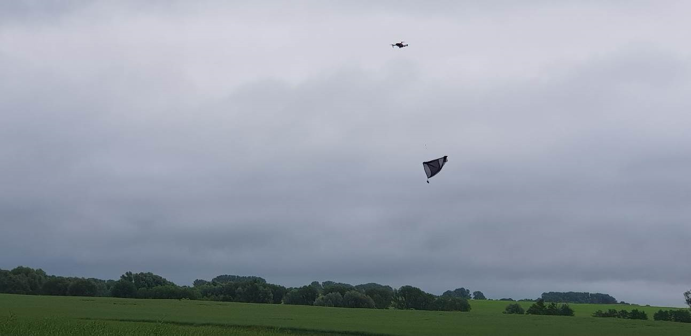

(contact <a href="mailto:wiebke.ullmann@uni-potsdam.de">wiebke.ullmann[at]uni-potsdam.de</a> or <a href="mailto:kramer@izw-berlin.de">kramer[at]izw-berlin.de</a>)

**Short Abstract:** 
Die reduzierte Abundanz und Diversität von Insekten bedeutet eine Verringerung der Nahrungsverfügbarkeit für insektivore Räuber. Dadurch steigt die Konkurrenz zwischen Arten welche sich von ähnlichen Insekten ernähren. Dies kann zum Konkurrenzausschlussprinzip und somit zum Verlust von Biodiversität führen. Um die Auswirkungen des Insektensterbens auf das Konkurrenzverhalten insektivorer Tierarten zu bestimmen, wollen wir Rauch- und Mehlschwalben in insektenarmen Agrarlandschaften besendern und die Bewegungen der Tiere mit der lokalen Abundanz und Diversität der Insekten in Zusammenhang bringen. Da die fliegenden Insektivoren jedoch in unterschiedlichen Flughöhen ihre Beute jagen, müssen die Insekten in unterschiedlichen Luftschichten gefangen werden. Dazu wollen wir eine Drohne mit einem Insektenfangnetz ausstatten. Die insektenfangende Drohne soll dann in unterschiedlichen Luftschichten mit dem Netz fliegen und Insekten fangen. Mit dieser Methode wollen wir die Insektendiversität und –abundanz in den unterschiedlichen Luftschichten quantifizieren und diese mit den Flugpfaden der Schwalben korrelieren. Gleichzeitig soll ein Vergleich verschiedener Insektenfangmethoden unternommen werden: Befinden sich die gleichen Insekten im Netz der Drohne wie in der Malaisefalle?

{width=30%}

**Freilanduntersuchungen und Laborarbeit:**
-	Erstellen einer Arbeitsroutine zum Abfliegen verschiedener Luftschichten mit Drohnen und Insektenfangnetzen
-	Durchführung des Insektenfangs an verschiedenen Orten im Untersuchungsgebiet
-	Hilfe bei der Ausstattung der Drohne mit dem Fangnetz
-	Insektenbestimmung und Quantifizierung, der mit den Drohnen und den Malaisefallen gefangenen Insekten (möglichst bis zur Familie)

**Untersuchungsgebiet/Zeitraum:**
Die Masterarbeit beginnt im März 2023 mit den Vorbereitungen (Annerkennung als Vertiefungsmodul möglich). Im Mai 2023 und Juni/Juli 2023 werden für jeweils ca. eine Woche täglich Insektenfänge durchgeführt. Das Untersuchungsgebiet befindet sich in der Nordwestuckermark (ca. 15km westlich von Prenzlau). In der ZALF-Forschungsstation in Dedelow stehen Zimmer als Unterkunftsmöglichkeit bereit. 

**Voraussetzungen**
Führerschein Klasse B, selbständige Arbeit im Feld und im Team mit Masterstudenten, HiWis und Praktikanten, Drohnenführerschein von Vorteil

**Kontakt:**
Wiebke Ullmann			 
Universität Potsdam, Vegetationsökolgie & Naturschutz          
Am Mühlenberg 3, 14476 Potsdam         
[Ullmann](wiebke.ullmann@uni-potsdam.de)	
Tel.: 01715453029

Prof. Dr. Stephanie Kramer-Schadt
Leibniz-Institute für Zoo- und Wild-tierforschung
Alfred-Kowalke-Str. 17, 10315 Berlin
[Kramer-Schadt](kramer@izw-berlin.de)

