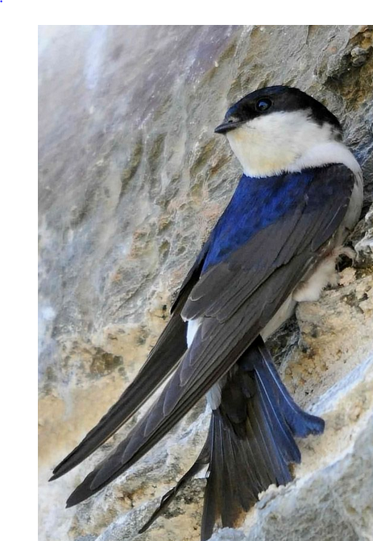

  
  (contact <a href="mailto:wiebke.ullmann@uni-potsdam.de">wiebke.ullmann[at]uni-potsdam.de</a> or <a href="mailto:kramer@izw-berlin.de">kramer[at]izw-berlin.de</a>)

**Short Abstract:** 
  Die reduzierte Abundanz und Diversität von Insekten bedeutet eine Verringerung der Nahrungsverfügbarkeit für insektivore Räuber. Dadurch steigt die Konkurrenz zwischen Arten welche sich von ähnlichen Insekten ernähren. Dies kann zum Konkurrenzausschlussprinzip und somit zum Verlust von Biodiversität führen. Um die Auswirkungen des Insektensterbens auf das Konkurrenzverhalten insektivorer Tierarten zu bestimmen, wollen wir Rauch- und Mehlschwalben in insektenarmen Agrarlandschaften besendern und die Bewegungen der Tiere sowie deren Reproduktionserfolg mit der lokalen Abundanz und Diversität der Insekten in Zusammenhang bringen. Dazu werden die Schwalben mit hochauf-lösenden Telemetriesendern ausgestattet und Insekten mit Malaisefallen und Drohnen im Untersuchungsgebiet gefangen. 
In den Gebieten in denen die Insektivoren nach Nahrung suchen werden 18 Malaisefallen aufgestellt und gleichzeitig unterschiedliche Luftschichten mit insektenfangenden Drohnen abgeflogen. So soll die Nahrungsverfügbarkeit im Unterschungsgebiete überprüft werden. Für die Mitarbeit im Drohnenprojekt, der Betreuung der Insektenfallen vor Ort und eventuell der Bestimmung der Insekten im Labor benötigen wir Hilfe und vergeben Praktikanten-Stellen.

{width=30%}

**Freilanduntersuchungen und eventuelle Laborarbeit:**
  -	Hilfe bei der Durchführung des Insektenfangs mit Drohnen und Malaisefallen im Untersuchungsgebiet
-	Eventuell Insektenbestimmung und Quantifizierung, der mit den Drohnen und den Malaisefallen gefangenen Insekten (möglichst bis zur Familie)

**Untersuchungsgebiet/Zeitraum:**
  Das Feldarbeit findet statt vom 30.04. bis zum 12.05.2023 und vom 24.06. bis 06.07.2023. Wenn ein längeres Praktikum erwünscht wird, kann bei der Insektenbestimmung im Labor geholfen werden. Die Laborarbeit findet zwischen dem 12.05. und dem 24.06.2023 statt. Das Untersuchungsgebiet befindet sich in der Nordwestuckermark (ca. 15km westlich von Prenzlau). In der ZALF-Forschungsstation in Dedelow stehen Zimmer als Unterkunfts-möglichkeit bereit. Die Insektenbestimmungen können zuhause oder an der Uni Potsdam im Labor durchgeführt werden. 

**Voraussetzungen**
  Führerschein Klasse B (wenn möglich, eigenes Auto), selbständige Arbeit im Feld und im Team mit Masterstudenten, HiWis und Praktikanten

**Kontakt:**
  Wiebke Ullmann			 
Universität Potsdam, Vegetationsökolgie & Naturschutz          
Am Mühlenberg 3, 14476 Potsdam         
[Ullmann](wiebke.ullmann@uni-potsdam.de)	
Tel.: 01715453029

Prof. Dr. Stephanie Kramer-Schadt
Leibniz-Institute für Zoo- und Wild-tierforschung
Alfred-Kowalke-Str. 17, 10315 Berlin
[Kramer-Schadt](kramer@izw-berlin.de)

