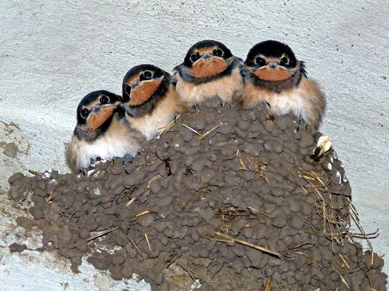

(contact <a href="mailto:wiebke.ullmann@uni-potsdam.de">wiebke.ullmann[at]uni-potsdam.de</a> or <a href="mailto:kramer@izw-berlin.de">kramer[at]izw-berlin.de</a>)

**Short Abstract:** 
Die reduzierte Abundanz und Diversität von Insekten bedeutet eine Verringerung der Nahrungsverfügbarkeit für insektivore Räuber. Dadurch steigt die Konkurrenz zwischen Arten welche sich von ähnlichen Insekten ernähren. Dies kann zum Konkurrenzausschlussprinzip und somit zum Verlust von Biodiversität führen. Um die Auswirkungen des Insektensterbens auf das Konkurrenzverhalten insektivorer Tierarten zu bestimmen, wollen wir Rauch- und Mehlschwalben in insektenarmen Agrarlandschaften besendern und die Bewegungen der Tiere sowie deren Reproduktionserfolg mit der lokalen Abundanz und Diversität der Insekten in Zusammenhang bringen. Dazu werden die Schwalben mit hochauf-lösenden Telemetriesendern ausgestattet und Insekten mit Malaisefallen im Untersuchungsgebiet gefangen. Um den Reproduktionserfolg verzeichnen zu können, müssen die Nester der besenderten Schwalben identifiziert werden. Die Nestidentifikation wird während des Schwalbenfangs mit Sichtbeobachtungen durchgeführt und später mit der Telemetrietechnick überprüft bzw. vervollständigt. Der Nachwuchs soll mit Kameraauf-zeichnungen und/oder mit einer Endoskopkamera gezählt werden. Die Insekten aus den Malaisefallen sollen möglichst bis zur Familie bestimmt werden und in Größenklassen unterteilt und gewogen werden. 

{width=30%}

**Freilanduntersuchungen und Laborarbeit:**
-	Erstellen einer Arbeitsroutine zur Nestidentifikation und zum Zählen des Nachwuches
-	Nestidentifikation und Zählen des Nachwuchses der besenderten Tiere
-	Mitbetreuung der Malaisefallen im Untersuchungsgebiet
-	Insektenbestimmung und Quantifizierung, der mit Malaisefallen gefangenen Insekten (möglichst bis zur Familie)

**Untersuchungsgebiet/Zeitraum:**
Die Masterarbeit beginnt im März 2023 mit den Vorbereitungen (Annerkennung als Vertiefungsmodul möglich). Im Mai 2023 und Juni/Juli 2023 findet die Feldarbeit statt (ca. 10-14 Tage im Mai und dann noch mal 10-14 Tage ab ca. Ende Juni). Das Untersuchungsgebiet befindet sich in der Nordwestuckermark (ca. 15km westlich von Prenzlau). In der ZALF-Forschungsstation in Dedelow stehen Zimmer als Unterkunftsmöglichkeit bereit. 
Voraussetzungen
Führerschein Klasse B, selbständige Arbeit im Feld und im Team mit weiteren Masterstudenten, HiWis und Praktikanten

**Kontakt:**
Wiebke Ullmann			 
Universität Potsdam, Vegetationsökolgie & Naturschutz          
Am Mühlenberg 3, 14476 Potsdam         
[Ullmann](wiebke.ullmann@uni-potsdam.de)	
Tel.: 01715453029

Prof. Dr. Stephanie Kramer-Schadt
Leibniz-Institute für Zoo- und Wild-tierforschung
Alfred-Kowalke-Str. 17, 10315 Berlin
[Kramer-Schadt](kramer@izw-berlin.de)

