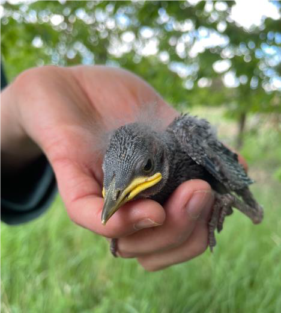
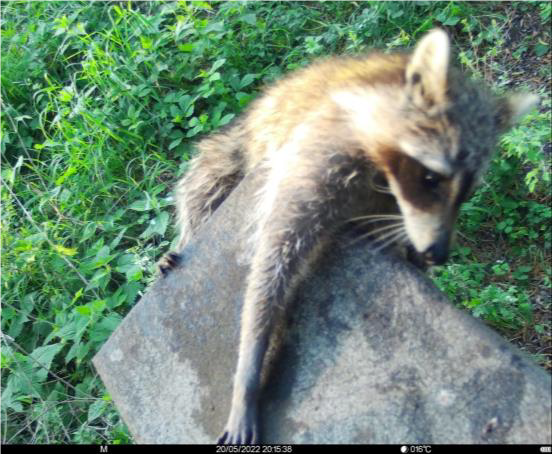

(contact <a href="mailto:grabow@izw-berlin.de">grabow[at]izw-berlin.de</a> or  <a href="mailto:landgraf@izw-berlin.de">landgraf[at]izw-berlin.de</a>)

**Hintergrund:** 
Der Reproduktionserfolg bei Singvögeln hängt zu großen Teilen von dem elterlichen Investment ab, also deren Fütterungsraten und Erfolg während der Nahrungssuche. Durch Landnutzungswandel, Insektensterben und Klimawandel wird die Eigenschaft zur effektiven Nahrungssuche zunehmend wichtiger, da Störungen in Ökosystemen vermehrt auftreten. Um den Einfluss solcher Störungen zu bestimmen, nutzen wir ein natürliches Studiensystem in dem natürliche (z.B. invasive Prädatoren) und anthropogene Störungen (z.B. regelmäßige Brutkastenkontrollen durch Forscher) auf verminderte Nahrungs-vorkommen in hochindustrialisierten Agrarlandschaften treffen. Um beobachten zu können, wie sich europäische Stare (Sturnus vulgaris) während der Brutzeit auf Nahrungssuche begeben, werden wir die Stare mit Hochdurchsatztelemetrie (ATLAS – Advanced Tracking of Animals in Real Life Systems) besendern um ihr Bewegungsverhalten in real time zu studieren. Parallel werden wir Kamerafallen und Soundrekorder in der Nähe der Brutkästen ausbringen um durchgehend mögliche Störungen innerhalb des Systems zu dokumentieren, was eine genaue Klassifikation von Störungsevents ermöglicht. Durch regelmäßige Kontrollen der Körpermaße (z.B. Gewicht, Körpermaße) von Jungtieren in einer etablierten Brutkolonie können wir Rückschlüsse auf den Erfolg der Eltern bei der Jungenaufzucht (Anzahl und Zustand der Küken) feststellen und prüfen, ob dieser mit den Fütterungsraten bzw. dem Nahrungsangebot im Habitat erklärbar wird. Anschließend können wir zeitliche Störungsdynamiken innerhalb des Brutzeitraums quantifizieren, um zu überprüfen, ob diese die Fitness (= Reproduktionserfolg) zusätzlich beeinflussen.

**Feldarbeit und Datenanalyse:**

- Hilfe beim Fang, Beringung, Besenderung und Probenentnahme bei adulten Staren 
- Kontrolle von Nistkästen, Vermessung von Jungtieren 
- Ausbringung von Kamerafallen, Analyse und Klassifizierung von Stör-Events (z.B. Prädatoren) 
- Analyse der Ergebnisse in R (gemeinsam mit WissenschaftlerInnen des Leibniz IZW)

{width=50%}

**Untersuchungsgebiet und Studienzeitraum:**

Die Feldarbeit beginnt Mitte April 2024 (spätestens Anfang Mai). Das Untersuchungsgebiet befindet sich in der Nordwestuckermark (ca. 15 km westlich von Prenzlau). In der ZALF-Forschungsstation in Dedelow stehen Zimmer gratis als Unterkunftsmöglichkeit bereit.

**Anforderungen:** 

- Interesse am Forschen im Team, Beantwortung eigener Fragestellungen 
- mehrtägige Forschungsaufenthalte auf der Feldstation (teilweise am Wochenende) 
- Belastbarkeit (frühes Aufstehen, Feldarbeit auch bei schwierigem Wetter!) 
- eigenständiges Einarbeiten in den Umgang mit Kamerafallen 
- eigenständige Klassifizierung von Fotofallen-daten (Software wird zur Verfügung gestellt) 
- R Kenntnisse erwünscht

{width=50%}

Bei Interesse melden Sie sich bitte zeitnah an Marius Grabow <a href="mailto:grabow@izw-berlin.de">grabow[at]izw-berlin.de</a> (verantwortlicher Projekt-Doktorand) und Dr. Conny Landgraf <a href="mailto:landgraf@izw-berlin.de">landgraf[at]izw-berlin.de</a> (Feldkoordinatorin).

