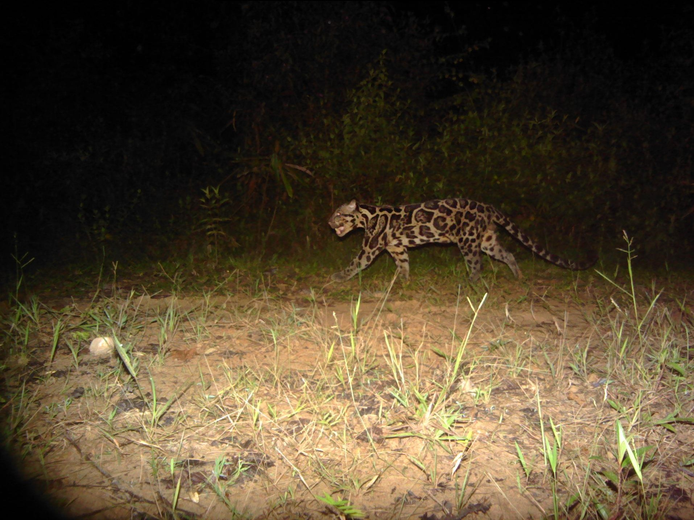

```{r setup, include=FALSE}
knitr::opts_chunk$set(echo = FALSE)
```

<div class='headerbox'><hbox>for graduate and undergraduate students</hbox></div><br>

We are looking for motivated students interested in questions about **wildlife dynamics and distributions** under global change, **animal behavioral ecology** or advancing **theory in ecology and evolution**. Students should have a strong background in (or the will to learn) R, statistics and modelling. Please contact us for possible thesis subjects and state your skills and interests (e.g., CV, certificates,…) along with the name of one or two references. 

**TU Berlin students**, please consider the [Reader](https://www.oekosys.tu-berlin.de/fileadmin/fg35/Lehre/Downloads/ABSOLVENTINNEN_INFOS_Reader_171023.pdf) for the steps necessary to conduct a thesis. Successful attendance of our courses ‘biodiversity dynamics I + II’ , where we teach spatial R, distribution modelling and occupancy modelling, is of advantage.

Below, you will find a list of offers for Bachelor- and Master-theses, an overview over currently running theses as well as a list of completed theses for your information.


<div class='headerbox'><hbox>Completed theses</hbox></div><br>

**2022**

* <p>**Social status driven epigenetic differences in female spotted hyenas in the Serengeti National Park.** <span style='color:#FF8C00;'>Nick Mewes.</span> <span style='color:#C0C0C0;'>14.06.2022. MSc. Universität Potsdam. Ecology, Evolution and Conservation. Supervision: Alexandra Weyrich (Dept 2, IZW), Sarah Benhaiem (Dept 6, IZW)</span> <span style='color:#32CD32;'>->manuscript in prep.</span></p>

* <p>**Birds in the city: understanding direct and indirect effects of human disturbance and vegetation structure on functional diversity in Berlin.** <span style='color:#FF8C00;'>Estelle Solem.</span><span style='color:#C0C0C0;'> 06.04.2022. BSc. Humboldt Universität zu Berlin. Geographie. Supervision: Tobias Kümmerle (HU), Aimara Planillo, S Kramer-Schadt </span> <span style='color:#32CD32;'>-> manuscript in prep.</span></p>

* <p>**Differential DNA methylation between dominant and subordinate spotted hyena twins.** <span style='color:#FF8C00;'> Lena Ruf.</span><span style='color:#C0C0C0;'>  05.04.2022. MSc. University of Potsdam. Ecology, Evolution and Conservation. Supervision: Alexandra Weyrich, Sarah Benhaiem, Jörns Fickel (UP)  </span> <span style='color:#32CD32;'>-> manuscript in prep.</span></p>

* <p>**Urban planning for animals and humans: An empirical investigation of planning approaches and their perception by Berlin citizens.**  <span style='color:#FF8C00;'> Lisa Jäger.</span><span style='color:#C0C0C0;'>  23.02.2022. MSc. TU Berlin. Ecology and Environmental Planning. Supervision: Tanja Straka (TUB), Kramer-Schadt S. </span></p>

* <p>**Einfluss einer Unterrichtseinheit über Wildbienen auf die Einstellungen, die Emotionen und das Wissen von Schülern.**  <span style='color:#FF8C00;'> Sarah Festl.</span><span style='color:#C0C0C0;'> 25.02.2022. BSc. TU Berlin. Ecology and Environmental Planning. Supervision: Tanja Straka (TUB), Kramer-Schadt S.</span></p>{width=30%}


* <p>**Spatial use and population development of the Eurasian otter *Lutra lutra* in Sielmanns Naturlandschaft Groß Schauen and the state of Brandenburg.**  <span style='color:#FF8C00;'> Yvonne Rychlak.</span><span style='color:#C0C0C0;'> 02.02.2022. MSc. Ecology, Evolution and Nature Conservation. University of Potsdam. Supervision: Niels Blaum (UP), Kramer-Schadt S.</span></p>

**2021**

* <p>**Modelling Eurasian red squirrel (*Sciurus vulgaris*) occurrence along urban gradients in Berlin.**  <span style='color:#FF8C00;'>  Marius Grabow.</span><span style='color:#C0C0C0;'> 29.09.2021. MSc. TU Berlin. Ecology and Environmental Planning. Supervision: Louvrier J (IZW), Kramer-Schadt S. </span> <span style='color:#32CD32;'> -> Manuscript submitted to Front Evol Ecol. </span> <span style='color:#9400D3;'>-> Prize for best Master thesis!</span></p>

* <p>**Accuracy of a new high throughput wildlife movement tracking system in comparison with GPS tracking.**  <span style='color:#FF8C00;'> Johannes Marold.</span><span style='color:#C0C0C0;'> 16.09.2021. BSc. TU Berlin. Ecology and Environmental Planning. Supervision: Radchuk V (IZW), Kramer-Schadt S.</span></p>

* <p>**Density and life-history of the Sunda clouded leopard *Neofelis diardi* in the Deramakot Forest Complex, Sabah, Malaysia.**  <span style='color:#FF8C00;'> Katharina Kasper.</span><span style='color:#C0C0C0;'> 30.08.2021. MSc. Goethe-Universität Frankfurt am Main. Supervision: Thomas Müller (SBiK-F), Andreas Wilting (IZW).</span></p>{width=30%}

* <p>**Evaluating the habitat suitability of tiger in Bardia National Park and Buffer Zone areas, Nepal.**  <span style='color:#FF8C00;'> Kamal Ghimire.</span><span style='color:#C0C0C0;'> 18.08.2021. MSc. TU Dresden. Tropical Forestry. Supervision: Berger U (TUD), Kramer-Schadt S.</span></p>

* <p>**Small-Scale Habitat Selection of the European Wildcat *Felis silvestris silvestris* in the Bernese Seeland, Switzerland.**  <span style='color:#FF8C00;'> Johanna Bellack.</span><span style='color:#C0C0C0;'> 26.06.2021. BSc. TU Berlin. Ecology and Environmental Planning. Supervision: Maronde L (KORA), Kramer-Schadt S.</span></p>

* <p>**Effect of artificial light at night (ALAN) on behaviour of the European hedgehog (*Erinaceus europaeus Linnaeus*, 1758) in the urban area of Berlin.**  <span style='color:#FF8C00;'> Briseida Lozano Granados.</span><span style='color:#C0C0C0;'> 15.05.2021. MSc. TU Berlin. Urban Ecology. Supervision: Berger A, Kramer-Schadt S. </span> <span style='color:#32CD32;'> -> coauthor in Berger et al. (2020) ANIMALS.</span></p>

* <p>**What contribution can non-standardized Citizen Science data make in biodiversity monitoring?**  <span style='color:#FF8C00;'> Lena Fiechter.</span><span style='color:#C0C0C0;'> 21.01.2021. MSc. TU Berlin. Ecology and Environmental Planning. Supervision: Planillo A, Kramer-Schadt S, Heucke-Voigt S (MfN).  </span> <span style='color:#32CD32;'>-> coauthor in Planillo et al. (2021) LAND URB PLAN.</span></p>

* <p>**A habitat suitability model for Grey Crowned Cranes (*Balearica regulorum*) in Rwanda based on sightings.**  <span style='color:#FF8C00;'> Ann-Marie Attenberger.</span><span style='color:#C0C0C0;'> 04.01.2021. MSc. TU Berlin. Ecology and Environmental Planning. Supervision: Olivier Nsengimana (RWCA), Kramer-Schadt S, vd Lippe M (TUB).</span></p>{width=30%}

**2020**

* <p>**A population viability and connectivity analysis for the alpine lynx (*Lynx lynx*) population. **  <span style='color:#FF8C00;'> Eva Sanchez Arribas.</span><span style='color:#C0C0C0;'> 19.11.2020. MSc. Uppsala University, Sweden. Supervision: Kramer-Schadt S, Planillo A, Molinari-Jobin A (KORA).</span> <span style='color:#32CD32;'> -> Manuscript in prep.</span></p>{width=30%}

* <p>**Influence of roost site availability on activity of forest-dwelling bats above coniferous forests.**  <span style='color:#FF8C00;'> Franziska Röpke.</span><span style='color:#C0C0C0;'> 15.10.2020. BSc. Ökologie und Umweltplanung. TU Berlin. Supervision: Volker Kelm (K&S Umweltgutachten), Kramer-Schadt S.</span></p>

* <p>**Spatial, temporal and interindividual determinants of wildlife-vehicle collision mortality in spotted hyenas in the Serengeti National Park between 1989 and 2020.** <span style='color:#FF8C00;'>Marwan Naciri.</span><span style='color:#C0C0C0;'>  25.06.2020. Msc. Master Biosciences École Normale Supérieure (ENS) Lyon, Frankreich. Supervision: Benhaiem S, Gicquel M, Planillo A, East M, Hofer H. </span> <span style='color:#32CD32;'>-> Manuscript in prep.</span></p>

* <p>**Using social network analysis on a population of reintroduced Northern Bald Ibis (*Geronticus eremita*) to understand decisions of migratory association.** <span style='color:#FF8C00;'> Sinah Drenske.</span><span style='color:#C0C0C0;'> 03.08.2020. Msc. Ökologie und Umweltplanung. Technische Universität Berlin. Supervision: Kramer-Schadt S, Radchuk V, Benhaiem S, Landgraf C.  </span> <span style='color:#9400D3;'>-> Prize for best Master thesis!</span></p>

**2019**

* <p>**Demography and population viability of the Northern Bald Ibis (*Geronticus eremita*), a reintroduced bird species.** <span style='color:#FF8C00;'> Sinah Drenske.</span><span style='color:#C0C0C0;'> 04.02.2019. Bsc. Ökologie und Umweltplanung. Technische Universität Berlin. Supervision: Kramer-Schadt S, Radchuk V, Kowarik I (TUB). </span> <span style='color:#32CD32;'>-> Manuscript submitted to Oryx</span></p>{width=30%}

* <p>**Wolfmanagement in Deutschland – Vergleich der Wolfmanagementpläne der Bundesländer.** <span style='color:#FF8C00;'> Patrick Enders.</span><span style='color:#C0C0C0;'> 26.09.2019. Bsc. Landschaftsarchitektur und Landschaftsplanung. TU Berlin. Supervision: Heiland S (TUB), Kramer-Schadt S.</span></p>

* <p>**Inwiefern beeinflussen anthropogene Faktoren die Streifgebietsgrößen sowie täglichen Distanzen von Wildschweinen (*Sus scrofa*)?** <span style='color:#FF8C00;'> Elena Wernitz.</span><span style='color:#C0C0C0;'> 08.08.2019. Bsc. Ökologie und Umweltplanung. TUB. Supervision: Stillfried M, Kramer-Schadt S.</span></p>

* <p>**Predicting community structure in a changing world – a new dynamic agent-based model to simulate multi-species home range behavior.** <span style='color:#FF8C00;'> Marie-Sophie Rohwäder.</span><span style='color:#C0C0C0;'> 26.02.2019. Msc. Ökologie, Evolution und Naturschutz. Universität Potsdam. Supervision: Kramer-Schadt S, Jeltsch F (UP).</span></p>

* <p>**Assessing patterns of livestock attacks caused by wolf (*Canis lupus*) using sightings and habitat predictions.** <span style='color:#FF8C00;'> Moritz Wenzler.</span><span style='color:#C0C0C0;'> 26.11.2019. Msc. Global Change Geography. Humboldt-Universität zu Berlin. Kramer-Schadt S, Planillo A, Kümmerle T (HU). </span> <span style='color:#32CD32;'>-> coauthored manuscript in prep.</span></p>

**2018**

* <p>**Life-history consequences of snare injuries in female spotted hyenas: A long term study in the Serengeti National Park, Tanzania.** <span style='color:#FF8C00;'> Sara Kaidatzi.</span><span style='color:#C0C0C0;'> 02.05.2018. Diploma thesis. Biologie. Freie Universität Berlin. Benhaiem S, East ML, Hofer H.</span></p>

* <p>**Usage of landscape metrics to predict spatial distribution of mammals in urban areas.** <span style='color:#FF8C00;'> Jessica Thimian. </span><span style='color:#C0C0C0;'> 04.08.2018. BSc. Biologie. Freie Universität Berlin. Supervision: Gras P, Kramer-Schadt S, Hofer H.</span></p>

* <p>**Monthly home ranges and habitat preferences of raccoons (*Procyon lotor*) in the Uckermark, Germany – a estimation method comparison.** <span style='color:#FF8C00;'> Pedro Mello Rose. </span><span style='color:#C0C0C0;'> 2018. BSc. Biologie. Freie Universität Berlin. Supervision: Scholz C, Hofer H.</span></p>

* <p>**An occupancy analysis of the ocelot (*Leopardus pardalis*) and its potential preys in Eastern Panama. ** <span style='color:#FF8C00;'> Angelica Maria Moreno Sosa.</span><span style='color:#C0C0C0;'> 09.10.2018. MSc. Universität Bremen. Supervision: Abrams J, Kramer-Schadt S, Marko Rohlfs (U Bremen). </span> <span style='color:#32CD32;'>-> Moreno Sosa et al. (2022) Mammal Biology.</span></p>


