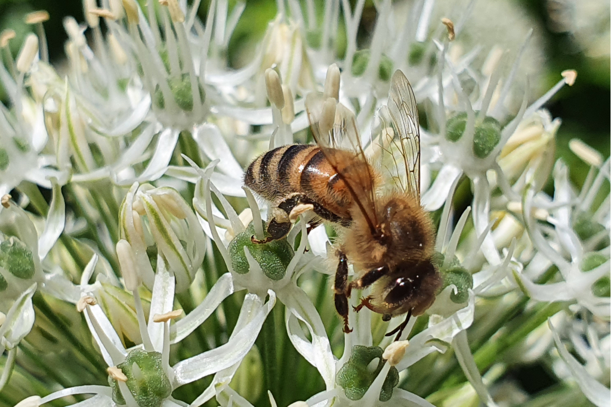
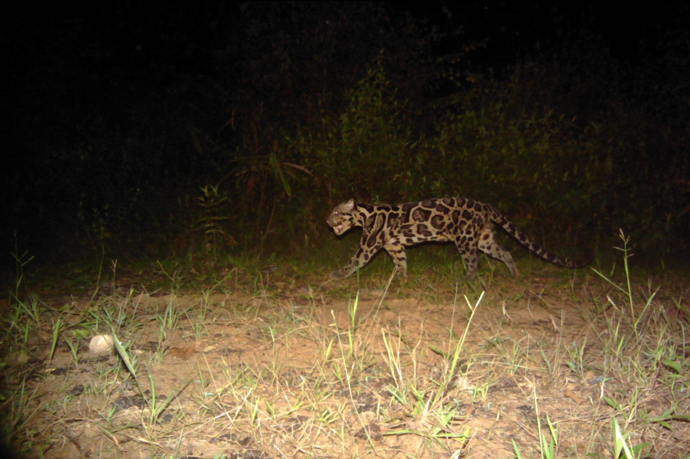
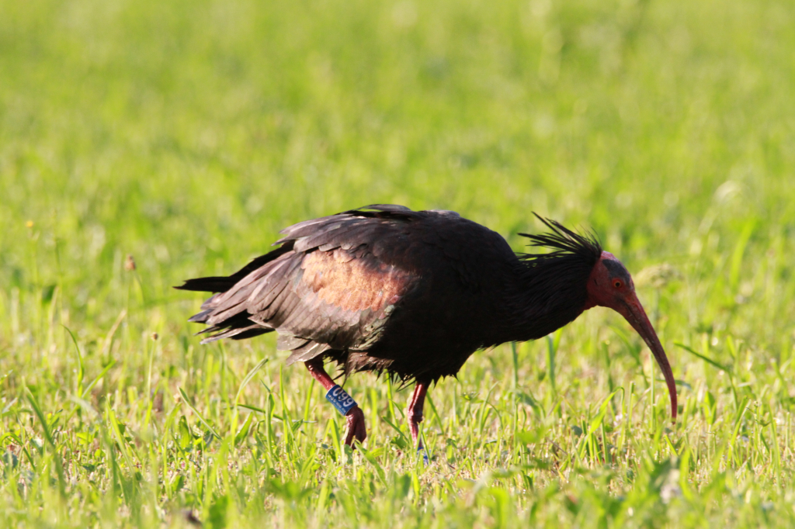
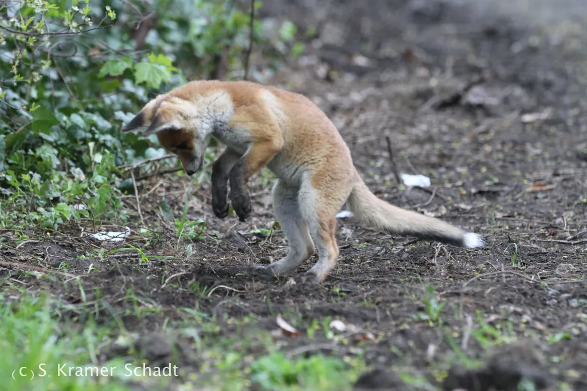
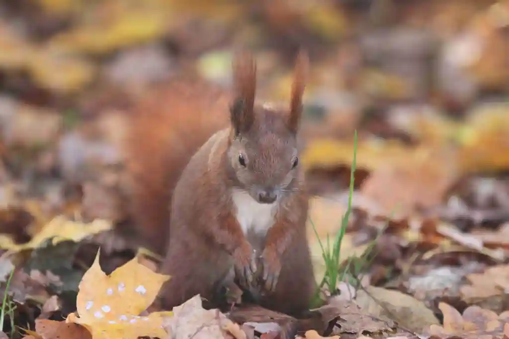

```{r setup, include=FALSE}
knitr::opts_chunk$set(echo = FALSE)
```

<div class='highlightbox'>
  We are looking for motivated students interested in questions about **wildlife dynamics and distributions** under global change, **animal behavioral ecology** or advancing **theory in ecology and evolution**. Students should have a strong background in (or the will to learn) R, statistics and modelling. Please contact us for possible thesis subjects and state your skills and interests (e.g., CV, certificates,…) along with the name of one or two references.  
    
  **For TU Berlin students:** Please consider the [Reader](https://www.oekosys.tu-berlin.de/fileadmin/fg35/Lehre/Downloads/ABSOLVENTINNEN_INFOS_Reader_171023.pdf) for the steps necessary to conduct a thesis. Successful attendance of our courses ‘biodiversity dynamics I + II’ , where we teach spatial R, distribution modelling and occupancy modelling, is of advantage.  
    
  Below, you will find an overview over currently running theses as well as a list of completed theses for your information and a list of [offers](msc-bsc-theses-offers.html)&ensp;|&ensp; for Bachelor- and Master-theses 
</div>

For older Bachelor- and Master-theses please check here:<br> [2020](msc-bsc-theses-2020.html)&ensp;|&ensp;[2019](msc-bsc-theses-2019.html)&ensp;|&ensp;[2018](msc-bsc-theses-2018.html)

<div class='headerbox'><hbox>Completed Theses</hbox></div><br>

{width=32.5%}
{width=32.5%}
{width=32.5%}
{width=32.5%}
{width=32.5%}
{width=32.5%}

**2022**

* Evaluating the effects of blackberry (*Rubus niveus*) abundance on land bird diversity on Santiago Island, Galapagos. **Mateo Reyes.** <span class='desaturated'>23.05.2022. BSc. TU Berlin. Ecology and Environmental Planning. Supervision: Kramer-Schadt S, M von der Lippe (TUB).</span>

* Zur Verbreitung des Rotfuchses (Vulpes vulpes) in deutschen Nationalparken auf Grundlage von Kamerafallendaten. **Clara Heinrich.** <span class='desaturated'>20.05.2022. BSc. TU Berlin. Ecology and Environmental Planning. Supervision: Kramer-Schadt S, C Fiderer (ALUF).</span>

* Wildtiere in deutschen Großstädten: ein Vergleich zwischen Medienpräsenz und Wahrnehmung von Stadtbewohnern. **Henry Karsch.** <span class='desaturated'>15.05.2022. MSc. FU Berlin. Fachbereich Biologie/Chemie/Pharmazie. Supervision: Jonathan Jeschke (FU), Tanja Straka (TUB), S Kramer-Schadt</span>

* Social status driven epigenetic differences in female spotted hyenas in the Serengeti National Park. **Nick Mewes.** <span class='desaturated'>14.06.2022. MSc. Universität Potsdam. Ecology, Evolution and Conservation. Supervision: Alexandra Weyrich (Dept 2, IZW), Sarah Benhaiem (Dept 6, IZW)</span>

* Birds in the city: understanding direct and indirect effects of human disturbance and vegetation structure on functional diversity in Berlin. **Estelle Solem.** <span class='desaturated'>06.04.2022. BSc. Humboldt Universität zu Berlin. Geographie. Supervision: Tobias Kümmerle (HU), Aimara Planillo, S Kramer-Schadt</span>

* Differential DNA methylation between dominant and subordinate spotted hyena twins. **Lena Ruf.** <span class='desaturated'>05.04.2022. MSc. University of Potsdam. Ecology, Evolution and Conservation. Supervision: Alexandra Weyrich, Sarah Benhaiem, Jörns Fickel (UP)</span>

* Urban planning for animals and humans: An empirical investigation of planning approaches and their perception by Berlin citizens. **Lisa Jäger.** <span class='desaturated'>23.02.2022. MSc. TU Berlin. Ecology and Environmental Planning. Supervision: Tanja Straka (TUB), Kramer-Schadt S.</span>

* Einfluss einer Unterrichtseinheit über Wildbienen auf die Einstellungen, die Emotionen und das Wissen von Schülern. **Sarah Festl.** <span class='desaturated'>25.02.2022. BSc. TU Berlin. Ecology and Environmental Planning. Supervision: Tanja Straka (TUB), Kramer-Schadt S.</span>

* Spatial use and population development of the Eurasian otter *Lutra lutra* in Sielmanns Naturlandschaft Groß Schauen and the state of Brandenburg. **Yvonne Rychlak.** <span class='desaturated'>02.02.2022. MSc. Ecology, Evolution and Nature Conservation. University of Potsdam. Supervision: Niels Blaum (UP), Kramer-Schadt S.</span>


