```{r setup, include=FALSE}
knitr::opts_chunk$set(echo = FALSE)
```


<ul class="card-wrapper">
  <li class="card-repo">
    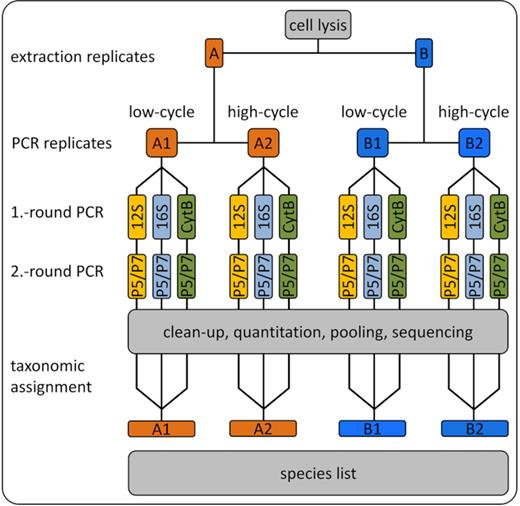
    <h3>Axtner et al. 2019</h3>
    <p>An efficient and robust laboratory workflow and tetrapod database for larger scale environmental DNA studies. *GIGASCIENCE*, 8:giz029.</p><p>
    <a href='https://doi.org/10.1093/gigascience/giz029'>{width=12%}</a> 
    <a href='https://github.com/EcoDynIZW/Axtner_2019_GigaScience'>{width=12%}</a></p>
  </li>
  
  
  <li class="card-repo">
    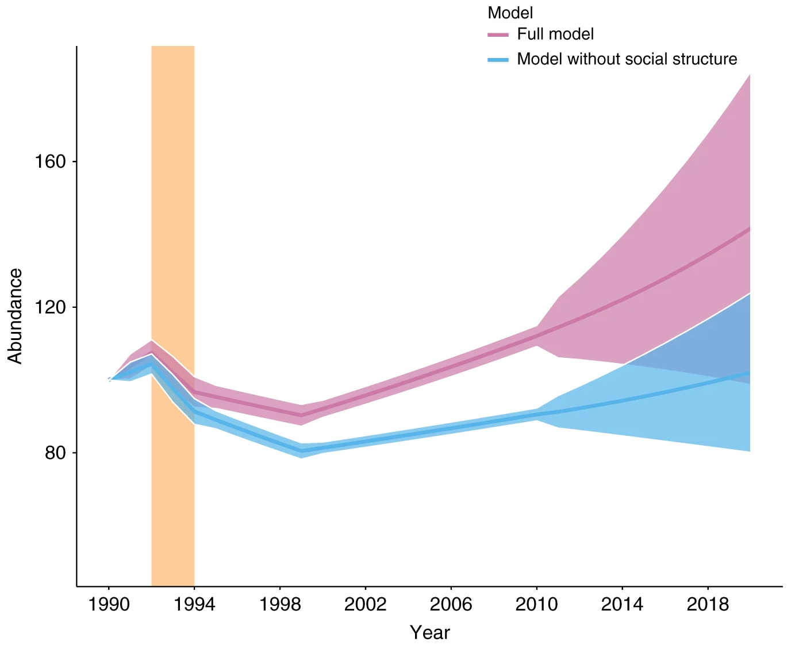
    <h3>Benhaiem et al. 2018</h3>
    <p>Slow recovery from a disease epidemic in the spotted hyena, a keystone social carnivore. *COMMUN BIOL*, 1:201.</p><p>
    <a href='https://doi.org/10.1038/s42003-018-0197-1'>{width=12%}</a> 
    <a href='https://github.com/EcoDynIZW/Benhaiem_2018_CommsBio'>{width=12%}</a></p>
  </li>
  
  
  <li class="card-repo">
    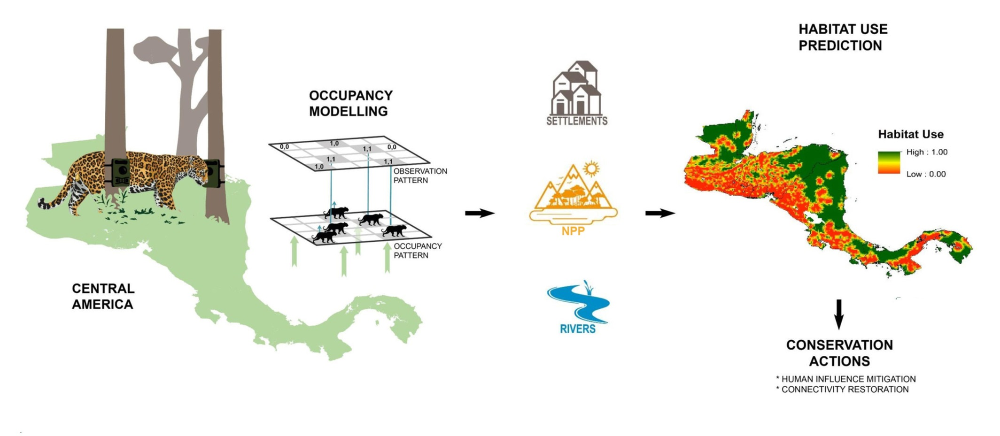
    <h3>Calderon et al. 2022</h3>
    <p>Occupancy models reveal potential of conservation prioritization for Central American jaguars. *ANIM CONSERV*.</p><p>
    <a href='https://doi.org/10.1111/acv.12772'>{width=12%}</a> 
    <a href='https://github.com/EcoDynIZW/Calderon_2022_AnimCons'>{width=12%}</a></p>
  </li>
  
  
  <li class="card-repo">
    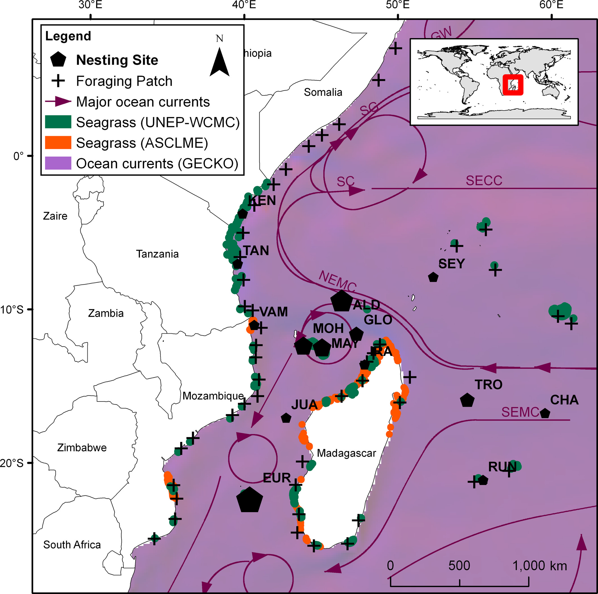
    <h3>Dalleau et al. 2019</h3>
    <p>Modeling the emergence of migratory corridors and foraging hot spots of the green sea turtle. *ECOL EVOL*, 9:10317–1034.</p><p>
    <a href='https://doi.org/10.1002/ece3.5552'>{width=12%}</a> 
    <a href='https://www.comses.net/codebases/69863caa-2f8e-4412-a564-a2826d9d38d3/releases/1.0.0/'>{width=12%}</a></p>
  </li>
  
  
  <li class="card-repo">
    
    <h3>Drenske et al. 2022</h3>
    <p>On the road to self-sustainability: Reintroduced migratory European Northern Bald Ibises (*Geronticus eremita*) still need management interventions for population viability. *ORYX*.</p><p>
    <!--<a href=''>{width=12%}</a>-->
    <a href='https://github.com/EcoDynIZW/Drenske_2022_Oryx'>{width=12%}</a>
    <a href='https://doi.org/10.5281/zenodo.6790671'>{width=12%}</a>
    <a href='https://www.comses.net/codebases/f021a012-1507-417f-88ad-d181914219d1/releases/1.0.0/'>{width=12%}</a></p>
  </li>
  
  
  <li class="card-repo">
    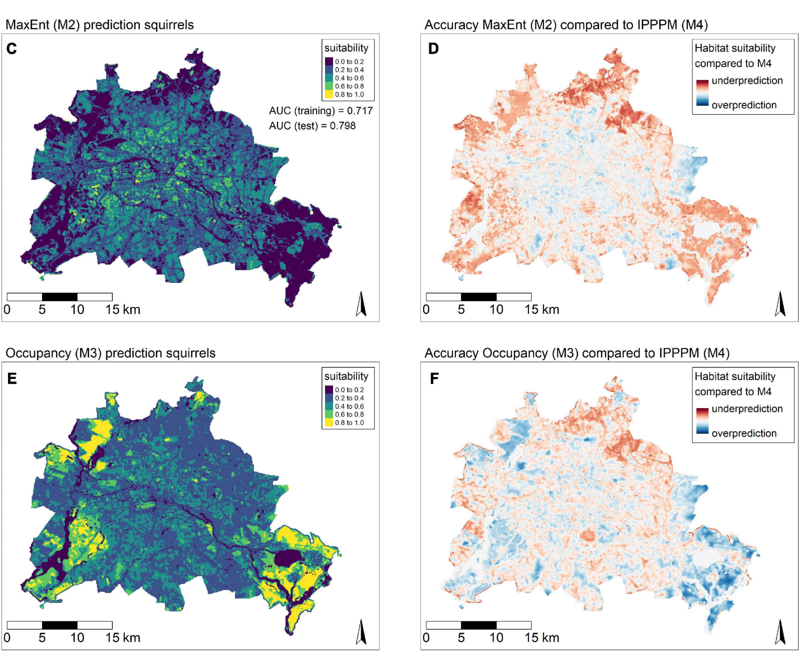
    <h3>Grabow et al. 2022</h3>
    <p>Data-integration of opportunistic species observations into hierarchical modeling frameworks improves spatial predictions for urban red squirrels.  *FRONT ECOL EVOL*, 10:881247.</p><p>
    <a href='https://dx.doi.org/10.3389/fevo.2022.881247'>{width=12%}</a> 
    <a href='https://github.com/EcoDynIZW/Grabow_2022_FrontEcolEvol'>{width=12%}</a></p>
  </li>
  
  
  <li class="card-repo">
    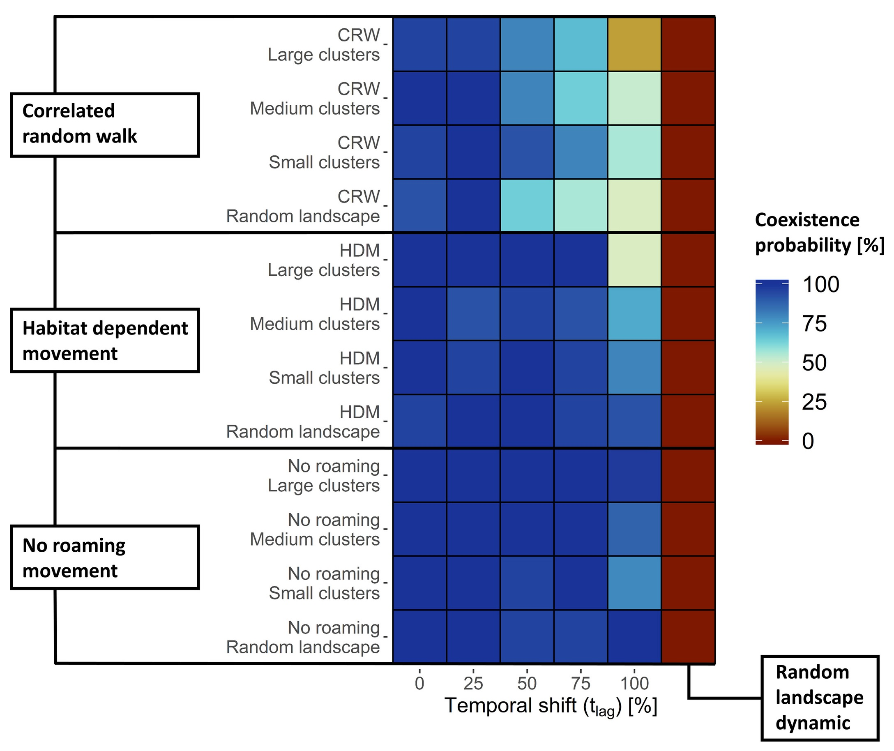
    <h3>Kürschner et al. 2021</h3>
    <p>Movement can mediate temporal mismatches between resource availability and biological events in host–pathogen interactions. *ECOL EVOL*, 11:5728–5741.</p><p>
    <a href='https://doi.org/10.1002/ece3.7478'>{width=12%}</a> 
    <a href='https://github.com/EcoDynIZW/Kuerschner_2021_EcolEvol'>{width=12%}</a>
    <a href='https://zenodo.org/record/4593791'>{width=12%}</a></p>
  </li>
  
  
  <li class="card-repo">
    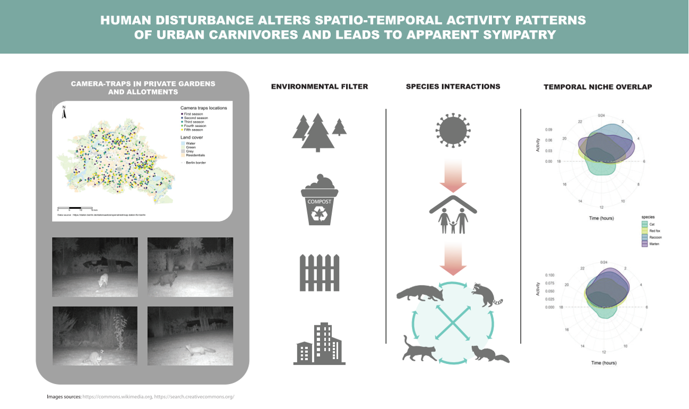
    <h3>Louvrier et al. 2021</h3>
    <p>Spatiotemporal interactions of a novel mesocarnivore community in an urban environment before and during SARS-CoV-2 lockdown. *J ANIM ECOL*, 91:367–380.</p><p>
    <a href='https://doi.org/10.1111/1365-2656.13635'>{width=12%}</a> 
    <a href='https://github.com/EcoDynIZW/Louvrier_2021_JAnimEcol'>{width=12%}</a>
</p>
  </li>
  
  
  <li class="card-repo">
    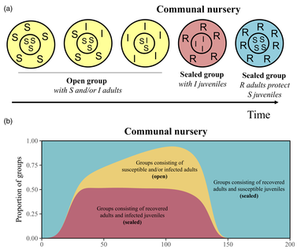
    <h3>Marescot et al. 2020</h3>
    <p>‘Keeping the kids at home’ can limit the persistence of contagious pathogens in social animals. *J ANIM ECOL*, 90:2523–2535.</p><p>
    <a href='https://doi.org/10.1111/1365-2656.13555'>{width=12%}</a> 
    <a href='https://github.com/EcoDynIZW/Marescot_Franz_Benhaiem_2021_JAnimEcol'>{width=12%}</a></p>
  </li>
  
  
  <li class="card-repo">
    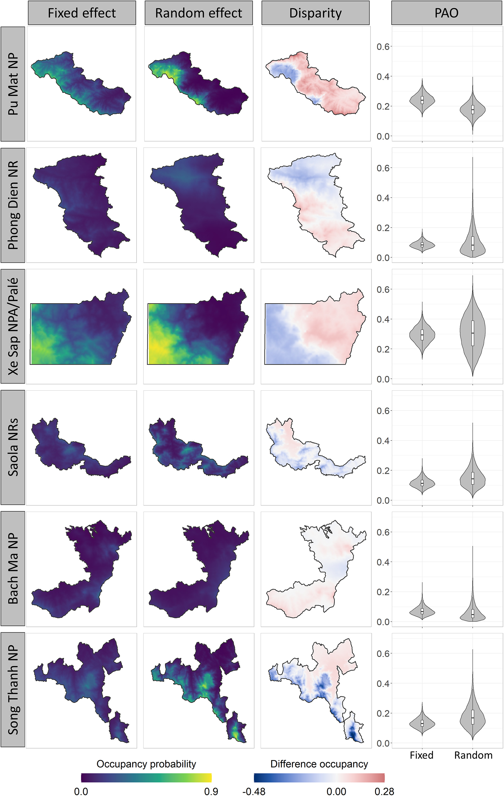
    <h3>Nguyen et al. 2021</h3>
    <p>Getting the big picture: Landscape-scale occupancy patterns of two Annamite endemics among multiple protected areas. *CONS SCI PRACT*, 4:e620.</p><p>
    <a href='https://doi.org/10.1111/csp2.620'>{width=12%}</a> 
    <a href='https://github.com/EcoDynIZW/Nguyen_2021_CSP'>{width=12%}</a></p>
  </li>
  
  
  <li class="card-repo">
    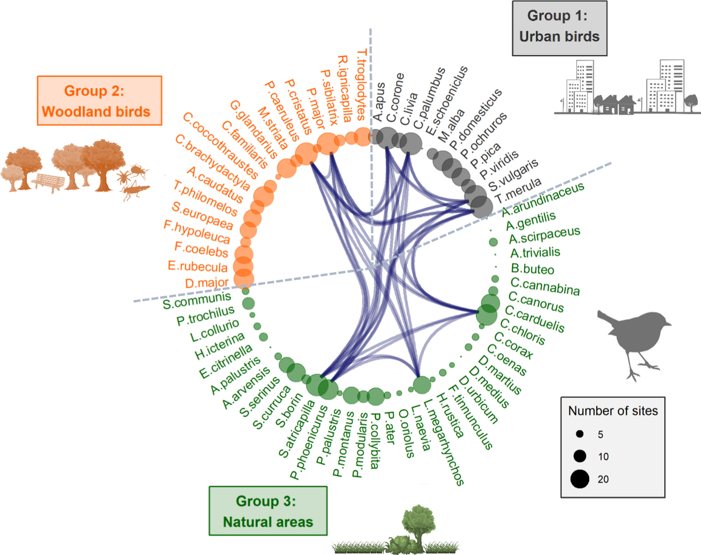
    <h3>Planillo et al. 2021</h3>
    <p>Arthropod abundance modulates bird community responses to urbanization. *DIV DIST*, 27:34-49.</p><p>
    <a href='https://doi.org/10.1111/ddi.131698'>{width=12%}</a> 
    <a href='https://github.com/EcoDynIZW/Planillo_2021_DivDist'>{width=12%}</a></p>
  </li>
  
  
  <li class="card-repo">
    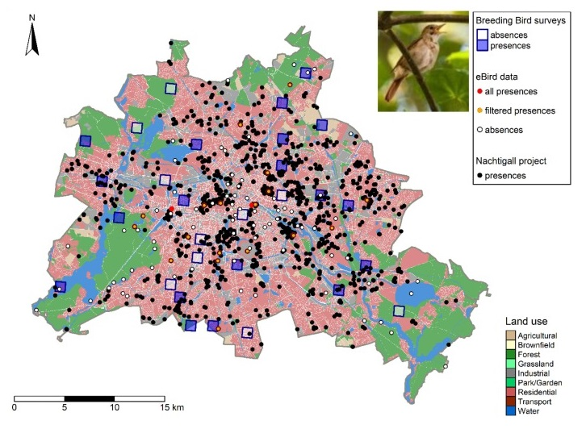
    <h3>Planillo et al. 2021</h3>
    <p>Citizen science data for urban planning: Comparing different sampling schemes for modelling urban bird distribution. *LAND URB PLAN*, 211:104098.</p><p>
    <a href='https://doi.org/10.1016/j.landurbplan.2021.104098'>{width=12%}</a> 
    <a href='https://github.com/EcoDynIZW/Planillo_2021_LandUrbPlan'>{width=12%}</a></p>
  </li>
  
  
  <li class="card-repo">
    
    <h3>Radchuk et al. 2016</h3>
    <p>From individuals to population cycles: the role of extrinsic and intrinsic factors in rodent populations. *ECOLOGY*, 97:720-732.</p><p>
    <a href='https://doi.org/10.1890/15-0756.1'>{width=12%}</a> 
    <a href='https://www.comses.net/codebases/4b484186-d8fb-4307-a710-fc05daa36afa/releases/1.0.0/'>{width=12%}</a></p>
  </li>
  
  
  <li class="card-repo">
    
    <h3>Radchuk et al. 2019</h3>
    <p>Adaptive responses of animals to climate change are most likely insufficient. *NAT COM*, 10:3109.</p><p>
    <a href='https://doi.org/10.1038/s41467-019-10924-4'>{width=12%}</a> 
    <a href='https://github.com/EcoDynIZW/Radchuk_2019_NatCom'>{width=12%}</a></p>
  </li>
  
  
  <li class="card-repo">
    
    <h3>Scherer et al. 2020</h3>
    <p>Moving infections: individual movement decisions drive disease persistence in spatially structured landscapes. *OIKOS*, 129:651–667.</p><p>
    <a href='https://doi.org/10.1111/oik.07002'>{width=12%}</a> 
    <a href='https://github.com/EcoDynIZW/Scherer_2020_OIKOS'>{width=12%}</a>
    <a href='https://zenodo.org/badge/latestdoi/177115379'>{width=12%}</a></p>
  </li>
  
  
  <li class="card-repo">
    
    <h3>Voigt et al. 2022</h3>
    <p>Modelling the power of acoustic monitoring to predict bat fatalities at wind turbines. *CONSER SCI PRACT*, 4:e12841.</p><p>
    <a href='https://doi.org/10.1111/csp2.12841'>{width=12%}</a> 
    <a href='https://github.com/EcoDynIZW/Voigt_2022_ConservSciPract'>{width=12%}</a></p>
  </li>
</ul>
