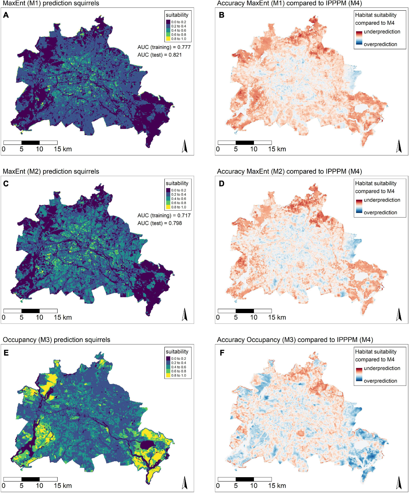

```{r setup, include=FALSE}
knitr::opts_chunk$set(echo = FALSE)
```


<ul class="card-wrapper">
  <li class="card-repo">
    
    <h3>Benhaiem et al. 2018</h3>
    <p>Slow recovery from a disease epidemic in the spotted hyena, a keystone social carnivore. *Commun. Biol.* 1:201.</p><p>
    <a href='http://doi.org/10.1038/s42003-018-0197-1'>{width=12%}</a> 
    <a href='https://github.com/EcoDynIZW/Benhaiem_2018_CommsBio'>{width=12%}</a></p>
  </li>
</ul>

TODO: redo new card style for all other repositories below

-> nur Erstautor mit et al als h3, inkl. Jahreszahl ohne Klammern
-> Journals einheitlich formatieren (überall Punkte, Doppelpunkt vor Seitenzahl etc - meist schon done)
-> Zenodo links hinzufügen (wie bei Paper + Github mit icon-zenodo.img)


<ul class="card-wrapper-wide">
   <li class="card-wide">
<div class="card-content">{width=100%}</div><br>

<div class="card-content">Calderón AP, Louvrier J, Planillo A, Araya-Gamboa D, Arroyo-Arce S, Barrantes-Núñez M, Carazo-Salazar J, Corrales-Gutiérrez D, Doncaster CP, Foster R, García MJ, Garcia-Anleu R, Harmsen B, Hernández-Potosme S, Leonardo R, Trigueros DM, McNab R, Meyer N, Moreno R, Salom-Pérez R, Sauma Rossi A, Thomson I, Thornton D, Urbina Y, Grimm V and Kramer-Schadt S, Occupancy models reveal potential of conservation prioritization for Central American jaguars. *Anim. Conserv.* (2022).<br>
<a href='https://doi.org/10.1111/acv.12772'>{width=12%}</a> 
<a href='https://github.com/EcoDynIZW/Calderon_2022_AnimCons'>{width=12%}</a></div>
  </li>

</ul>


<ul class="card-wrapper-wide">
   <li class="card-wide">
<div class="card-content">{width=100%}</div>

<div class="card-content">Drenske S, Radchuk V, Scherer C, Esterer C, Kowarik I, Fritz J, Kramer-Schadt S. On the road to self-sustainability: Reintroduced migratory European Northern Bald Ibises (*Geronticus eremita*) still need management interventions for population viability. *Oryx* (2022).<br>
<a href='https://github.com/EcoDynIZW/Drenske_2020_Oryx'>{width=12%}</a></div>
  </li>

</ul>


<ul class="card-wrapper-wide">
   <li class="card-wide">
<div class="card-content">{width=100%}</div>

<div class="card-content">Grabow M, Louvrier JLP, Planillo A, Kiefer S, Drenske S, Börner K, Stillfried M, Hagen R, Kimmig S, Straka TM and Kramer-Schadt S. Data-integration of opportunistic species observations into hierarchical modeling frameworks improves spatial predictions for urban red squirrels. *Front. Ecol. Evol.* (2022).<br>
<a href='https://dx.doi.org/10.3389/fevo.2022.881247'>{width=12%}</a> 
<a href='https://github.com/EcoDynIZW/Grabow_2022_FrontEcolEvol'>{width=12%}</a></div>
  </li>

</ul>


<ul class="card-wrapper-wide">
   <li class="card-wide">
<div class="card-content">{width=100%}</div><br>

<div class="card-content">Kürschner T, Scherer C, Radchuk V, Blaum N, Kramer-Schadt S. Movement can mediate temporal mismatches between resource availability and biological events in host–pathogen interactions. *Ecol. Evol.* (2021) 11:5728–5741.<br>
<a href='http://doi.org/10.1002/ece3.7478'>{width=12%}</a> 
<a href='https://github.com/EcoDynIZW/Kuerschner_2021_EcolEvol'>{width=12%}</a></div>
  </li>

</ul>


<ul class="card-wrapper-wide">
   <li class="card-wide">
<div class="card-content">{width=100%}</div><br>

<div class="card-content">Marescot L, Franz M, Benhaiem S, Hofer H, Scherer C, East ML & Kramer-Schadt S (2021). ‘Keeping the kids at home’ can limit the persistence of contagious pathogens in social animals. *J. Anim. Ecol.* (2021) 90:2523–2535.<br>
<a href='https://doi.org/10.1111/1365-2656.13555'>{width=12%}</a> 
<a href='https://github.com/EcoDynIZW/Marescot_Franz_Benhaiem_2021_JAnimEcol'>{width=12%}</a></div>
  </li>

</ul>


<ul class="card-wrapper-wide">
   <li class="card-wide">
<div class="card-content">{width=100%}</div>

<div class="card-content">Radchuk V, Reed T, Teplitsky C et al. Adaptive responses of animals to climate change are most likely insufficient. *Nat. Com.* (2019) 10:3109.<br>
<a href='http://doi.org/10.1038/s41467-019-10924-4'>{width=12%}</a> 
<a href='https://github.com/EcoDynIZW/Radchuk_2019_NatCom'>{width=12%}</a></div>
  </li>

</ul>


<ul class="card-wrapper-wide">
   <li class="card-wide">
<div class="card-content">{width=100%}</div><br>

<div class="card-content">Scherer C, Radchuk V, Franz M, Thulke HH, Lange M, Grimm V and Kramer-Schadt S. (2020), Moving infections: individual movement decisions drive disease persistence in spatially structured landscapes. *Oikos* (2020) 129:651–667.<br>
<a href='http://doi.org/10.1111/oik.07002'>{width=12%}</a> 
<a href='https://github.com/EcoDynIZW/Scherer_2020_OIKOS'>{width=12%}</a></div>
  </li>

</ul>


