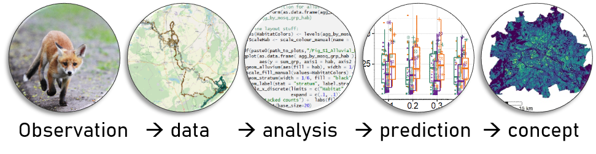

```{r setup, include=FALSE}
knitr::opts_chunk$set(echo = FALSE)
```


# Course *biodiversity dynamics*

Welcome to the course collection we have developed at our Department. Below you will find the compilation of our courses. These are hosted within one repository, so that data can be shared between the single course blocks The course has a strong focus on ecological data analysis and modelling, especially spatio-temporal data of animals. It covers the whole pipeline from observation and sampling &rarr; data analysis &rarr; model prediction &rarr; conservation concept.  
<br>



The single course blocks follow a logical order. The first two introductory courses give an overview over handling data in R. These two course blocks are mandatory for all other courses; we then introduce statistical analyses for various types of data, e.g. from spatial distribution models for single species via biodiversity analyses of community counts, towards analyses of population trends. To do the courses, please follow the code step by step in the respective html-files of each course (see below). 
<br>

Each year, we teach a block course (in March) held in English, which comprises 6 ECTS (approx. 180 hrs, of which 60 hrs are preparation, 60 hrs are in presence, and 60 hrs are for preparing a project which will be graded). We will lecture the steps in data analysis, and you will prepare a little spatial conservation concept with data we provide; you are welcome to bring your own data. Drop us a line if you are interested in joining ( assist6[at]izw-berlin.de ). 
<br>

## Course announcements

* 20.02.2023: 9 - 15 hrs CET: Introduction to spatial R via zoom; exercises on your own 
<br>
* 20.-24.03.2023: block course `biodiversity dynamics` (at IZW; hybrid possibility)
<br>

## Prior steps
### Program installation

* RStudio Desktop (https://posit.co/download/rstudio-desktop/)  <br>
* current R-version (https://cran.r-project.org/bin/windows/base/)  <br>
* RTools (https://cran.r-project.org/bin/windows/Rtools/) or you are using the `{installr}` package by following the examples (https://search.r-project.org/CRAN/refmans/installr/html/install.Rtools.html) <br>
<br>

If you are **not** familiar with `R` and `RStudio`, open `RStudio` and follow the steps shown here of how to write scripts in R: [Intro to RStudio](https://raw.githubusercontent.com/EcoDynIZW/EcoDynIZW.github.io/main/img/resources/teaching/L1_Intro_RStudio.pdf)
<br>

If you are familiar with scripting in `R` in `RStudio`, here is [Cedric's](https://www.cedricscherer.com/) tip of the day of a cool feature in `RStudio`: use the rainbow parentheses option. For this, go to `Tools` &rarr; `Global Options` &rarr; `Code` &rarr;` Display`: tick rainbow parentheses. It helps you visually with  closing brackets correctly for function calls and loops.


### Change decimal separator
...from comma to point in your computer settings if you are working from a German PC, e.g. in `Windows` &rarr; `Settings` &rarr; `Time and Region` &rarr; `Region` &rarr; `Advanced Settings` &rarr; `decimal separator`: change here to point.


### Download course
Simply copy our course `github repository` directly [here](https://github.com/EcoDynIZW/d6_teaching_collection/archive/refs/heads/main.zip). This will download the whole folder structure with some basic data. However, we still recommend that you make a copy of the `R-scripts` so that you can write your own comments and code into the scripts. <br>

We chose the following folder structure for our courses:
<br>

``` bash
└── d6_teaching_collection                 # root folder 
    ├──  data                              # data folder
    │    └── data_borneo                   # e.g., the Borneo data
    │        ├── geo_raster_current_asc    # geo data, raster ascii format, as in data_borneo
    │        └── animal_data               # animal observation data in borneo
    ├── output                             # storage for files created during course
    ├── R                                  # store here all your scripts, i.e.
    │   ├── script_course1.R               # r-files or rmd-files with codes
    │   └── script_course2.R
    ├── R_exercises                        # Exercises 
    └── d6_teaching_collection.Rproj       # the R-project
```
<br>

<details><summary> Optional - use own course folder setup </summary>

##### Optional - use own course folder setup
Only do this if you haven't done the prior step of downloading the whole course and want to set up your own course folder structure or download only a part of the course. In order to ease access to data and script-functionality, we recommend that you use a similar folder structure as we do (see above). You will find the `github repository` here: https://github.com/EcoDynIZW/d6_teaching_collection.

a) If you are familiar with `R` and want to do the steps 'by hand', create a main (root) folder named `d6_teaching_collection`, then create the subfolders (`data, output, R`) relative to this root-folder (= `d6_teaching_collection`). Create an `R-project` within this folder (e.g. `d6_teaching_collection.Rproj`. For this, open `RStudio` &rarr; `File` &rarr; `New Project` &rarr; `Existing directory`: and then link it with the root folder).
<br>

b) Users familiar with `R` and `RMarkdown` could directly implement our [d6 workflow package](https://github.com/EcoDynIZW/d6) to make project setups easier and to handle code and projects in a reproducible way. If you chose this option, please read the `ReadMe` that appears on the github website and install the d6 package (with the options `github= FALSE`). This has the advantage that you have automatically created a root directory and an `R-project`. You can then load the data (e.g. data_borneo, provided in zip-files, see below) directly under the root directory. In the `d6`-package there are already start-rmd-scripts (= `RMarkdown`-scripts with `yaml` header &rarr; open and execute with the symbol `knitR`), which make the start easier. But you can also create your own `R`-scripts, e.g. a new script for each course unit, which you put into the folder `R`.
<br>  

For both options, a) and b), you would need to download the data separately (link to zip.file below)
<br>

</details>


# Follow the courses

...when you have downloaded the course folder repository (see above). In the respective course `R` folder, you will find html-files and rmd-files. Open the html-file in a browser by double-clicking. Open `RStudio` in parallel by double-clicking on the `d6_teaching_collection.Rproj`-file. Under `Files` (lower right window pane) , you can open the `R`-scripts.
<br>

Then, either create your own `R`-script and follow the steps in the html-file (you can copy-paste the commands from the html-file), or save a copy of the rmd-file under your own name and run the code chunks step by step in the `RStudio` console. But you should always have the html-file opened in parallel to `RStudio`. Each course comes with exercises as a learning control.


<details><summary>**Courses 1 and 2: Basic concepts in R & Spatial R**</summary>

<div class='highlightbox'>These courses contain the minimum knowledge for handling, manipulating and visualizing various data types in `R` (Course1: `vectors`, `data.frames`, `lists`; Course2: spatial data like `raster` and vector files). The second course builds on the concepts introduced in course 1. It is therefore recommended to start with Course 1. 
<br>

You can run Course 1 without downloading any additional data. Please note that course 1 is **not** meant as a beginners course - a lot of great in-depth courses are available online (see links provided in Course 1). Course 1 is rather a 'refresher' of the basic `R` concepts that are needed for all subsequent courses. In a nutshell, it goes through the [base R cheatsheet](https://iqss.github.io/dss-workshops/R/Rintro/base-r-cheat-sheet.pdf). It is recommended to have the cheatsheet downloaded and to make your own notes into a copy of our script. You will find the course material for Course 1 in the repository under ./R/Course1_R_Intro.
<br>

For Course 2, you need to have the repository downloaded for access to the spatial data. Please open the .html file in ./R/Course2_R_Spatial.
</div> 

</details>


<details><summary>**Courses 3_a and 3_b Species distribution models**</summary>

<div class='highlightbox'>

In these courses, you will learn how to establish a functional relationship between the (relative) occurrence probability of species and (environmental) variables. This functional relationship – or species distribution/ occupancy model – can be extrapolated to other similar areas and used as an assessment of the availability of potentially suitable habitat for the respective species.   

##### presence only  / MaxEnt

Please download MaxEnt here: https://biodiversityinformatics.amnh.org/open_source/maxent/
For MaxEnt you may still need to install a Java version. If you double-click the file maxent.jar, an  interface should appear.
<br>

Download course data: For conducting course 3, we will provide you with additional data. Drag and drop the folders "data_borneo" and "data_berlin" from the provided zip files into the main folder (here: `d6_teaching_collection`). 
<br> 

Link to data_borneo and data_berlin will be provided. 

Please open the .html file in ./R/Course3_a_presence_only_sdm.

##### repeated presence absence / occupancy models
Please open the .html file in ./R/Course3_b_presence_absence_occupancy.

</div> 

</details>


<details><summary>**Course 4 Movement analysis**</summary>

<div class='highlightbox'>This course is an overview over the first steps for analysing relocation (telemetry) data. Using our collared red fox (Vulpes vulpes) ‘Q von Stralau’ as an example of movement data with fixes every 4 minutes, we will show how to clean your data and make first analyses of the tracks (step length, turning angles) and home range analyses.

Please open the .html file in ./R/Course4_telemetry_movement.

</div> 

</details>


<details><summary>**Course 5 Biodiversity metrics**</summary>

<div class='highlightbox'>In this part of the course we are going to explore more in detail how we measure and compare biodiversity among different sites. We will focus mainly of alpha diversity, which refers to the diversity at a specific site; this is the group of metrics we use to compare diversity among sites. We will explore the classic and current alpha diversity indices for both presence/absence data and abundance data. Then, we will learn which conditions the diversity samples need to meet to be comparable and how to analyse the effects of environmental variables in the diversity metric values. Finally, we will apply all this to statistically analyse urban Berlin bird diversity and create a spatial “map of diversity” for the city.  

Please open the .html file in ./R/Course5_biodiversity_abundance_metrics.

</div> 

</details>


<details><summary>**Course 6 Population analyses**</summary>

<div class='highlightbox'>

Please open the .html file in ./R/Course6_demography_population_models.

</div> 

</details>

