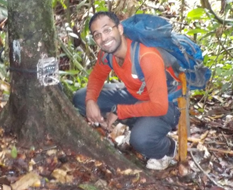

My work takes place in a landscape in Sabah, Malaysian Borneo. I am using camera trapping data to look at how large mammal habitat use and distribution is affected by forest degradation and poaching. I am also using anti-poaching patrol data to identify landscape features most used by poachers. The goal is to identify high risk areas that rangers can focus their attention on.

{width=30%} 

Roshan Guharajan