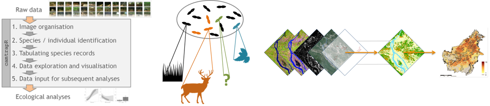

```{r setup, include=FALSE}
knitr::opts_chunk$set(echo = FALSE)
```

```{r, layout="l-screen-inset"}
knitr::include_graphics("img/team-div-header.png")
```

<div class='highlightbox'>
  <span class='highlight'>
  Globally mammalian biodiversity is declining at an alarming rate as a result of widespread habitat loss and degradation, and unsustainable hunting. We study how these anthropogenic drivers impact the distribution and abundance of ground dwelling mammals. In our field projects we use camera-traps and environmental DNA (eDNA) and invertebrate-derived DNA (iDNA) metabarcoding to assess species occurrences and we employ statistical models that investigate how anthropogenic drivers affect species distribution. We develop standardized methods and strategies for rigorous biodiversity assessments in order to provide robust scientific baseline data that allow monitoring species-specific and community-wide trends over time. In our work we regularly collaborate closely with local stakeholders and decision makers in order to integrate our data and results directly into wildlife and conservation management policy.
  </span>
</div>

**Dr. Andreas Wilting**, Deputy Department and Team Lead —  ecologist and evolutionary biologist with strong interest in species conservation, interested in methods and tools to study species distributions and to use these biodiversity data to target conservation efforts.

**Dr. Rahel Sollmann**, Team Lead — ecologist and quantitative biologist has specialised in the analysis of camera trap data with Bayesian methods for wildlife conservation. 

**Dr. Jan Axtner**, Data Management — data manager, ecologist and evolutionary geneticist, finds ways how to produce, store and handle large amounts of data of modern high-throughput biodiversity assessments.
  
<br>

```{r, layout="l-screen"}
knitr::include_graphics("img/meckpom-csf-inferno-cut-top.png")
```

## Running Projects

<div class='headerbox'><hbox>Field Projects</hbox></div>


<div class='headerbox-secondary'><hbox-secondary>Malaysia; Borneo</div>

**People involved: Roshan Guharajan, Jürgen Niedballa, Seth T Wong**

**Local partners: Sabah Forestry Department, Ta Ann Holdings Berhad, WWF Malaysia (Sarawak)**

In Malaysian Borneo we study how different anthropogenic drivers affect the occurrence and abundance of ground-dwelling mammal and bird communities. Since 2008, we have monitored mammalian communities over time in forest sites in various stages of recovering from severe logging impacts and under different forest management strategies. We compare the impacts of these strategies (i.e. mixed land-uses with industrial tree plantation and natural forest management, conventionally selective logging and reduced impact logging) at different spatial and temporal scales.

Financial support: Federal Ministry of Education and Research (BMBF), Panthera, Point Defiance Zoo and Aquarium, Point Defiance Zoo Society, Mohamed bin Zayed Species Conservation Fund, International Association for Bear Research and Management

<small>
  <b>Key Publications:</b>
  <ul>
    <li>[Guharajan et al. (2021) FOR ECOL MANAG](https://www.semanticscholar.org/paper/Sustainable-forest-management-is-vital-for-the-of-Guharajan-Mohamed/23023a67dcd41eb1c1baa29a51da0966bed806ec)</li>
    <li>[Mathai et al. (2019) GLOB ECOL EVOL](https://www.sciencedirect.com/science/article/pii/S2351989418302981)</li>
    <li>[Brozovic et al. (2018) MAMMALIAN BIOLOGY](https://www.sciencedirect.com/science/article/abs/pii/S1616504718301320?via%3Dihub)</li>
    <li>[Wong et al. (2018) MAMMALIAN BIOLOGY](https://www.sciencedirect.com/science/article/abs/pii/S161650471730157X?via%3Dihub)</li>
    <li>[Mathai et al. (2017) MAMMALIAN BIOLOGY](https://www.sciencedirect.com/science/article/abs/pii/S1616504717301453?via%3Dihub)</li>
    <li>[Sollmann et al. (2017) DIVERS DISTRIB](https://onlinelibrary.wiley.com/doi/10.1111/ddi.12530)</li>
  </ul>
</small>


<div class='headerbox-secondary'><hbox-secondary>Viet Nam, Laos; Annamite region</div>

**People involved: Andrew Tilker, An The Troung Nguyen, Thanh Van Nguyen, Jürgen Niedballa**

**Local partners Viet Nam: WWF Vietnam, Save Vietnam’s Wildlife, Fauna & Flora International, Re:wild, Southern Institute of Ecology SIE, Central Institute for Natural Resources and Environmental Studies, GreenViet**

**Local partners Laos: WWF Laos, Association Anoulak**

We want to learn more about the ecology of the little known Annamite endemics and understand what anthropogenic predictors drive the current distribution of these threatened species. In addition to habitat loss, unsustainable hunting is emerging as an increasingly important threat to tropical wildlife biodiversity. Due to pervasive hunting even many protected areas face massive species losses today. This widespread defaunation has been particularly severe in Indochina, where ‘industrial’ snaring has decimated wildlife populations drastically and driven many species to local extinction. Since 2014 we have implemented systematic camera-trapping and iDNA surveys across protected and non-protected areas within the Annamite ecoregion. Using modern species distribution models we aim to identify and predict areas of particular conservation concern in order to support better conservation efforts by our partners.

Financial support: Federal Ministry of Education and Research (BMBF), Point Defiance Zoo & Aquaria, National Geographic, Ocean Park Conservation Foundation, Manfred-Hermsen-Stiftung, Mohamed bin Zayed Species Conservation Fund, Eva Mayr-Stihl Stiftung

<small>
  <b>Key Publications:</b>
  <ul>
    <li>[Tilker et al. (2020) DIVERS DISTRIB](https://onlinelibrary.wiley.com/doi/full/10.1111/ddi.13029)</li>
    <li>[Nguyen et al. (2019) NAT ECOL EVOL](https://www.nature.com/articles/s41559-019-1027-7)</li>
    <li>[Tilker et al. (2019) COMMS BIOL](https://www.nature.com/articles/s42003-019-0640-y)</li>
    <li>[Tilker et al. (2017) Science](https://www.science.org/doi/10.1126/science.aap9591)</li>
  </ul>
</small>


<div class='headerbox'><hbox>Concepts & Methodology</hbox></div>


<div class='headerbox-secondary'><hbox-secondary>Hierarchical statistical modeling for wildlife research.</div>

**People involved: Ana Sanz, Jürgen Niedballa**

**Collaborators: Prof. Dr. Beth Gardner and many others, depending on specific projects**

Wildlife survey data are fraught with challenges: often sparse, spatially and/or temporally limited or biased due to logistic constraints, and imperfectly reflecting ecological states and processes due to imperfect detection (i.e., failing to observe species or individuals even though they are present). Hierarchical statistical modeling has emerged as the prime tool to deal with these challenges, by describing separate sub-models for the underlying ecological and the detection process. We employ such models throughout our research projects. But we also modify existing and develop new hierarchical models, and make these more accessible to end users, to improve our ability to study, monitor, and ultimately, protect wildlife. Modeling approaches we work with range from occupancy models for species occurrence to N-mixture, distance sampling and other count-based models for species abundance and population dynamics, to traditional and spatial capture-recapture models for abundance, density and demographics. 

<small>
  <b>Key Publications:</b>
  <ul>
    <li>[Ke et al. (2022) ECOL APPL](https://doi.org/10.1002/eap.2632)</li>
    <li>[Sollmann et al. (2021) ECOL APPL](https://esajournals.onlinelibrary.wiley.com/doi/full/10.1002/eap.2249)</li>
    <li>[Gardner et al. (2018) ECOL EVOL](https://onlinelibrary.wiley.com/doi/full/10.1002/ece3.4509)</li>
    <li>[Sollmann et al. (2016) MEE](https://besjournals.onlinelibrary.wiley.com/doi/full/10.1111/2041-210X.12518)</li>
    <li>[Royle et al. 2014. Spatial Capture Recapture. Academic Press, Waltham, MA.]()</li>
  </ul>
</small>


<div class='headerbox-secondary'><hbox-secondary>Developing standardized and reliable survey tools to monitor mammals in tropical rainforests.</div>




**People involved: Jan Axtner, Roshan Guharajan, Thanh Van Nguyen, Jürgen Niedballa, Rahel Sollmann, Badru Mugerwa, Andrew Tilker, Seth T Wong, Andreas Wilting**

**Collaborators: Prof. Dr. Douglas Yu (University of East Anglia, Norwich, UK & Kunming University, Kunming, China), Dr. Jesse F Abrams (University of Exeter, Exeter, UK)**

Studying biodiversity on a larger scale is essential to support political and conservation decisions. However, combining and integrating different biodiversity datasets into larger scale analyses is often challenging and associated with a loss of data accuracy and detail. We improve, develop and establish standardized methods and protocols to study and monitor biodiversity. Hereby we focus mainly on high-throughput methods that are applicable in tropical rainforests.
ScreenForBio user guide

<small>
  <b>Key Publications:</b>
  <ul>
    <li>[Abrams et al. (2021) ECOGRAPHY](https://onlinelibrary.wiley.com/doi/10.1111/ecog.05577)</li>
    <li>[Nguyen et al. (2021) ENVIRONMENTAL DNA](https://onlinelibrary.wiley.com/doi/10.1002/edn3.182)</li>
    <li>[Wong et al. (2019) GLOBAL ECOL AND EVOL](https://www.sciencedirect.com/science/article/pii/S2351989419303099)</li>
    <li>[Abrams et al. (2019) J APPL ECOL](https://besjournals.onlinelibrary.wiley.com/doi/10.1111/1365-2664.13411)</li>
    <li>[Axtner et al. (2019) GIGASCIENSE](https://academic.oup.com/gigascience/article/8/4/giz029/5450733)</li>
    <li>[Niedballa et al. (2019) REMOTE SENS ECOL CONSERV](https://zslpublications.onlinelibrary.wiley.com/doi/10.1002/rse2.107)</li>
    <li>[Abrams et al. (2019) ECOL INFORM](https://www.sciencedirect.com/science/article/abs/pii/S1574954118302759?via%3Dihub)</li>
    <li>[Bush et al. (2017) NAT ECOL EVOL](https://www.nature.com/articles/s41559-017-0176)</li>
    <li>[Mohd Salleh et al. (2017) GIGASCIENSE](https://academic.oup.com/gigascience/article/6/8/gix053/3958782)</li>
    <li>[Niedballa et al. (2016) METHODS ECOL EVOL](https://besjournals.onlinelibrary.wiley.com/doi/10.1111/2041-210X.12600)</li>
  </ul>
</small>

```{r, layout="l-screen"}
knitr::include_graphics("img/meckpom-csf-inferno-cut-bottom.png")
```
