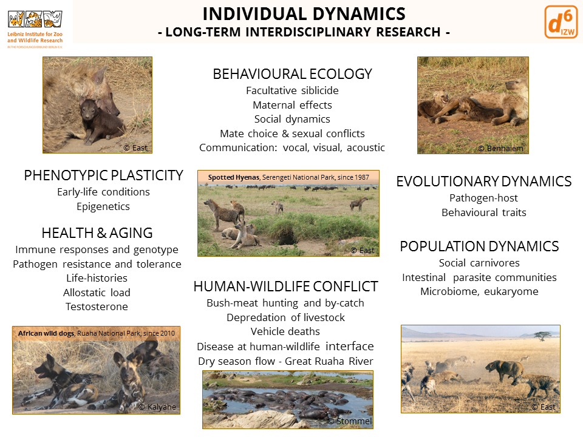
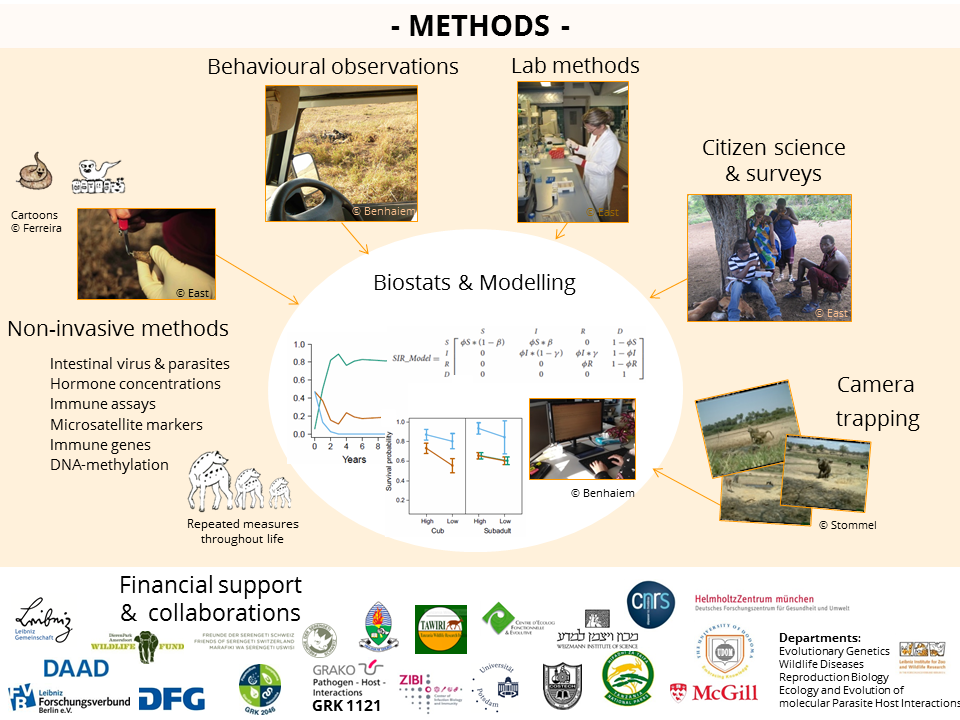

```{r setup, include=FALSE}
knitr::opts_chunk$set(echo = FALSE)
```

```{r, layout="l-screen-inset"}
knitr::include_graphics("img/team-ind-header.png")
```

<div class='highlightbox'>
  <span class='highlight'>
  Welcome! We study individual and social dynamics principally in African carnivores. Our key long-term research focuses on spotted hyenas in the Serengeti National Park. Research began in 1987 and currently we have detailed information on more than 2500 individually known hyenas. Our interdisciplinary research applies non-invasive and minimally invasive techniques and to further this aim we have developed and verified fecal assays for spotted hyenas.
  </span>
</div>

<b style='color:red;'>
-> decide if needs to be standardized  
     -> shorten text? no text? text for others?  
     -> conceptual overview for all? remove?
</b>

### Overview of our main research foci and methods:

  


---

# Why focus on spotted hyenas?

This fascinating species has a set of unique traits including female social dominance, an erectile penile structure in females similar in structure to that of the male penis, high post-natal investment in terms of lactation and facultative siblicide, females that acquire a social position immediately below that held by their mother (rank ‘inheritance’) when they become adult and immigrant males that queue (stand in line) for social status. The spotted hyena is a keystone carnivore in the Serengeti ecosystem and it is both an excellent hunters and scavenger. These aspects make it an ideal model species to study key unresolved questions on a wide range of topics, including social behaviour, sexual conflict, maternal effects, host-pathogen dynamics, endocrinology, immunology and pathogen-host adaptations.

Our study population experiences extreme and unpredictable fluctuations in prey abundance throughout the year, because of the migratory movements of its main prey – wildebeest, zebras and Thompson’s gazelles – and the low abundance of resident herbivores. We discovered that spotted hyenas in the Serengeti National Park solve this problem by ‘commuting’ long distances to forage throughout the year. Individuals leave their clan territory and travel to areas up to 70 km to locate areas contain large aggregations of migratory herbivores where they feed before returning ‘home’ to their clan territory. This commuting system is ideal for testing ideas concerning the effect of prey abundance on various aspects of hyena ecology and behaviour. Furthermore, exceptionally high post-natal maternal investment in terms of lactation and rank related access to food resources make hyenas ideal for research on socially mediated effects of maternal input on offspring survival and other components of fitness.

Human activities are an important source of mortality spotted hyenas in the Serengeti National Park. Illegal setting of wire snares by bushmeat hunters is extensive along the west and northwest border of the Serengeti National Park. Hyenas in our study population are killed as ‘by-catch’ in these wire snares when they ‘commute’ in areas containing large aggregations of migratory herbivores which are also profitable locations used by illegal bushmeat hunters.

---

## Running Projects

<b style='color:red;'>
-> add running project summaries with key literature
</b>

```{r, layout="l-screen"}
knitr::include_graphics("img/meckpom-csf-inferno-cut-bottom.png")
```
