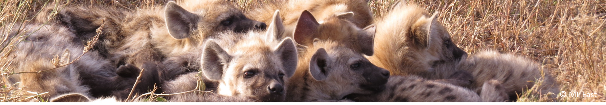
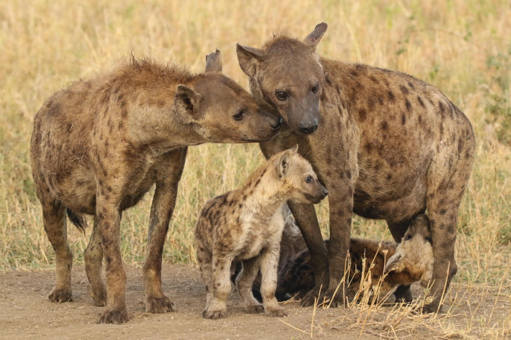
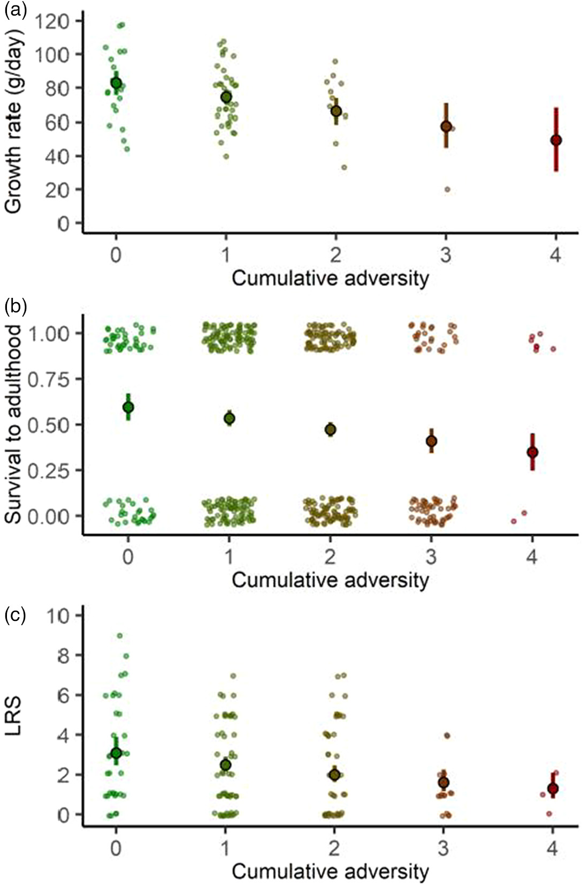
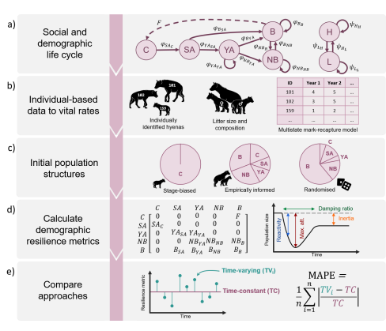
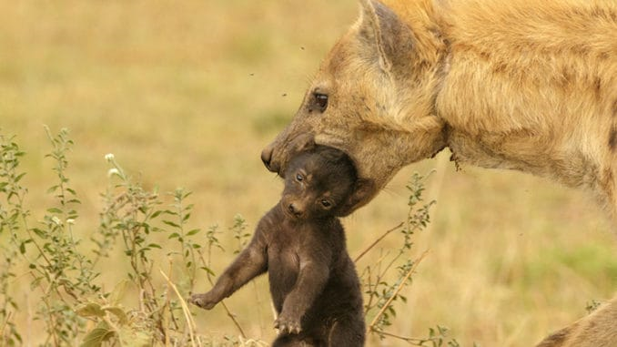
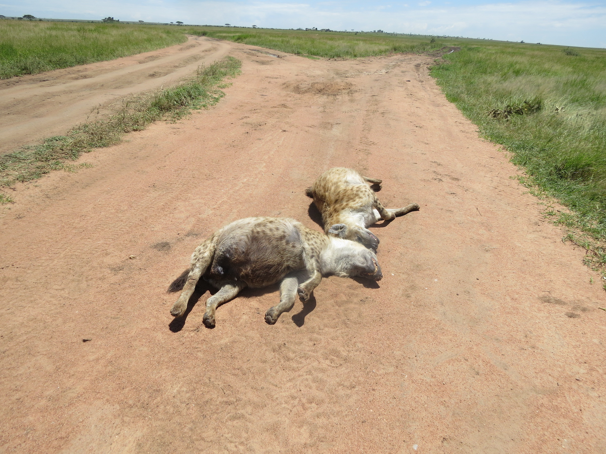
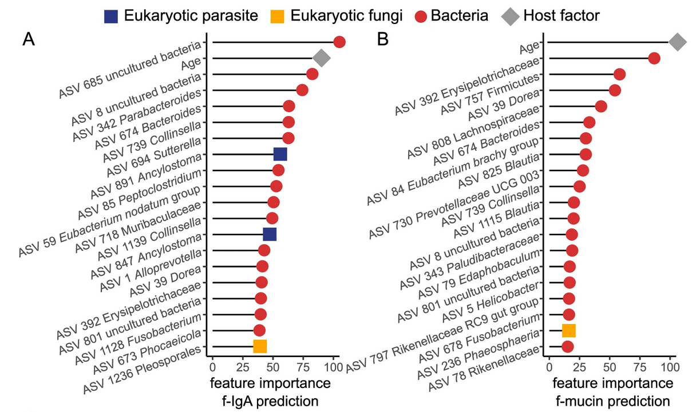
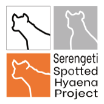

```{r setup, include=FALSE}
knitr::opts_chunk$set(echo = FALSE)
```

```{r, layout="l-screen-inset"}

```

<div class='highlightbox'>
  <span class='highlight'>
  Welcome! We study spotted hyaenas (**Crocuta crocuta**) in the Serengeti National Park, Tanzania. Since 1987, we have followed thousands of individually known hyaenas to investigate how social and environmental conditions shape survival, reproduction, health and life-history trade-offs across the lifespan. Together with our collaborators, we study hormones, immunity, epigenetics and demographic resilience. The long-term nature of the project provides a unique opportunity to examine how this highly social carnivore responds to environmental variability within a complex ecosystem. Our interdisciplinary research combines behavioural observations, demographic monitoring and non-invasive methods, including several faecal assays developed and validated for spotted hyaenas.
  </span>
</div>

!(img/teams/team-ind/gicquel_2022.png)
<br>
[*Figure: M. Gicquel (from [Gicquel et al. 2022 Ecosphere*](https://doi.org/10.1002/ecs2.4012))]
<br>
**Why are spotted hyenas so interesting to study?**<br>

Spotted hyaenas live in social groups known as clans, which can contain up to 120 individuals. Their societies are characterised by female dominance, stable linear dominance hierarchies and strong social bonds among related females. Many aspects of hyaena society resemble those of cercopithecine primates, making them a valuable model system for studying the evolution and consequences of complex social processes in mammals.

Our study clans live in the Serengeti National Park, Tanzania, where prey availability fluctuates strongly throughout the year because of the migratory movements of wildebeest, zebras and Thomson’s gazelles. Previous research on this population revealed that Serengeti hyaenas cope with this variable resource by commuting long distances to forage in areas with large aggregations of migratory herbivores, before returning to their clan territories. Commuting hyaenas may be injured or killed by wire snares set illegally by bushmeat hunters, or by road collisions associated with increasing traffic and tourism pressure within the park. Combined with ongoing changes in rainfall patterns and prey movements, these anthropogenic pressures may alter how hyaenas respond to environmental variability and disease outbreaks. 
Our long-term project, covering thousands of individuals across multiple generations, provides a rare opportunity to investigate how ecological and social processes shape behaviour, health, life-history trajectories and population resilience through the integration of behavioural, demographic and physiological data.
  
<br>

```{r, layout="l-screen"}

```

# Running Projects

<div class='headerbox'><hbox>The costs and benefits of living in complex societies</hbox></div>
<br>

{width=51%}

*Picture: Sonja Metzger*

Spotted hyaenas provide a powerful system for investigating how individuals navigate complex social relationships shaped by dominance hierarchies, kinship and social bonds. We investigate the costs and benefits of living in such complex social groups. 

Current topics

*	Sex roles and maternal investment 
*	Sibling rivalry and maternal effects
*	Agonistic interactions and drivers of conspecific injuries
*	Fitness consequences of social rank 
*	Infanticide and adoptions 

<small>
  <b>Selected publications:</b>
  <ul>
    <li>[East et al. (2022) FRONT ECOL EVOL](https://doi.org/10.3389/fevo.2022.860854)</li>
    <li>[Kappeler et al. (2023) BIOL REV](https://doi.org/10.1111/brv.12915)</li>
    <li>[White et al. (2026) ECOL EVOL](https://doi.org/10.1002/ece3.73229)</li>
   </ul>
</small>


<div class='headerbox'><hbox>Individual life history trajectories and demographic resilience</hbox></div>

{width=35%}{width=65%}

We investigate how environmental conditions shape individual life histories and how populations resist and recover from environmental disturbances.

Current topics:

*	Early life adversity and senescence  
*	Resistance and recovery following disease outbreaks and other disturbances 

<small>
  <b>Selected publications:</b>
  <ul>
    <li>[Gicquel et al. (2022) J ANIM ECOL](https://doi.org/10.1111/1365-2656.13785)</li>
    <li>[White et al. (2025) preprint on spotted hyaena resilience](https://www.authorea.com/doi/full/10.22541/au.173644757.79726606)</li>
   </ul>
</small>


<div class='headerbox'><hbox>Environmental variability and human disturbance</hbox></div>
<br>
{width=57.2%}{width=42.8%}

*Pictures: Sonja Metzger*

We study how climate variability and human activities influence behaviour, fitness and mortality risk in Serengeti spotted hyaenas.

Current topics

*	Climate-driven changes in prey migration  and feeding events
*	Illegal bushmeat hunting (snaring) and anthropogenic mortality 
*	Roadkills and disturbance through tourism pressure 
*	Human induced surface water scarcity
*	Management and conservation metrics 


<small>
  <b>Key Publications:</b>
  <ul>
    <li>[Sidous et al. (2026) in print / under review ](https://www.biorxiv.org/content/10.64898/2026.02.10.705143.abstract)</li>
    <li>[Schmied et al. (2024) WILDL BIOL](https://nsojournals.onlinelibrary.wiley.com/doi/full/10.1002/wlb3.01131)</li>
    <li>[Naciri et al. (2023) BIOL CONSERV ](https://www.sciencedirect.com/science/article/pii/S0006320723000502)</li>
    <li>[Benhaiem et al. (2023) ANIM CONSERV ](https://zslpublications.onlinelibrary.wiley.com/doi/full/10.1111/acv.12798)</li>
   </ul>
</small>


<div class='headerbox'><hbox>Integrative approaches to health and fitness</hbox></div>
<br>
{width=60%}

*Source: Soares et al. 2025*

We combine behavioural and demographic data with physiological, immunological and epigenetic approaches to investigate mechanisms linking social and environmental conditions to health and fitness.

Current topics

*	Epigenetic signatures of social rank 
*	Gut microbiome, health and metabolome
*	Early-life effects on allostatic load and immunity 


<small>
  <b>Selected publications:</b>
  <ul>
    <li>[Vullioud et al. (2024) COMMUN BIOL](https://doi.org/10.1038/s42003-024-05926-y)</li>
    <li>[Soares et al. (2025) COMMUN BIOL](https://www.nature.com/articles/s42003-025-08243-0)</li>
    <li>[Soares et al. (2025) preprint on early-life effects and immunity](https://www.biorxiv.org/content/10.64898/2025.12.16.694767v1.abstract)</li>
   </ul>
</small>


<div class='headerbox'><hbox>General Information</hbox></div>

**Get our information leaflet about the Serengeti Spotted Hyaena Project!**

::: {.floatting}
```{r out.width='28%', out.extra='style="float:left; padding:2px"'}

```

<br>
&emsp;&rarr; [English version](https://github.com/EcoDynIZW/EcoDynIZW.github.io/raw/main/resources/hyaena-leaflet/Serengeti Hyaena Project Leaflet_English.pdf)

&emsp;&rarr; [Deutsche Version (in German)](https://github.com/EcoDynIZW/EcoDynIZW.github.io/raw/main/resources/hyaena-leaflet/Serengeti Hyaena Project Informationsbroschuere_Deutsch.pdf)

&emsp;&rarr; [Toleo la Kiswahili (in Swahili)](https://github.com/EcoDynIZW/EcoDynIZW.github.io/raw/main/resources/hyaena-leaflet/Serengeti Hyaena Project Leaflet_Swahili.pdf)

&emsp;&rarr; [Version française (in French)](https://github.com/EcoDynIZW/EcoDynIZW.github.io/raw/main/resources/hyaena-leaflet/Serengeti Hyaena Project Brochure_Francais.pdf)


```{r, layout="l-screen"}

```
