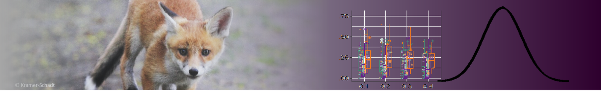
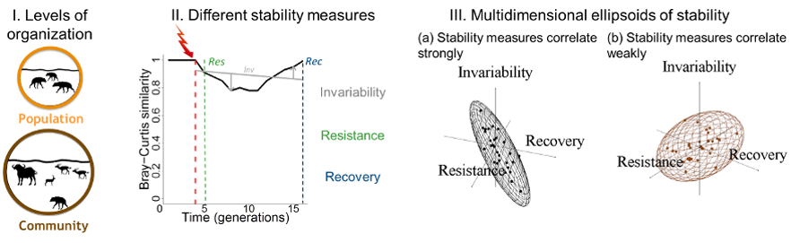
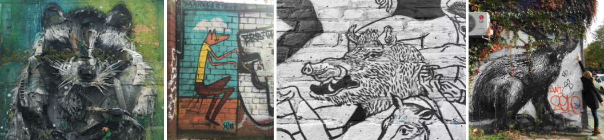
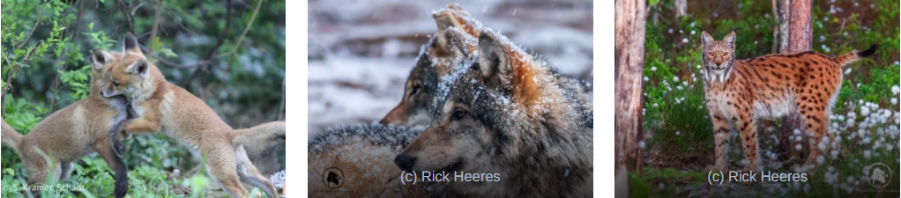

```{r setup, include=FALSE}
knitr::opts_chunk$set(echo = FALSE)
```

```{r, layout="l-screen-inset"}

```

<div class='highlightbox'>
  <span class='highlight'>
  Wildlife has to cope with many challenges in the Anthropocene, but data are often too scarce and messy to predict the future fate of populations and communities under global change. To disentangle processes and drivers behind ecological and evolutionary dynamics of wildlife populations and communities, we combine field work with advanced data analysis and the development of concepts with designing stochastic simulation models. We use forecasting techniques to project scenarios of population and community change under disturbances. With this, we contribute to applied and theoretic ecology and biodiversity conservation under global change.
  </span>
</div>

**Dr. Stephanie Kramer-Schadt**, Department and Team Lead, applied ecologist, population and disease dynamics at the landscape scale, passionate about wildlife per se, carnivores in particular, D6 and movement ecology, uses models as tools to communicate management issues.</br>

**Dr. Viktoriia Radchuk**, Team Lead, quantitative ecologist, stability of populations and communities under global change, interested in theory, synthesis, and integration of data with models to assist conservation.</br>

Coordination: **Dr.Conny Landgraf**, organizes us, behavioral ecologist, interested in sensory and acoustic cues of animals.</br>

GIS-Lab: **Moritz Wenzler-Meya**, geodata analyst, responsible for the GIS lab, providing geodata and supporting coding.</br>


# Running Projects


<div class='headerbox'><hbox>Theory and Synthesis</hbox></div>


<div class='headerbox-secondary'><hbox-secondary>Stability under global change and across levels of organization</headerbox-secondary></div>

**Dr. Cédric Scherer, Thibault Fronville**



To understand how populations and communities react to global change we study how their stability is affected by disturbances. To this end we model disturbances of different types and intensity and measure several stability metrics.

* **Animal responses to climate change**
* **Environmental variation effects on stability of populations and communities**

<small>
  <b>Key Publications:</b>
  <ul>
    <li>[Radchuk et al. (2019) Ecol. Lett. 22:674–684](https://doi.org/10.1111/ele.13226)</li>
   <li>[Radchuk et al. (2019) Nat. Commun. 10:3109](https://doi.org/10.1038/s41467-019-10924-4'>10.1038/s41467-019-10924-4)</li>  
   </ul>
</small>


<div class='headerbox-secondary'><hbox-secondary>Wildlife disease dynamics: Linking host and pathogen traits</headerbox-secondary></div>

**Dr. Cédric Scherer, Tobias Kürschner, Marius Grabow**


Pathogens are an integral part of biodiversity, influencing population dynamics of their hosts and playing an important functional role in shaping community structure. Here, our aim is to understand the effect that species as ‘mobile pathogen links’ with their different movement types and life-history strategies have on disease distribution, spread, persistence and evolution. 

&ensp;&rarr;&ensp;see also [BioMove Graduate School](https://www.bio-move.org/)

* **Movement effects on pathogen spread and disease persistence**
* **Evolution of pathogenic strains in dynamic landscapes**
* **Pathogen-induced movement strategies and fitness consequences**

<small>
  <b>Key Publications:</b>
  <ul>
    <li>[Kürschner et al. (2021) Ecol. Evol. 11:5728–5741](https://doi.org/10.1002/ece3.7478)</li>
  <li>[Scherer et al. (2020) OIKOS 129:651–667](https://doi.org/10.1111/oik.07002'>10.1111/oik.07002)</li>
  <li>[Scherer et al. (2019) J. Anim. Ecol.](https://doi.org/10.1111/1365-2656.13070)</li>
  <li>[Marescot et al. (2018) Funct. Ecol. 32:1237–1250](https://doi.org/10.1111/1365-2435.13059)</li>
    <li>[Kramer-Schadt et al. (2009) OIKOS 118:199-208](https://doi.org/10.1111/j.1600-0706.2008.16582.x)</li>
   </ul>
</small>


<div class='headerbox'><hbox>Applied Ecology</hbox></div>
 
<div class='headerbox-secondary'><hbox-secondary>Urban wildlife ecology: How do animals respond to novel environments?</hbox-secondary></div>

**Dr. Aimara Planillo, Dr. Julie Louvrier, Sinah Drenske, Simon Moesch**



Urbanisation poses risks and opportunities for wildlife. We investigate how species cope with these everyday challenges by analysing the spatial factors and species interactions that underlie their distributions along a rural to urban gradient and by making inference on their behavioral plasticity. 

&ensp;&rarr;&ensp;see also [BIBS — rural-urban coupling](https://www.bbib.org/rural-urban-coupling.html)  
&ensp;&rarr;&ensp;see also [WT Impact](https://www.wtimpact.de/)

* **Bridging spatial data in community distribution models**
* **Effects of species interactions and human disturbance on community compositions**
* **Ecology of red foxes (*Vulpes vulpes*) in anthropogenic landscapes**
* **Human perceptions of urban wildlife**

<small>
  <b>Key Publications:</b>  
  <ul>
    <li>[Planillo et al. (2021) Landsc. Urban. Pla. 211:104098](https://doi.org/10.1016/j.landurbplan.2021.104098'>10.1016/j.landurbplan.2021.104098)</li>
    <li>[Planillo, Kramer-Schadt, et al. (2020)  Divers. Distrib. 27:34–49](https://doi.org/10.1111/ddi.13169'>10.1111/ddi.13169)</li>
    <li>[Gras et al. (2018) Front. Ecol. Evol. 6:136](https://doi.org/10.3389/fevo.2018.00136)</li>
    <li>[Stillfried et al. (2017) Front. Ecol. Evol. 5:157](https://doi.org/10.3389/fevo.2017.00157)</li>
   </ul>
</small>

<div class='headerbox-secondary'><hbox-secondary>Wildlife distributions, population dynamics, and conservation</hbox-secondary></div>

**Dr. Julie Louvrier, Dr. Aimara Planillo, Dr. Cédric Scherer, Dr. Joe Premier, Ana Patricia Calderon, Eva Sánchez Arribas**



Wildlife faces big challenges persisting in human-dominated landscapes. We model their population dynamics, viability and connectivity using individual-based models on a spatially-explicit basis, with the aim of supporting wildlife management and conservation.

* **Wolf population dynamics and establishment in Germany**
* **Jaguar connectivity and conservation prioritization in Central America**
* **Modelling genetic processes to support the conservation management of Eurasian lynx**

<small>
  <b>Key Publications:</b>
  <ul>
    <li>[Premier et al. (2020) Mov. Ecol. 8:16](https://doi.org/10.1186/s40462-020-00204-y)</li>
    <li>[Heurich, Schultze-Naumburg et al. (2018) Biol. Conserv. 224:355-365](https://doi.org/10.1016/j.biocon.2018.05.011'>10.1016/j.biocon.2018.05.011)</li>
    <li>[Radchuk, Ims & Andreassen (2016) Ecology 97:720-732](https://doi.org/10.1890/15-0756.1'>10.1890/15-0756.1)</li>
    <li>[Struebig et al. (2015) Curr. Biol. 25:372–378](https://doi.org/10.1016/j.cub.2014.11.067)</li>
   </ul>
</small>

```{r, layout="l-screen"}
knitr::include_graphics("img/meckpom-csf-inferno-cut-bottom.png")
```
