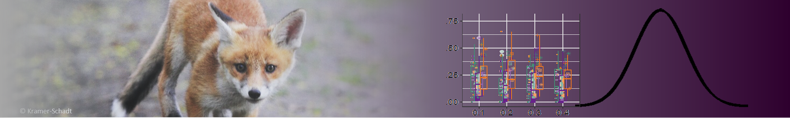
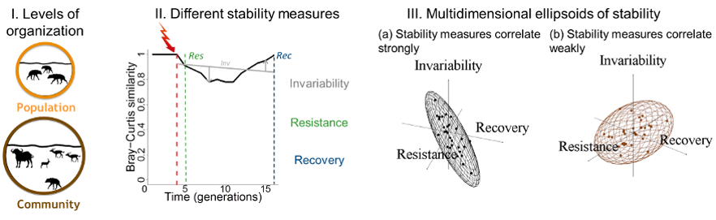
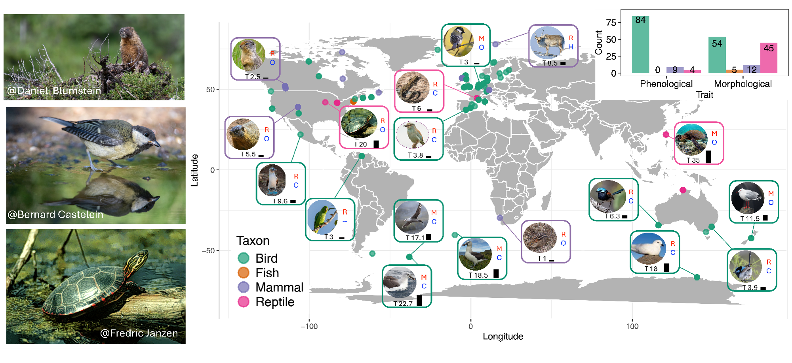
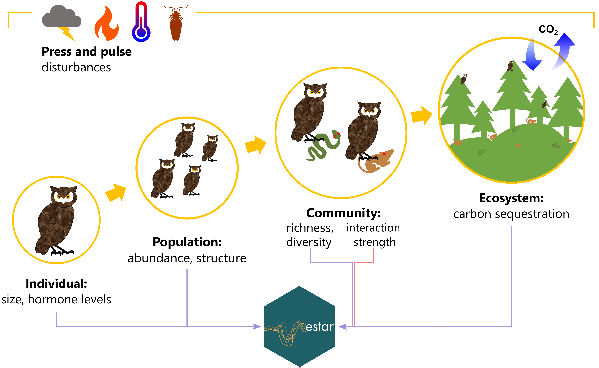
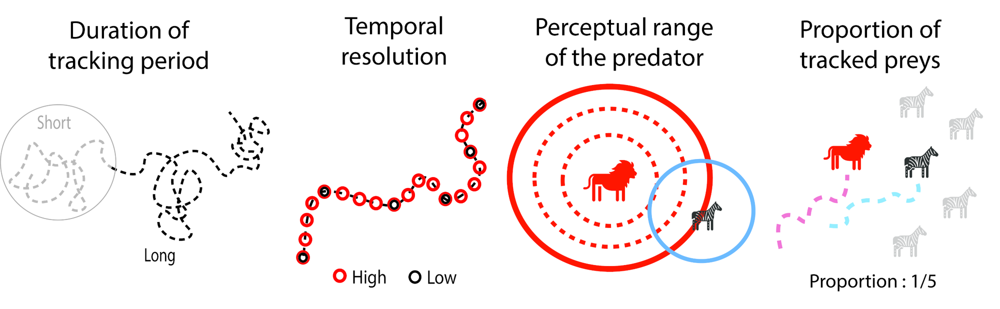
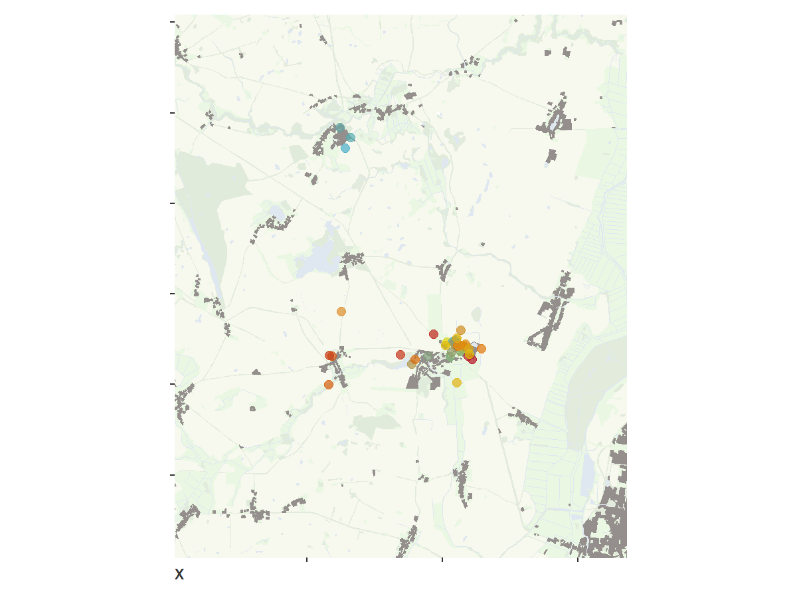
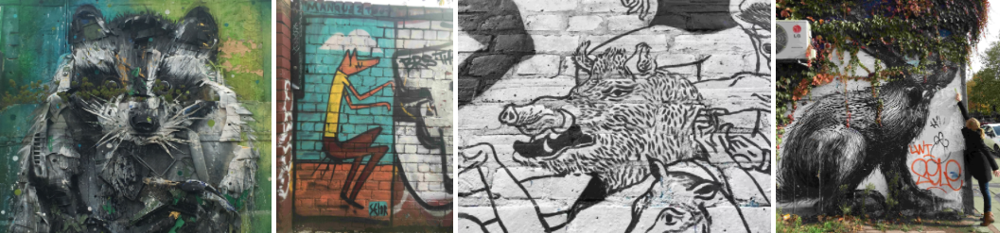
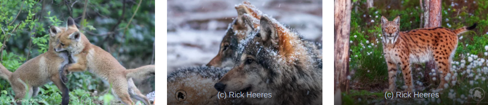

```{r setup, include=FALSE}
knitr::opts_chunk$set(echo = FALSE)
```

```{r, layout="l-screen-inset"}

```

<div class='highlightbox'>
  <span class='highlight'>
  Wildlife has to cope with many challenges in the Anthropocene, but data are often too scarce and messy to predict the future fate of populations and communities under global change. To disentangle processes and drivers behind ecological and evolutionary dynamics of wildlife populations and communities, we combine field work with advanced data analysis and the development of concepts with designing stochastic simulation models. We use forecasting techniques to project scenarios of population and community change under disturbances. With this, we contribute to applied and theoretic ecology and biodiversity conservation under global change.
  </span>
</div>

**Dr. Stephanie Kramer-Schadt**, Department and Team Lead — applied ecologist, population and disease dynamics at the landscape scale, passionate about wildlife per se, carnivores in particular, D6 and movement ecology, uses models as tools to communicate management issues.</br>

**Dr. Viktoriia Radchuk**, Team Lead — quantitative ecologist, stability of populations and communities under global change, interested in theory, synthesis, and integration of data with models to assist conservation.</br>

**Dr. Conny Landgraf**, Field Coordination — behavioral ecologist, interested in sensory and acoustic cues of animals.</br>

**Moritz Wenzler-Meya**, GIS-Lab—  geodata analyst, responsible for the GIS lab, providing geodata and supporting coding.</br>
  
<br>

```{r, layout="l-screen"}
knitr::include_graphics("img/banner-mv-csf-top.png")
```

# Running Projects

<!-- <div class='headerbox-secondary'><hbox-secondary>Stability under global change and across levels of organization</headerbox-secondary></div> -->

<!--  -->

<font size="5"> **Responses of wildlife to climate change**</font> 



**Ashlee Mikkelsen, Rohit Chakravarty, Guillaume Chero, Carys Jones**

We study how species and communities in the wild cope with climate change. To this end we often combine long-term individual observations with process-based simulations. We also use comparative studies to synthetize the current state of knowledge.

<small>
  <b>Selected Publications:</b>
  <ul>
    <li>[Chakravarty et al. (2021) SCI REP](https://doi.org/10.1038/s41598-021-01939-3)</li>
    <li>[Chakravarty et al. (2023) J ANIM ECOL](https://doi.org/10.1111/1365-2656.13897)</li>
   <li>[Radchuk et al. (2019) NAT COMMUN](https://doi.org/10.1038/s41467-019-10924-4'>10.1038/s41467-019-10924-4)</li>  
   <li>[Radchuk et al. (2026) NAT COMMUN](https://doi.org/10.1038/s41467-025-68172-8)</li>  
   </ul>
</small>


<font size="5"> **Quantifying stability of populations and communities**</font> 



**Cedric Scherer, Julie Louvrier, Ludmilla Figueiredo, Ella White, Malte Kurreck**

We contribute to advancing conceptual frameworks and developing methodological tools to improve quantification of ecological stability and resilience. We test the existing and newly developed methods on the simulated data that provides clear benchmarks and support the pick-up of methods by practitioners by offering training workshops.

<small>
  <b>Selected Publications:</b>
  <ul>
    <li>[Radchuk et al. (2019) ECOL LETT](https://doi.org/10.1111/ele.13226)</li>
   <li>[Figueiredo et al. (2026) METHODS ECOL EVOL](https://doi.org/10.1111/2041-210x.70265)</li>  
   </ul>
</small>


<font size="5"> **Movement ecology: Advancing methods**</font> 



**Thibault Fronville**

Movement of animals in the wild is shaped by a combination of biotic and abiotic factors, e.g. landscape structure, presence of con- and hetero-specifics and intrinsic state of the moving individual. To improve our understanding of how these biotic and abiotic factors affect movement, we test the existing and contribute to developing new methods.

<small>
  <b>Selected Publications:</b>
  <ul>
    <li>[Fronville et al. (2024) METHODS ECOL EVOL](https://doi.org/10.1111/2041-210X.14323)</li>
    <li>[Fronville et al. (2025) MOVE ECOL](https://doi.org/10.1186/s40462-025-00567-0)</li>
    <li>[Signer et al. (2025) ECOL EVOL](https://doi.org/10.1002/ece3.71434)</li>
   </ul>
</small>

<font size="5"> **Wildlife in a ONE HEALTH context**</font> 


**Tobias Kürschner, Marius Grabow, Simeon Lisovski, Nikki Pearson**

Pathogens are an integral part of biodiversity, influencing population dynamics of their hosts and playing an important functional role in shaping community structure. Here, our aim is to understand the effect that species as ‘mobile pathogen links’ with their different movement types and life-history strategies have on disease distribution, spread, persistence and evolution. 

Current topics

* [Soil-transmitted helminth infections at the livestock-wildlife interface](https://www.vetmed.fu-berlin.de/en/einrichtungen/sonstige/grk3096/index.html)

* [West-Nile infections in wild birds](https://www.gesundheitsforschung-bmftr.de/de/wnvcombat-kontrolle-von-wnv-infektionen-unter-anwendung-eines-ganzheitlichen-one-health-19682.php)

* Movement effects on pathogen spread and disease persistence

* Pathogen-induced movement strategies and fitness consequences

<small>
 <b>Selected Publications:</b>
  <ul>
  <li>[Kürschner et al. (2024) ECOL EVOL](https://doi.org/10.1002/ece3.11065)</li>
  <li>[Kürschner et al. (2026) ECOSPHERE](https://doi.org/10.1002/ecs2.70539)</li>
  <li>[Grabow et al. (2024) COMMUN BIOL](https://doi.org/10.1038/s42003-024-07114-4)</li>
  <li>[Grabow et al. (2025) PROC R SOC B](http://doi.org/10.1098/rspb.2025.0238)</li>
  <li>[Patzina-Mehling et al. (2026) NAT COMMUN](https://doi.org/10.1038/s41467-026-73251-5)</li>
   </ul>
</small>

<!-- <br> -->
<!-- <video autoplay loop muted playsinline width="640" controls> -->
<!--   <source src="img/simulation_Kuerschner_et_al_2025.mp4" type="video/mp4" size="640"> -->
<!--   Your browser does not support the video tag. -->
<!-- </video> -->
<!-- <br> -->
<!-- &ensp;&rarr;&ensp;Simulation of virulence evolution in different host density landscapes, Kürschner et al. (2024) ECOL EVOL. -->
<!-- <br> -->


<!--  -->

<!-- &ensp;&rarr;&ensp;Ultra high resolution ATLAS tracking data of barn swallows and house martins. Movement data represents individual foraging decisions during one day, Grabow et al. (2025) PROC R SOC B. -->

<font size="5"> **Urban wildlife ecology: How do animals respond to novel environments?**</font> 



**Sinah Drenske**

Urbanisation poses risks and opportunities for wildlife. We investigate how species cope with these everyday challenges by analysing the spatial factors and species interactions that underlie their distributions along a rural to urban gradient and by making inference on their behavioral plasticity. 

<small>
  <ul>
    <li>[Drenske et al. (2024) FRONT ECOL EVOL](https://doi.org/10.3389/fevo.2024.1455142'>10.3389/fevo.2024.1455142)</li>
    <li>[Louvrier et al. (2022) J ANIM ECOL](https://doi.org/10.1111/1365-2656.13635)</li>
    <li>[Moesch et al. (2024) ECOL SOC](https://doi.org/10.5751/ES-15211-290306)</li>
   </ul>
</small>

<font size="5"> **Wildlife distributions, population dynamics, and conservation**</font> 



**Eva Sánchez Arribas**, **Aimara Planillo**

Wildlife faces big challenges persisting in human-dominated landscapes. We model their population dynamics, viability and connectivity using individual-based models on a spatially-explicit basis, with the aim of supporting wildlife management and conservation.

<small>
  <ul>
    <li>[Planillo et al. (2024) WILDL BIOL](https://doi.org/10.1002/wlb3.01246)</li>
    <li>[Planillo et al. (2024) DIVERS DISTRIB](https://doi.org/10.1111/ddi.13789)</li>
    <li>[Sánchez Arribas et al. (2026) CONSERV BIOL](https://doi.org/10.1111/cobi.70321)</li>
   </ul>
</small>


```{r, layout="l-screen"}
knitr::include_graphics("img/banner-mv-csf-bottom.png")
```
