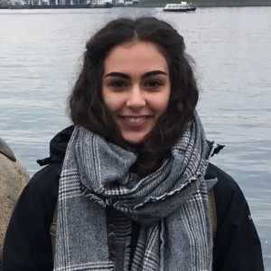

```{r setup, include=FALSE}
knitr::opts_chunk$set(echo = FALSE)
```

### [How do animals respond to climate change?](proj-pop-stab-1.html)

We study how climate change affects phenological and morphological traits in animals worldwide. Further, we investigate what are the implications of such trait changes for population dynamics (sTraitChange workshop) and for individual fitness (see also: sDiv workshop [sTraitChange](https://www.idiv.de/de/sdiv/arbeitsgruppen/pool-of-working-groups/straitchange.html). We are currently assembling the trait data base for analysing whether phenological or morphological traits of terrestrial animals are adaptive under climate change scenarios. I am working with Viktoriia Radchuk on the sTraitChange project – a meta-analysis, covering the whole world and multiple taxa, where we are looking at the effects of climate change on traits, and how these changes mediate effects on demographic rates (survival and reproduction) and population dynamics.

<figure>
  
  <figcaption>Carys Jones</figcaption>
</figure>

---

### [How does environmental variation affect stability of populations and communities?](proj-pop-stab-2.html)

Large changes in Earth’s climate are apparent, and there is some evidence that populations and communities respond to climate change. In order to tackle this issue, I study the effect of different levels of climatic variation on population and community dynamics, by using theoretical modelling. I also try to understand tipping points and early warning in populations and communities, by studying fluctuations in traits and demographic rates.

<figure>
  
  <figcaption>Guillaume Chero</figcaption>
</figure>