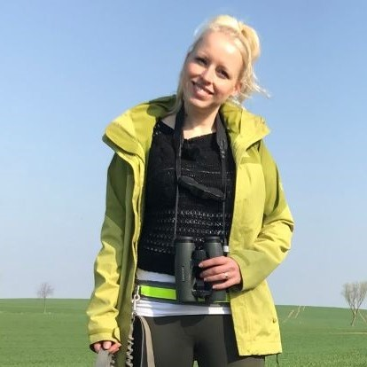

```{r setup, include=FALSE}
knitr::opts_chunk$set(echo = FALSE)
```

### [Bridging spatial data in community distribution models](proj-pop-urban-1.html)

Understanding species distributions is fundamental for wildlife management and landscape planning. Species distributions are largely driven by their habitat associations and their response to environmental or anthropogenic factors. In addition, species distributions and the structure of ecological communities are also driven by species interactions such as predation or competition. Using data that were collected in fundamentally different ways complicates the process of modeling the distribution and structure of biological communities. Based on this problematic, I will work on evaluating how environmental and anthropogenic drivers shape the assembly and dynamics of mammalian communities at different spatiotemporal scales.

<figure>
  <br>
  <figcaption>Dr. Julie Louvrier</figcaption>
</figure>


### [Effects of species interactions and human disturbance on community composition in urban areas](proj-pop-urban-2.html)

Urban areas present new challenges to wildlife communities. Special conditions created by human disturbance and novel stressors, such as noise or light, affect both species response to urban environment and species interactions. In order to better understand species and communities’ response to urban environment and to predict (multi)species distributions, I work with hierarchical multi-response models to study community composition and analyse how species interactions are modified by anthropogenic disturbance in an urbanization gradient. I do this with data from invertebrates, birds and mammals, including competition/facilitation relationships, as well as predator-prey interactions.

<figure>
  <br>
  <figcaption>Dr. Aimara Planillo</figcaption>
</figure>


### [Ecology of red foxes (*Vulpes vulpes*) in anthropogenic landscapes](proj-pop-urban-3.html)

We live in a time in which our environment is subject to constant anthropogenic change. This change has direct and indirect effects on wildlife. However, certain species like the red fox (*Vulpes vulpes*) have adapted to these human dominated habitats very well. But what is the secret of success? With this project I am trying to get one step closer to deciphering the mystery by using an overarching approach that deals with movement ecology, foraging strategies and diseases (parasites and microbiomes) of this successful carnivore.

<figure>
  <br>
  <figcaption>Dr. Carolin Scholz</figcaption>
</figure>


### [Human perceptions of urban wildlife](proj-pop-urban-4.html)

Understanding human perceptions towards urban wildlife is essential for the development of management instruments. While some species such as wild boar (Sus scrofa) or red fox (Vulpes vulpes) are associated with damage, fear and disease, humans also seek contact with nature and feed animals like squirrels (Sciurus vulgaris) and hedgehogs (Erinaceidae). In my PhD project, I investigate the social side of human-wildlife-interactions in urban areas. With a nationwide survey I aim to gather information on which animals are perceived as positive, neutral and negative and what humans connect with certain speciesby humans. Combined with modelling of human-wildlife-interaction zones and expert interviews with forest and greenspace managers, conservation organisations and hunting associations, my aim is to classify measures in terms of greenspace planning, environmental education and population control, which lead to a less conflictive human-wildlife-coexistence.

<figure>
  <br>
  <figcaption>Simon Moesch</figcaption>
</figure>